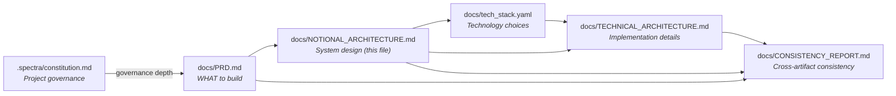
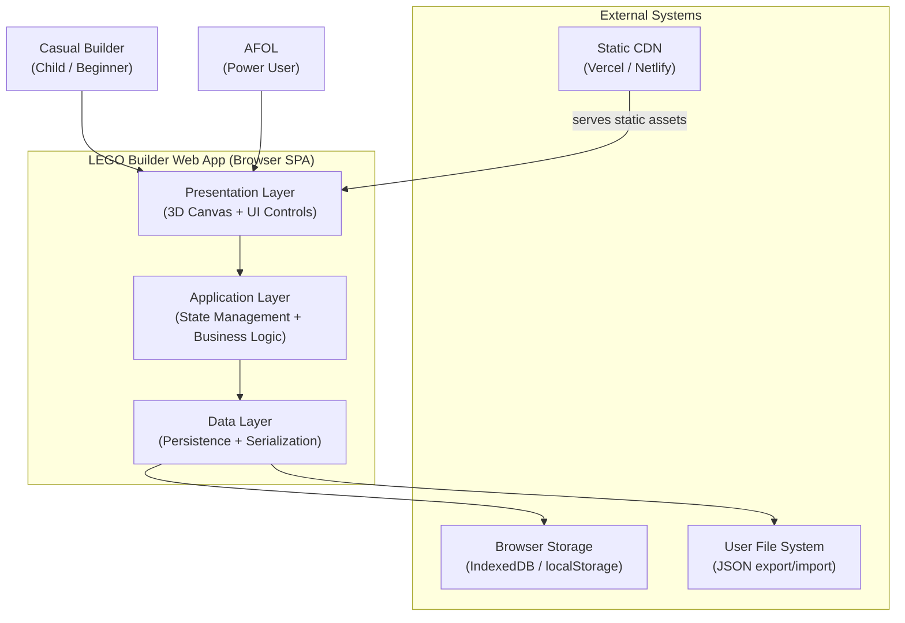
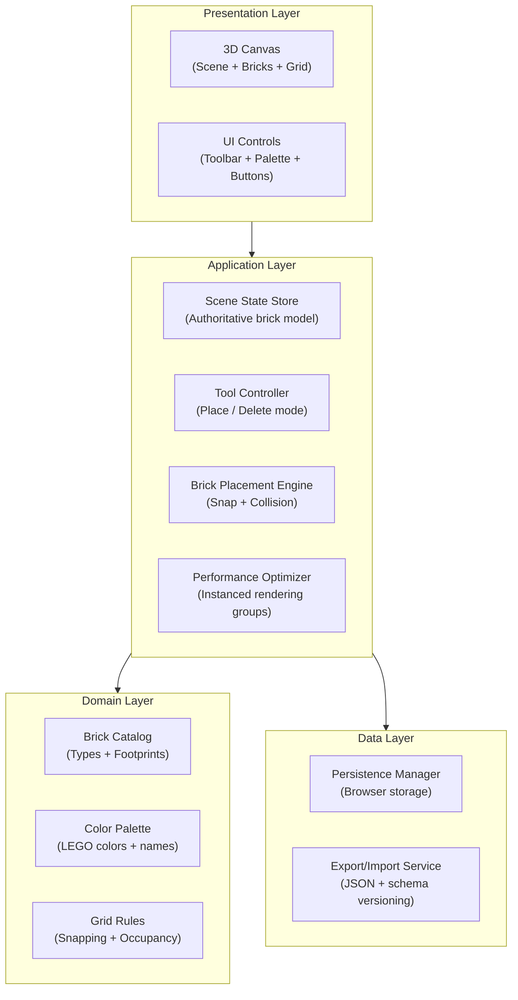
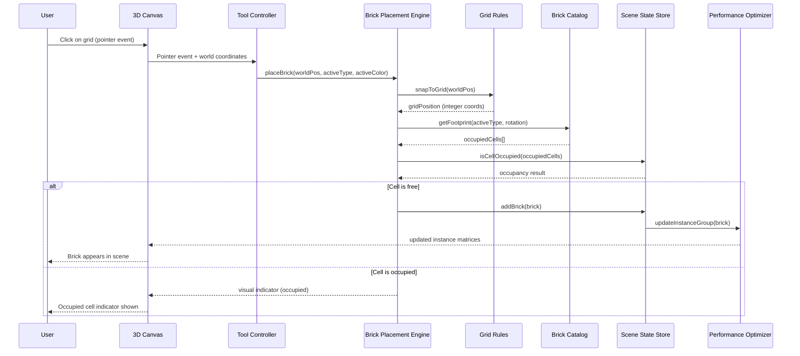
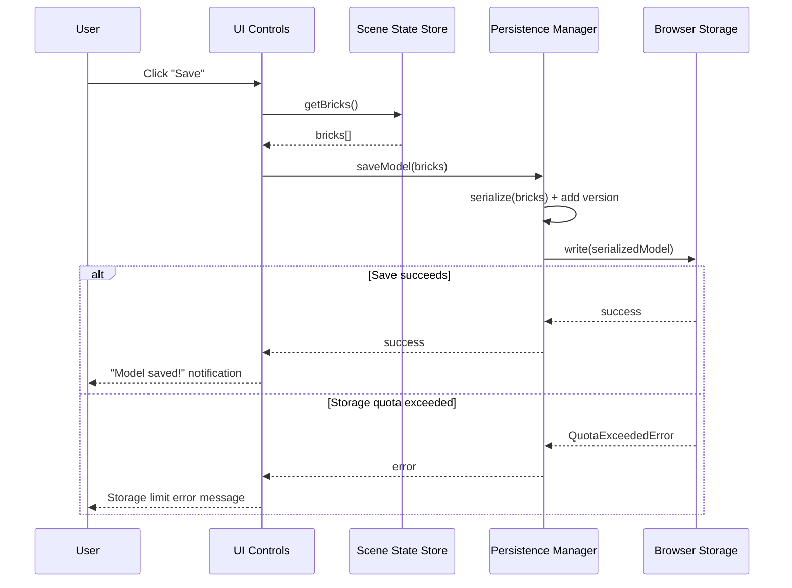
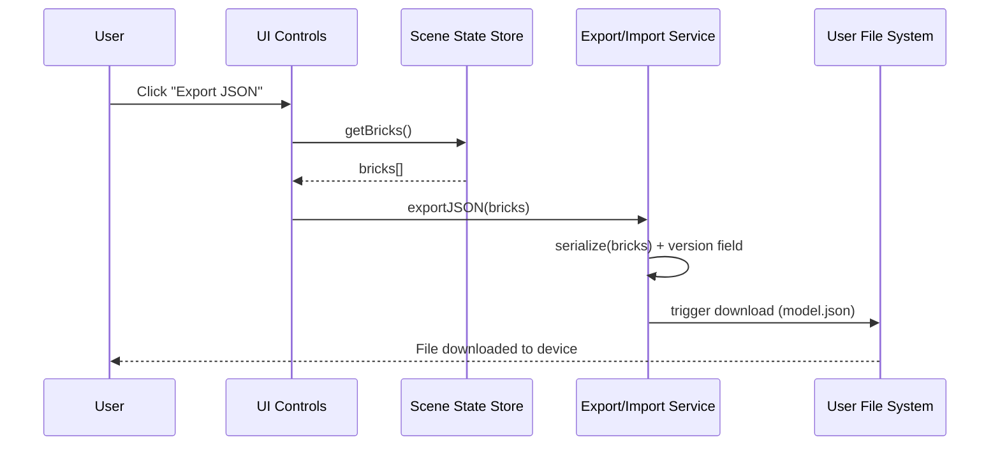

# Notional Architecture — LEGO Builder Web App

> **This document describes WHAT the system does, not HOW it's implemented.**
>
> For technology choices, see `docs/tech_stack.yaml`.
> For implementation details, see `docs/TECHNICAL_ARCHITECTURE.md`.

---

## Document Relationships

| Document | Focus | Changes When |
|----------|-------|--------------|
| `.spectra/constitution.md` | Project governance (governs all below) | Team norms or governance depth change |
| `docs/PRD.md` | Requirements (FR/NFR) | Business needs change |
| `docs/NOTIONAL_ARCHITECTURE.md` | System design (this file) | Component structure changes |
| `docs/tech_stack.yaml` | Technology mapping | Framework/version evolves |
| `docs/TECHNICAL_ARCHITECTURE.md` | Implementation details | Tech implementation changes |
| `docs/CONSISTENCY_REPORT.md` | Cross-artifact consistency check | After all specs/arch finalized |

---

## 1. System Context

> The LEGO Builder Web App is a fully client-side Single Page Application (SPA). All computation, rendering, state management, and persistence occur within the user's browser. There is no backend server, no cloud database, and no external API calls during normal use. The system boundary is the browser tab.

### 1.1 System Boundaries

| Boundary | Inside System | Outside System |
|----------|---------------|----------------|
| **Rendering Boundary** | 3D scene rendering, UI controls, camera management | User's GPU/display hardware |
| **State Boundary** | In-memory brick model, active tool, selected color/type | Browser storage (external persistence) |
| **Data Boundary** | Serialization/deserialization logic, schema versioning | IndexedDB/localStorage, user file system |
| **Delivery Boundary** | Application code and assets | CDN infrastructure (Vercel/Netlify) |
| **Network Boundary** | Zero outbound requests during normal use (NFR-SEC-001) | External servers (explicitly excluded) |

---

## 2. Component Overview

> All components are **Deterministic** — the LEGO Builder MVP has no probabilistic (AI/LLM) components. Same user input always produces the same scene state.

| Component | Responsibility | Classification |
|-----------|---------------|----------------|
| **3D Scene Renderer** | Renders the 3D grid, brick meshes, lighting, and camera controls. Handles WebGL output. | Deterministic |
| **Brick Placement Engine** | Validates and executes brick placement on the grid. Enforces grid snapping and collision detection. | Deterministic |
| **Tool Controller** | Manages the active tool mode (Place, Delete). Routes user interactions to the correct handler. | Deterministic |
| **Brick Catalog** | Defines available brick types (1×1, 1×2, 2×2, 2×4) and their geometric footprints. | Deterministic |
| **Color Palette** | Provides the set of standard LEGO colors with names and values. | Deterministic |
| **Scene State Store** | Holds the authoritative in-memory model: all placed bricks with position, type, color, rotation. | Deterministic |
| **UI Controls** | Toolbar (tool selection), brick type selector, color palette, save/load/export/import buttons. | Deterministic |
| **Persistence Manager** | Serializes and deserializes the scene state to/from browser storage. Manages schema versioning. | Deterministic |
| **Export/Import Service** | Converts scene state to/from versioned JSON files for sharing. Validates imported data. | Deterministic |
| **Performance Optimizer** | Groups same-type bricks for instanced rendering to maintain target FPS. | Deterministic |

### 2.1 Component Classification

| Classification | Behavior | Validation | Examples in This System |
|---------------|----------|------------|-------------------------|
| **Deterministic** | Same input → Same output | TDD (Unit/Integration tests) | All 10 components above |
| **Probabilistic** | Same input → Variable output | EDD (Evals) | None in MVP |
| **Hybrid** | Mixed behavior | Both TDD + EDD | None in MVP |

> **EDD Not Required:** The LEGO Builder MVP has no probabilistic components. All behavior is deterministic and fully covered by TDD.

---

## 2b. Business Process → Component Mapping

| Business Process | Key Steps | Component(s) | Classification | AI Opportunity? |
|-----------------|-----------|--------------|----------------|:---------------:|
| BP-1: Brick placement and arrangement | Select type → Select color → Click grid → Snap to cell → Validate occupancy | Brick Placement Engine, Tool Controller, Scene State Store, 3D Scene Renderer | Deterministic | NO |
| BP-2: Model save and load | Serialize state → Write to storage → Read from storage → Deserialize → Repopulate scene | Persistence Manager, Scene State Store, 3D Scene Renderer | Deterministic | NO |
| BP-3: Model sharing | Serialize to JSON → Trigger download → User transfers file → Import → Validate → Repopulate | Export/Import Service, Scene State Store, 3D Scene Renderer | Deterministic | NO |

> No AI opportunities identified for MVP. All processes are user-driven interactions with deterministic outcomes.

---

## 3. Layered Architecture

> This is a client-only SPA. There is no backend server, no communication layer, and no AI/agent layer. The architecture is a three-layer client-side system.

### 3.1 Presentation Layer

**Responsibility:** Render the 3D scene and UI controls. Translate user interactions (mouse clicks, button presses) into application-layer commands.

| Component | Purpose |
|-----------|--------|
| **3D Canvas** | Renders the WebGL scene: ground grid, placed brick meshes, ambient/directional lighting, camera with orbit/zoom/pan controls. Handles pointer events on the canvas for brick placement and deletion. |
| **UI Controls** | Renders the toolbar (Place/Delete tool buttons), brick type selector, color palette with LEGO color names, and action buttons (Save, Load, Export JSON, Import JSON). Provides visual feedback for active tool, selected type, and selected color. |

**Rules:**
- No business logic in this layer
- Translates user events into store actions or service calls
- Displays state from the Scene State Store (read-only from presentation)
- Accessibility: all UI controls outside the 3D canvas must meet WCAG 2.1 AA (NFR-A11Y-001)

### 3.2 Application Layer

**Responsibility:** Orchestrate the building workflow. Manage in-memory scene state. Coordinate between user interactions, domain rules, and data persistence.

| Component | Purpose |
|-----------|--------|
| **Scene State Store** | Single source of truth for all placed bricks (position, type, color, rotation), active tool, active color, and active brick type. Reactive — presentation layer re-renders on state change. |
| **Tool Controller** | Tracks the active tool mode (Place or Delete, defaulting to Place on load per FR-TOOL-001). Routes canvas pointer events to the Brick Placement Engine (Place mode) or deletion handler (Delete mode). |
| **Brick Placement Engine** | Validates placement requests: snaps world coordinates to integer grid units (FR-BRICK-001), checks for cell occupancy (including multi-cell footprints for 2×4 bricks per FR-BRICK-003), and commits valid placements to the Scene State Store. |
| **Performance Optimizer** | Groups placed bricks by type to enable instanced rendering (FR-PERF-001). Maintains instance matrices and color buffers. Updates groups incrementally on brick add/remove. |

**Rules:**
- Contains all business logic
- No direct DOM manipulation
- State changes are atomic and synchronous
- Performance Optimizer is transparent to other components (optimization detail, not business logic)

### 3.3 Communication Layer

> **Not applicable.** This is a client-only SPA with no voice, real-time messaging, or customer support features.

### 3.4 AI / Agent Layer

> **Not applicable.** The LEGO Builder MVP has no AI or agentic features. All behavior is deterministic. See PRD §2b.

### 3.5 Skill & Plugin Layer

**Spectra Governance Skills Active for This Project:**

| Layer | Skills Loaded | When |
|-------|--------------|------|
| **Governance (always)** | `governance-tdd`, `governance-traceability` | Every agent session |
| **Task-specific** | `spec-architecture`, `spec-prd-creation`, `spec-test-plan` | Architecture and PM agent sessions |
| **Wisdom (on demand)** | `wisdom-system-design` | Architecture decisions |

### 3.6 Domain Layer

**Responsibility:** Encapsulate the core rules of the LEGO building domain. Technology-agnostic definitions that do not change regardless of rendering framework.

| Component | Purpose |
|-----------|--------|
| **Brick Catalog** | Defines the 4 brick types (1×1, 1×2, 2×2, 2×4), their grid footprints (width × depth in grid units), and their 3D geometry dimensions. Used by the Brick Placement Engine for footprint validation and by the 3D Canvas for mesh sizing. |
| **Color Palette** | Defines the set of ≥10 standard LEGO colors with their official names (e.g., "Bright Red", "Reddish Brown") and color values. Used by UI Controls for display and by the Scene State Store for brick color assignment. |
| **Grid Rules** | Defines the snapping algorithm (round world coordinates to nearest integer), the occupancy model (which grid cells are blocked by a placed brick including rotation), and the flat-grid constraint (Y=0 plane only for MVP per CLR-01). |

**Rules:**
- Technology-agnostic
- No dependencies on rendering framework, state library, or storage
- Contains domain validation (e.g., "a 2×4 brick at position X blocks cells X through X+3")

### 3.7 Data Layer

**Responsibility:** Persist and retrieve scene state. Serialize/deserialize brick data. Manage schema versioning for forward compatibility.

| Component | Purpose |
|-----------|--------|
| **Persistence Manager** | Reads and writes the scene model to browser storage (IndexedDB preferred, localStorage fallback). Handles storage quota errors gracefully (FR-PERS-001 CLR-04). Completes save within 500ms for up to 1,000 bricks (FR-PERS-001). |
| **Export/Import Service** | Serializes the scene model to a versioned JSON format (FR-SHARE-001). Triggers browser file download on export. Reads and validates imported JSON files, rejecting malformed or incompatible data without corrupting the current scene (CLR-05). |

**Rules:**
- Abstracts storage mechanism from the Application Layer
- All persisted data includes a `version` field for schema migration
- Import validation is strict: invalid data is rejected, current scene is never corrupted
- No data is ever transmitted to external servers (NFR-SEC-001)

---

## 4. Data Flow

### 4.1 Primary Data Flow — Brick Placement

### 4.2 Primary Data Flow — Save Model

### 4.3 Primary Data Flow — JSON Export

### 4.4 Key Data Flows Summary

| Flow Name | Source | Destination | Purpose |
|-----------|--------|-------------|--------|
| Brick Placement | User pointer event on canvas | Scene State Store → 3D Canvas | Add brick to scene with grid snapping |
| Brick Deletion | User pointer event on brick mesh | Scene State Store → 3D Canvas | Remove brick from scene |
| Color Selection | User click on color swatch | Scene State Store (activeColor) | Update active color for next placement |
| Type Selection | User click on brick type | Scene State Store (activeBrickType) | Update active type for next placement |
| Brick Rotation | User rotate action on selected brick | Scene State Store (brick.rotation) → 3D Canvas | Rotate brick 90° around Y-axis |
| Save Model | User click Save | Scene State Store → Persistence Manager → Browser Storage | Persist current scene |
| Load Model | User click Load | Browser Storage → Persistence Manager → Scene State Store → 3D Canvas | Restore saved scene |
| JSON Export | User click Export | Scene State Store → Export Service → File System | Download versioned JSON file |
| JSON Import | User selects JSON file | File System → Import Service → Scene State Store → 3D Canvas | Restore scene from file |

---

## 5. Personas & Access Control

> This is a public, client-only application with no authentication. All personas have identical access to all features. Access control is not applicable for MVP.

### 5.1 Personas

| Persona | Description | Access Level |
|---------|-------------|:------------:|
| **Casual Builder** | Child (8–14) or beginner adult. Builds simple models for fun. Expects intuitive, forgiving interface. No account required. | Full (public) |
| **AFOL (Power User)** | Adult LEGO enthusiast. Builds complex models. Expects precise control, keyboard shortcuts, accurate LEGO color names. | Full (public) |

### 5.2 Access Matrix

| Feature | Casual Builder | AFOL |
|---------|:--------------:|:----:|
| Place / Delete bricks | ✅ | ✅ |
| Select brick color | ✅ | ✅ |
| Select brick type (1×1, 1×2, 2×2, 2×4) | ✅ | ✅ |
| Rotate bricks (FR-TOOL-003) | ✅ | ✅ |
| Save / Load model | ✅ | ✅ |
| Export / Import JSON (FR-SHARE-001) | ✅ | ✅ |
| Keyboard shortcuts | Optional | Expected |

> No role-based access control is required. All features are available to all users without authentication.

---

## 6. Integration Points

| Integration | Purpose | Data Exchanged | Direction |
|-------------|---------|----------------|-----------|
| **Browser Storage (IndexedDB/localStorage)** | Persist scene model between sessions (FR-PERS-001, FR-PERS-002) | Serialized brick array with version field | Bidirectional (write on save, read on load) |
| **User File System** | Export model as JSON file; import JSON file from user's device (FR-SHARE-001) | Versioned JSON file containing brick array | Outbound (export) + Inbound (import) |
| **Static CDN (Vercel/Netlify)** | Deliver application assets (JS, CSS, fonts, images) to the browser | Static files | Inbound (app delivery only) |
| **WebGL API (browser)** | Hardware-accelerated 3D rendering via the browser's WebGL 2.0 interface | GPU draw calls, shader programs, texture data | Outbound (render commands to GPU) |

> **No external API calls.** The application makes zero outbound network requests containing user data during normal operation (NFR-SEC-001).

---

## 7. Quality Attributes (NFRs)

| NFR | Architectural Decision | Component(s) Affected |
|-----|----------------------|----------------------|
| **NFR-PERF-001** — ≥30 FPS with 500 bricks | Use instanced rendering: group same-type bricks into a single draw call (FR-PERF-001). Avoid per-brick draw calls. | Performance Optimizer, 3D Scene Renderer |
| **NFR-PERF-002** — ≤3s initial load | Client-only SPA with code splitting and lazy loading. No server round-trip for initial render. | Presentation Layer (build/bundle config) |
| **NFR-SCALE-001** — 1,000 bricks without crash | Instanced rendering keeps GPU memory bounded. Scene State Store uses flat array (no deep nesting). | Performance Optimizer, Scene State Store |
| **NFR-SEC-001** — No external data transmission | Client-only architecture: zero backend, zero API calls. All data stays in browser. | Data Layer (Persistence Manager, Export Service) |
| **NFR-SEC-002** — OWASP Top 10 | No server-side code eliminates injection/CSRF risks. XSS mitigated by framework escaping. | Presentation Layer |
| **NFR-A11Y-001** — WCAG 2.1 AA | All UI controls (toolbar, palette, buttons) outside the 3D canvas are standard DOM elements with ARIA attributes. | UI Controls |
| **NFR-REL-001** — 99.9% uptime | Static hosting on CDN (Vercel/Netlify) with global edge network. No server to go down. | CDN (external) |
| **NFR-COMPAT-001** — Chrome/Firefox/Safari/Edge | WebGL 2.0 is supported in all target browsers. No browser-specific APIs used. | 3D Scene Renderer |
| **NFR-DEPLOY-001** — Static site CI/CD | SPA builds to static files. CI/CD pipeline deploys to CDN on merge to main. | Build/Deploy pipeline |

---

## 8. Component Mapping to tech_stack.yaml

| Notional Component | tech_stack.yaml Key | Purpose |
|--------------------|---------------------|---------|
| 3D Canvas (Presentation) | `components.frontend` | WebGL 3D rendering |
| UI Controls (Presentation) | `components.frontend` | Toolbar, palette, action buttons |
| Scene State Store (Application) | `components.state_management` | Reactive in-memory brick model |
| Tool Controller (Application) | `components.frontend` | Tool mode routing |
| Brick Placement Engine (Application) | `components.frontend` | Grid snapping + collision |
| Performance Optimizer (Application) | `components.frontend` | Instanced rendering groups |
| Brick Catalog (Domain) | `components.frontend` | Brick type definitions |
| Color Palette (Domain) | `components.frontend` | LEGO color definitions |
| Grid Rules (Domain) | `components.frontend` | Snapping + occupancy rules |
| Persistence Manager (Data) | `components.browser_storage` | Browser storage abstraction |
| Export/Import Service (Data) | `components.frontend` | JSON serialization + file I/O |

---

## 9. Enterprise Product Intelligence Layer

| This Product's Capability | Overlaps With | Resolution |
|---------------------------|--------------|------------|
| 3D brick building SPA | NONE | Build New |
| Browser-based persistence | NONE | Build New |
| JSON model export/import | NONE | Build New |

> **Anti-redundancy check result (from PRD §0b):** CLEAN. No overlapping capabilities found across org products. The `sreenivasmrpivot/legobuilder` repo is empty with no implementation.

- Services from other products this product will consume: NONE
- Services this product will expose for other products to consume: NONE

---

## 10. Decision Log

| Decision | Rationale | NFR Impact | Date |
|----------|-----------|------------|------|
| **Client-only SPA (no backend)** | MVP scope explicitly excludes cloud storage and user accounts (NG-1). Eliminates server cost, deployment complexity, and latency. Architecture supports adding a backend later (G-5). | NFR-SEC-001, NFR-REL-001, NFR-DEPLOY-001 | 2026-04-14 |
| **Flat grid only (Y=0 plane)** | CLR-01 resolution: vertical stacking deferred to v2. Simplifies collision detection and grid occupancy model significantly. | NFR-PERF-001 | 2026-04-14 |
| **BoxGeometry approximations for bricks** | CLR-02 resolution: avoids legal risk from LEGO trademark (AG-3). Simplifies geometry management. | NFR-PERF-001 | 2026-04-14 |
| **Instanced rendering for same-type bricks** | Required to meet NFR-PERF-001 (≥30 FPS with 500 bricks). Single draw call per brick type vs. 500 individual draw calls. | NFR-PERF-001, NFR-SCALE-001 | 2026-04-14 |
| **Browser storage abstraction (not raw localStorage)** | Provides IndexedDB fallback for larger models. Handles quota errors gracefully (CLR-04). Future-proofs for cloud sync (G-5). | NFR-SCALE-001 | 2026-04-14 |
| **Versioned JSON export format** | CLR-05 resolution: enables schema migration on import. Prevents data corruption from incompatible versions. | NFR-SCALE-001 | 2026-04-14 |
| **No authentication / no accounts** | MVP is public, client-only. No user data leaves the browser (NFR-SEC-001). Reduces friction for Casual Builder persona. | NFR-SEC-001 | 2026-04-14 |

---

## Next Steps

After completing this document:

1. **Define technology choices** in `docs/tech_stack.yaml`
2. **Create technical architecture** in `docs/TECHNICAL_ARCHITECTURE.md`
3. **Update test plan** in `docs/TEST_PLAN.md` based on component classification (all Deterministic — TDD confirmed)
4. **EDD not required** — no probabilistic components in MVP
