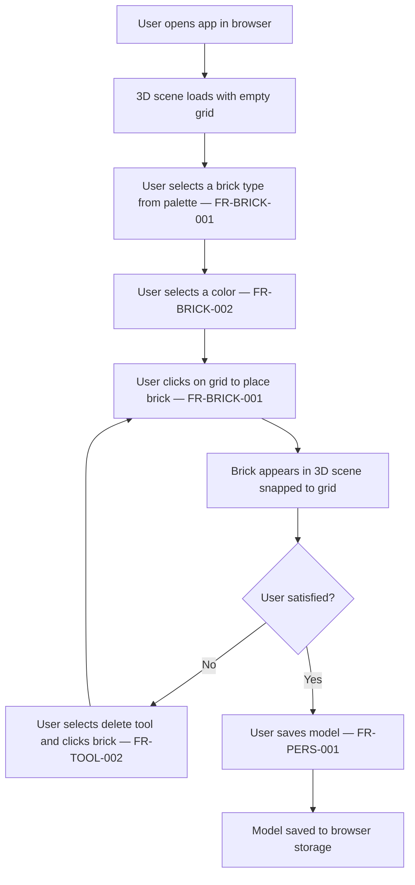
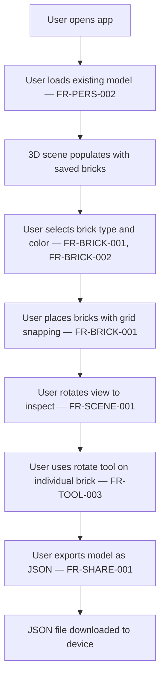

# Product Requirements Document (PRD) — LEGO Builder Web App

---

## Document Version

| Version | Date | Changes | OpenSpec Change |
|---------|------|---------|------------------|
| 1.0 | 2026-04-14 | Initial PRD | `initial-mvp` |

---

## 0. Constitution Reference

> This PRD is governed by the project constitution at `.spectra/constitution.md`.

| Constitution Attribute | Value |
|----------------------|-------|
| **Governance Depth** | Standard |
| **Compliance** | NONE |
| **Active Regulation Packs** | None |
| **Regulation Test Cases Scaffolded** | NO |
| **Compliance Review Cadence** | EVERY_SPRINT |
| **TDD Required** | YES |
| **EDD Required** | NO |
| **Model Tier Policy** | DEFAULT |
| **SLM Optimization** | DISABLED |
| **Lifecycle Hooks** | DEFAULT |
| **Delegation Policy** | DEFAULT |
| **Maturity Lever Target** | 3 |
| **Behavioral Verification Dashboard** | ENABLED |
| **E2E Testing** | ENABLED |

---

## 0b. Redundancy Analysis

| Check | Result | Action |
|-------|--------|--------|
| **Overlapping FRs** | NONE — no existing Spectra-governed products in org with overlapping capabilities | N/A |
| **Same Target Persona** | NONE | N/A |
| **Overlapping Business Processes** | NONE | N/A |
| **Reuse Recommendations** | NONE | N/A |

> **Anti-redundancy check result:** CLEAN. No overlapping capabilities found across org products. The `sreenivasmrpivot/legobuilder` repo is empty with no implementation.

---

## 1. Overview

### 1.1 Product Name

LEGO Builder Web App

### 1.2 Description

A browser-based 3D LEGO building application that allows users to place, rotate, color, and arrange virtual LEGO bricks in a 3D scene using WebGL rendering. The app targets both children and adult fans of LEGO (AFOLs), providing an intuitive, performant, and shareable building experience without requiring any software installation.

### 1.3 Goals

| ID | Goal | Success Metric | Priority |
|----|------|---------------|:--------:|
| G-1 | Deliver a performant 3D brick-building experience in the browser | Scene renders at ≥ 30 FPS with up to 500 bricks on mid-range hardware | P0 |
| G-2 | Provide an intuitive brick placement and editing workflow | New users can place, color, and delete a brick within 60 seconds without instructions | P0 |
| G-3 | Enable model persistence so users can save and resume their builds | Users can save a model locally and reload it with 100% fidelity | P0 |
| G-4 | Support model sharing so users can export and share their creations | Users can export a model as a JSON file and import it on another device | P1 |
| G-5 | Establish a foundation for future cloud sync and community features | Architecture supports adding a backend API without major refactoring | P2 |

### 1.4 Non-Goals (Explicitly Out of Scope)

| ID | Non-Goal | Why It's Out of Scope |
|----|----------|----------------------|
| NG-1 | Cloud storage or user accounts | MVP is client-only; backend adds complexity and cost |
| NG-2 | Physics simulation (gravity, collision) | Adds rendering complexity; not required for core building UX |
| NG-3 | Step-by-step guided instructions mode | Requires instruction authoring tooling; deferred to v2 |
| NG-4 | Mobile-first touch controls | Desktop browser is primary target for MVP; mobile is stretch goal |
| NG-5 | Multiplayer / collaborative building | Requires real-time backend; deferred to v2 |

### 1.5 Anti-Goals (Actively Avoid)

| ID | Anti-Goal | Why It's Harmful | Detection |
|----|-----------|-----------------|----------|
| AG-1 | Shipping a non-functional 3D canvas (blank screen, WebGL errors) | Core value proposition is the 3D experience; a broken canvas is worse than no app | CI behavioral test: canvas renders at least one brick without console errors |
| AG-2 | Storing user model data in a format that cannot be migrated | Locks users into a version; breaks save/load on app updates | Schema versioning check in persistence layer |
| AG-3 | Using LEGO-trademarked assets or part data without license | Legal liability | Legal review gate before any official part library integration |
| AG-4 | Rendering performance below 15 FPS with 100 bricks | Unusable experience; users abandon the app | Performance test: FPS measurement with 100 bricks |

### 1.6 OKRs (Objectives and Key Results)

**Objective 1: Deliver a delightful, performant 3D building experience**

| KR ID | Key Result | Baseline | Target | Status |
|-------|-----------|----------|--------|:------:|
| KR-1.1 | Scene renders ≥ 30 FPS with 500 bricks on mid-range hardware | 0 (not built) | ≥ 30 FPS | 🔴 Not Started |
| KR-1.2 | Time-to-first-brick (new user places first brick) ≤ 60 seconds | 0 (not built) | ≤ 60 seconds | 🔴 Not Started |
| KR-1.3 | Zero WebGL errors in browser console during normal use | 0 (not built) | 0 errors | 🔴 Not Started |

**Objective 2: Enable reliable model persistence and sharing**

| KR ID | Key Result | Baseline | Target | Status |
|-------|-----------|----------|--------|:------:|
| KR-2.1 | Save/load round-trip preserves 100% of brick data (position, color, type) | 0 (not built) | 100% fidelity | 🔴 Not Started |
| KR-2.2 | JSON export/import works across different browsers | 0 (not built) | Chrome, Firefox, Safari, Edge | 🔴 Not Started |

### 1.7 Goal–FR–OKR Traceability

| FR ID | Traces to Goal | Traces to KR | Violates Non-Goal? | Violates Anti-Goal? |
|-------|:-------------:|:------------:|:------------------:|:-------------------:|
| FR-SCENE-001 | G-1 | KR-1.1, KR-1.3 | No | No |
| FR-BRICK-001 | G-2 | KR-1.2 | No | No |
| FR-BRICK-002 | G-2 | KR-1.2 | No | No |
| FR-BRICK-003 | G-2 | KR-1.2 | No | No |
| FR-TOOL-001 | G-2 | KR-1.2 | No | No |
| FR-TOOL-002 | G-2 | KR-1.2 | No | No |
| FR-TOOL-003 | G-2 | KR-1.2 | No | No |
| FR-PERS-001 | G-3 | KR-2.1 | No | No |
| FR-PERS-002 | G-3 | KR-2.1 | No | No |
| FR-SHARE-001 | G-4 | KR-2.2 | No | No |
| FR-PERF-001 | G-1 | KR-1.1 | No | No |

### 1.8 What This Product Replaces (Innovator's Gift)

| Current Alternative | Type | Target Users Affected | Primary Pain Point |
|---------------------|------|----------------------|-------------------|
| LEGO Digital Designer (LDD) | Product (discontinued) | AFOLs, hobbyists | Discontinued; no browser support; Windows/Mac only |
| BrickLink Studio | Product | AFOLs, power users | Desktop install required; steep learning curve; not browser-based |
| Manual physical building | DIY | Children, casual users | No undo, no sharing, bricks get lost |
| Various HTML5 web builders | Product (fragmented) | Casual users | Poor UX, limited brick libraries, no persistence |

**Why They'll Switch**:
- Zero installation — works instantly in any modern browser
- Intuitive UX designed for both children and adults
- Reliable save/load with JSON export for sharing

**Switching Friction Mitigation**:
- Import support for common model formats (JSON) to ease migration
- Familiar toolbar metaphors (place, delete, rotate, color picker)

---

## 2. Personas

### 2.1 Casual Builder (Child / Beginner)

- **Description**: A child aged 8–14 or a beginner adult who wants to build simple LEGO models for fun. Expects a simple, colorful, and forgiving interface.
- **Access Level**: public
- **Capabilities**:
  - Place and delete bricks
  - Choose brick color from a palette
  - Rotate the 3D view
  - Save and load a model
- **Constraints**:
  - No account required
  - Must not encounter confusing error messages
  - Interface must be operable without reading documentation

### 2.2 Adult Fan of LEGO (AFOL / Power User)

- **Description**: An adult LEGO enthusiast who builds complex models and wants precise control over brick placement, color accuracy, and model export.
- **Access Level**: public
- **Capabilities**:
  - All Casual Builder capabilities
  - Select from multiple brick types (1×1, 1×2, 2×2, 2×4, etc.)
  - Precise grid-snapped placement
  - Export model as JSON for sharing or backup
  - Import a previously exported JSON model
- **Constraints**:
  - Expects keyboard shortcuts for common actions
  - Expects accurate LEGO color names (e.g., "Bright Red", "Reddish Brown")

---

## 2b. Business Processes & AI Opportunities

| Process ID | Business Process | Current State | Pain Points | AI Opportunity | Proposed AI Capability |
|:----------:|-----------------|---------------|-------------|:--------------:|----------------------|
| BP-1 | Brick placement and arrangement | Manual (user-driven) | Tedious for complex models; no snap assistance beyond grid | NO | N/A |
| BP-2 | Model save and load | Manual (user-driven) | No auto-save; risk of losing work | NO | N/A |
| BP-3 | Model sharing | Manual (export/import JSON) | No direct share link; requires file transfer | NO | N/A |

> No AI opportunities identified for MVP. All processes are user-driven interactions with no probabilistic components.

---

## 2c. Skill & Plugin Requirements

| Requirement ID | Type | Name | Purpose | Custom? |
|---------------|------|------|---------|--------|
| SK-001 | Governance Skill | `governance-tdd` | Enforce test-first development | No (core) |
| SK-002 | Governance Skill | `governance-traceability` | FR → Test → Code linkage | No (core) |

---

## 3. User Journeys

### 3.1 First-Time Build (Casual Builder)

### 3.2 Power User Build & Export (AFOL)

---

## 4. Functional Requirements (FR)

### FR-SCENE-001 — 3D Scene Rendering

| Field | Value |
|-------|-------|
| **ID** | FR-SCENE-001 |
| **Description** | The application SHALL render a 3D scene with a ground grid, ambient lighting, and camera controls (orbit, zoom, pan) using WebGL via React Three Fiber. |
| **Priority** | P0 |
| **Persona** | Casual Builder, AFOL |
| **Dependencies** | None |
| **Acceptance Criteria** | **Given** the app is loaded in a WebGL-capable browser, **When** the page finishes loading, **Then** a 3D grid plane is visible, the camera can be orbited by click-drag, zoomed by scroll, and panned by right-click-drag, with no WebGL errors in the browser console. |

### FR-BRICK-001 — Brick Placement

| Field | Value |
|-------|-------|
| **ID** | FR-BRICK-001 |
| **Description** | The application SHALL allow users to place a brick on the 3D grid by clicking a grid cell while in "Place" mode. Bricks SHALL snap to the grid at integer coordinates. |
| **Priority** | P0 |
| **Persona** | Casual Builder, AFOL |
| **Dependencies** | FR-SCENE-001 |
| **Acceptance Criteria** | **Given** the user has selected a brick type and color and is in Place mode, **When** the user clicks on a valid grid cell, **Then** a brick of the selected type and color appears at that grid position snapped to the nearest grid unit. **Given** the user clicks on an occupied cell, **When** the click event fires, **Then** no duplicate brick is placed and a visual indicator shows the cell is occupied. |

### FR-BRICK-002 — Brick Color Selection

| Field | Value |
|-------|-------|
| **ID** | FR-BRICK-002 |
| **Description** | The application SHALL provide a color palette with at least 10 standard LEGO colors. The selected color SHALL be applied to all subsequently placed bricks. |
| **Priority** | P0 |
| **Persona** | Casual Builder, AFOL |
| **Dependencies** | None |
| **Acceptance Criteria** | **Given** the color palette is visible, **When** the user clicks a color swatch, **Then** that color becomes the active color and the next placed brick uses that color. **Given** the palette is rendered, **When** the user hovers over a swatch, **Then** the LEGO color name is shown as a tooltip. |

### FR-BRICK-003 — Brick Type Selection

| Field | Value |
|-------|-------|
| **ID** | FR-BRICK-003 |
| **Description** | The application SHALL provide at least 4 brick types: 1×1, 1×2, 2×2, and 2×4. The selected brick type SHALL be used for all subsequent placements. |
| **Priority** | P0 |
| **Persona** | Casual Builder, AFOL |
| **Dependencies** | None |
| **Acceptance Criteria** | **Given** the brick palette is visible, **When** the user selects a brick type, **Then** the active brick type changes and a preview of the selected type is shown. **Given** a 2×4 brick is selected, **When** the user places it on the grid, **Then** the brick occupies a 2×4 footprint and blocks those cells from further placement. |

### FR-TOOL-001 — Place Mode

| Field | Value |
|-------|-------|
| **ID** | FR-TOOL-001 |
| **Description** | The application SHALL have a "Place" tool mode that is the default on load. In Place mode, clicking the grid places a brick. |
| **Priority** | P0 |
| **Persona** | Casual Builder, AFOL |
| **Dependencies** | FR-BRICK-001 |
| **Acceptance Criteria** | **Given** the app loads, **When** the scene is ready, **Then** Place mode is active by default and the Place tool button is visually highlighted. **Given** Place mode is active, **When** the user clicks the grid, **Then** a brick is placed at that location. |

### FR-TOOL-002 — Delete Mode

| Field | Value |
|-------|-------|
| **ID** | FR-TOOL-002 |
| **Description** | The application SHALL have a "Delete" tool mode. In Delete mode, clicking a brick removes it from the scene. |
| **Priority** | P0 |
| **Persona** | Casual Builder, AFOL |
| **Dependencies** | FR-BRICK-001 |
| **Acceptance Criteria** | **Given** Delete mode is active, **When** the user clicks on a placed brick, **Then** that brick is removed from the scene and the grid cell becomes available for placement. **Given** Delete mode is active, **When** the user clicks on an empty grid cell, **Then** nothing happens and no error is shown. |

### FR-TOOL-003 — Brick Rotation

| Field | Value |
|-------|-------|
| **ID** | FR-TOOL-003 |
| **Description** | The application SHALL allow users to rotate a selected brick in 90-degree increments around the Y-axis (horizontal rotation). |
| **Priority** | P1 |
| **Persona** | AFOL |
| **Dependencies** | FR-BRICK-001 |
| **Acceptance Criteria** | **Given** a brick is placed in the scene, **When** the user selects the brick and presses the rotate button (or keyboard shortcut R), **Then** the brick rotates 90 degrees clockwise around its Y-axis. **Given** a 1×2 brick is rotated, **When** the rotation completes, **Then** the brick's footprint updates to reflect the new orientation and occupied cells are recalculated. |

### FR-PERS-001 — Save Model

| Field | Value |
|-------|-------|
| **ID** | FR-PERS-001 |
| **Description** | The application SHALL allow users to save the current model to browser local storage. The save operation SHALL complete within 500ms for models up to 1,000 bricks. |
| **Priority** | P0 |
| **Persona** | Casual Builder, AFOL |
| **Dependencies** | FR-BRICK-001 |
| **Acceptance Criteria** | **Given** the user has placed at least one brick, **When** the user clicks "Save", **Then** the model data (brick positions, colors, types, rotations) is serialized and stored in browser local storage within 500ms, and a success notification is shown. **Given** local storage is full, **When** the save is attempted, **Then** an error message is shown explaining the storage limit. |

### FR-PERS-002 — Load Model

| Field | Value |
|-------|-------|
| **ID** | FR-PERS-002 |
| **Description** | The application SHALL allow users to load a previously saved model from browser local storage. The loaded model SHALL exactly match the saved state. |
| **Priority** | P0 |
| **Persona** | Casual Builder, AFOL |
| **Dependencies** | FR-PERS-001 |
| **Acceptance Criteria** | **Given** a model has been saved, **When** the user clicks "Load" and confirms, **Then** the 3D scene is cleared and repopulated with all saved bricks at their exact positions, colors, types, and rotations. **Given** no saved model exists, **When** the user clicks "Load", **Then** a message is shown indicating no saved model is available. |

### FR-SHARE-001 — JSON Export / Import

| Field | Value |
|-------|-------|
| **ID** | FR-SHARE-001 |
| **Description** | The application SHALL allow users to export the current model as a JSON file and import a JSON file to restore a model. The JSON format SHALL be versioned for future compatibility. |
| **Priority** | P1 |
| **Persona** | AFOL |
| **Dependencies** | FR-PERS-001 |
| **Acceptance Criteria** | **Given** the user clicks "Export JSON", **When** the export completes, **Then** a `.json` file is downloaded containing all brick data with a `version` field. **Given** the user clicks "Import JSON" and selects a valid file, **When** the import completes, **Then** the scene is populated with the imported bricks. **Given** the user selects an invalid or corrupted JSON file, **When** the import is attempted, **Then** an error message is shown and the current scene is not modified. |

### FR-PERF-001 — Instanced Rendering

| Field | Value |
|-------|-------|
| **ID** | FR-PERF-001 |
| **Description** | The application SHALL use instanced mesh rendering (Three.js InstancedMesh) for bricks of the same type to maintain ≥ 30 FPS with up to 500 bricks on mid-range hardware. |
| **Priority** | P0 |
| **Persona** | Casual Builder, AFOL |
| **Dependencies** | FR-SCENE-001 |
| **Acceptance Criteria** | **Given** 500 bricks of mixed types are placed in the scene, **When** the user orbits the camera, **Then** the frame rate remains ≥ 30 FPS as measured by the browser's performance API. **Given** the scene has 100 bricks, **When** the user orbits, **Then** the frame rate remains ≥ 60 FPS. |

---

## 5. Non-Functional Requirements (NFR)

| ID | Requirement | Target | Measurement | Source |
|----|-------------|--------|-------------|--------|
| NFR-PERF-001 | Rendering performance | ≥ 30 FPS with 500 bricks; ≥ 60 FPS with 100 bricks on mid-range hardware (Intel i5 / 8GB RAM / integrated GPU) | Browser Performance API FPS measurement in automated test | `initial-mvp` |
| NFR-PERF-002 | Initial load time | Page fully interactive (3D scene ready) in ≤ 3 seconds on a 10 Mbps connection | Lighthouse performance audit; Time to Interactive metric | `initial-mvp` |
| NFR-SCALE-001 | Model size | Support models up to 1,000 bricks without crashing or data loss | Load test with 1,000-brick model; verify no memory errors | `initial-mvp` |
| NFR-SEC-001 | No external data transmission | All user model data stays in the browser; no data sent to external servers in MVP | Network tab audit: zero outbound requests containing model data | `initial-mvp` |
| NFR-SEC-002 | OWASP Top 10 compliance | No XSS, CSRF, or injection vulnerabilities in the web app | OWASP ZAP scan or equivalent automated security scan | `initial-mvp` |
| NFR-A11Y-001 | Accessibility | WCAG 2.1 AA compliance for all UI controls outside the 3D canvas | axe-core automated scan; manual keyboard navigation test | `initial-mvp` |
| NFR-REL-001 | Uptime (static hosting) | 99.9% uptime via CDN-backed static hosting | Hosting provider SLA (Vercel/Netlify) | `initial-mvp` |
| NFR-COMPAT-001 | Browser compatibility | Works in Chrome 110+, Firefox 110+, Safari 16+, Edge 110+ with WebGL 2.0 | Cross-browser automated test suite | `initial-mvp` |
| NFR-DEPLOY-001 | Deployment | Deployable as a static site to Vercel or Netlify via CI/CD pipeline | CI pipeline deploys on merge to main; preview URL generated per PR | `initial-mvp` |

### 5.1 Agent Governance Requirements

| ID | Requirement | Target | Measurement | Source |
|----|-------------|--------|-------------|--------|
| NFR-AI-1 | Every implemented change must produce a TCU logbook entry with requirement/test/architecture linkage | 100% of TCUs | % of merged TCUs with complete linkage | `initial-mvp` |
| NFR-AI-2 | Forward pass artifacts must be reviewable by backward-pass agents | 100% of AI-generated changes | % of changes with complete forward artifact packet | `initial-mvp` |
| NFR-AI-3 | Backward-pass findings must be preserved before human review | 100% of reviewed TCUs | % of TCUs with backward-pass history | `initial-mvp` |
| NFR-AI-4 | Alignment scoring must be persisted per TCU | 100% of TCUs in governed workflow | % of TCUs with score record | `initial-mvp` |
| NFR-AI-5 | Architecture decisions must be grounded in PRD and/or existing code | 100% of architecture updates | Architecture prerequisite validation pass rate | `initial-mvp` |

---

## 6. User Stories

### US-1: Place My First Brick

**As a** Casual Builder,
**I want to** click on the 3D grid and see a brick appear,
**So that** I can start building my model immediately without reading any documentation.

**Acceptance Criteria:**
- Given the app is loaded, when I click on the grid in Place mode, then a brick appears at that location.
- Given I have not selected a color, when I place a brick, then the default color (Bright Red) is used.

**Related FRs:** FR-BRICK-001, FR-TOOL-001

### US-2: Build a Complex Model

**As an** AFOL,
**I want to** select different brick types, colors, and rotations,
**So that** I can construct detailed and accurate LEGO models.

**Acceptance Criteria:**
- Given I select a 2×4 brick and rotate it, when I place it, then it occupies the correct 4×2 footprint.
- Given I select "Reddish Brown" color, when I place a brick, then the brick renders in that exact color.

**Related FRs:** FR-BRICK-001, FR-BRICK-002, FR-BRICK-003, FR-TOOL-003

### US-3: Save and Resume My Build

**As a** Casual Builder,
**I want to** save my model and come back to it later,
**So that** I don't lose my work when I close the browser.

**Acceptance Criteria:**
- Given I have built a model, when I click Save, then the model is stored and a confirmation is shown.
- Given I return to the app later, when I click Load, then my model is restored exactly as I left it.

**Related FRs:** FR-PERS-001, FR-PERS-002

### US-4: Share My Creation

**As an** AFOL,
**I want to** export my model as a JSON file and share it with friends,
**So that** others can import and view or continue my build.

**Acceptance Criteria:**
- Given I click Export JSON, when the download completes, then the file contains all brick data.
- Given my friend imports the JSON file, when the import completes, then the scene matches my original build.

**Related FRs:** FR-SHARE-001

---

## 7. Success Metrics

| Metric | Target | Measurement Method |
|--------|--------|-------------------|
| FPS with 500 bricks | ≥ 30 FPS | Browser Performance API in automated test |
| FPS with 100 bricks | ≥ 60 FPS | Browser Performance API in automated test |
| Time to first brick placed (new user) | ≤ 60 seconds | Usability test with 5 participants |
| Save/load round-trip fidelity | 100% | Automated test: save → reload → compare |
| WebGL errors during normal use | 0 | Browser console monitoring in E2E tests |
| Lighthouse Performance Score | ≥ 80 | Lighthouse CI on every PR |

---

## 8. Dependencies & Integrations

| System | Purpose | Type |
|--------|---------|------|
| React Three Fiber | 3D rendering via Three.js in React | npm library |
| Three.js | WebGL 3D engine | npm library |
| Drei | React Three Fiber helpers (OrbitControls, Grid, etc.) | npm library |
| Zustand | Client-side state management | npm library |
| LocalForage | Browser storage abstraction (IndexedDB/localStorage) | npm library |
| Vite | Build tool and dev server | Build tool |
| Tailwind CSS | UI styling | npm library |
| Vercel / Netlify | Static site hosting and CI/CD | Hosting platform |

---

## 9. Feature Prioritization

| Priority | Features |
|----------|----------|
| P0 (Must Have) | FR-SCENE-001, FR-BRICK-001, FR-BRICK-002, FR-BRICK-003, FR-TOOL-001, FR-TOOL-002, FR-PERS-001, FR-PERS-002, FR-PERF-001 |
| P1 (Should Have) | FR-TOOL-003, FR-SHARE-001 |
| P2 (Nice to Have) | Mobile touch controls (deferred), Cloud sync (deferred) |

---

## 10. Clarification Report

| CLR ID | Category | Flagged Item | Question Asked | Human Answer | Resolution |
|--------|----------|-------------|----------------|--------------|------------|
| CLR-01 | FR_GAP | FR-BRICK-001: Stacking bricks vertically not specified | Should bricks stack vertically (Y-axis) or only be placed on a flat grid? | **Default applied:** MVP supports flat grid placement only (Y=0 plane). Vertical stacking deferred to v2. | FR-BRICK-001 acceptance criteria scoped to flat grid placement. |
| CLR-02 | FR_GAP | FR-BRICK-003: Brick geometry source not specified | Where do brick 3D geometries come from — custom BoxGeometry approximations or accurate LEGO part data? | **Default applied:** MVP uses BoxGeometry approximations (no official LEGO part data) to avoid legal risk (AG-3). | FR-BRICK-003 scoped to BoxGeometry approximations. |
| CLR-03 | NFR_GAP | NFR-PERF-001: "Mid-range hardware" not defined | What constitutes mid-range hardware for the FPS target? | **Default applied:** Intel i5 / 8GB RAM / integrated GPU (e.g., Intel Iris Xe). | NFR-PERF-001 updated with explicit hardware definition. |
| CLR-04 | EDGE_CASE | FR-PERS-001: Behavior when local storage is full | What should happen if local storage quota is exceeded during save? | **Default applied:** Show an error message explaining the storage limit; do not corrupt existing data. | FR-PERS-001 acceptance criteria updated with storage-full error case. |
| CLR-05 | EDGE_CASE | FR-SHARE-001: Behavior on invalid JSON import | What should happen if the imported JSON is malformed or from an incompatible version? | **Default applied:** Show an error message; do not modify the current scene. | FR-SHARE-001 acceptance criteria updated with invalid file error case. |

> **Clarification pass result:** 5 items flagged and resolved with defaults. All defaults are conservative and safe for MVP.

---

## 11. Appendix

### 11.1 Glossary

| Term | Definition |
|------|------------|
| AFOL | Adult Fan of LEGO — adult enthusiast who builds complex LEGO models |
| WebGL | Web Graphics Library — browser API for hardware-accelerated 3D rendering |
| React Three Fiber (R3F) | React renderer for Three.js, enabling declarative 3D scene composition |
| InstancedMesh | Three.js optimization that renders many identical geometries in a single draw call |
| Grid snapping | Constraining brick placement to integer grid coordinates for alignment |
| LOD | Level of Detail — rendering technique that reduces geometry complexity at distance |
| LocalForage | JavaScript library abstracting browser storage (IndexedDB, WebSQL, localStorage) |
| SPA | Single Page Application — web app that loads once and updates dynamically |

### 11.2 References

- Research Analysis: `docs/research/research_analysis.md`
- Three.js Documentation: https://threejs.org/docs/
- React Three Fiber Documentation: https://docs.pmnd.rs/react-three-fiber/
- WCAG 2.1 AA Guidelines: https://www.w3.org/TR/WCAG21/
