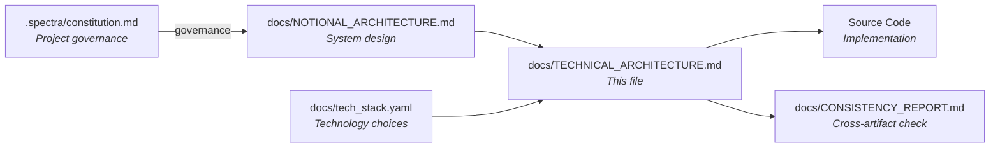

# Technical Architecture — LEGO Builder Web App

> **This document describes HOW the system is implemented with specific technologies.**
>
> For system design (technology-agnostic), see `docs/NOTIONAL_ARCHITECTURE.md`.
> For technology choices reference, see `docs/tech_stack.yaml`.

---

## Document Relationships



| Document | Focus | Changes When |
|----------|-------|--------------|
| `.spectra/constitution.md` | Project governance | Team norms or governance depth change |
| `docs/NOTIONAL_ARCHITECTURE.md` | System design | Component structure changes |
| `docs/tech_stack.yaml` | Technology mapping | Framework/version evolves |
| `docs/TECHNICAL_ARCHITECTURE.md` | Implementation (this file) | Tech implementation changes |
| `docs/CONSISTENCY_REPORT.md` | Cross-artifact consistency | After this file is finalized |

---

## 1. Technology Stack Summary

| Layer | Technology | Version |
|-------|------------|---------|
| **Frontend Framework** | React | 18.x |
| **Language** | TypeScript | 5.x |
| **Build Tool** | Vite | 5.x |
| **3D Rendering** | React Three Fiber + Three.js | 8.x + 0.165.x |
| **3D Helpers** | @react-three/drei | 9.x |
| **State Management** | Zustand | 4.x |
| **UI Styling** | Tailwind CSS | 3.x |
| **Browser Storage** | LocalForage | 1.10.x |
| **Package Manager** | pnpm | 8.x |
| **Unit/Component Tests** | Vitest + React Testing Library | 1.x + 14.x |
| **E2E Tests** | Playwright | 1.x |
| **Linting** | ESLint + Prettier | 8.x + 3.x |
| **Container** | Docker (multi-stage: node + nginx) | 20-alpine + nginx:alpine |
| **CI/CD** | GitHub Actions | — |
| **Hosting** | Vercel / Netlify (static CDN) | — |
| **Backend** | None (client-only MVP) | — |
| **LLM/AI** | None (no AI features in MVP) | — |

---

## 2. Frontend Implementation

### 2.1 Framework & Project Structure

**Framework:** React 18 + TypeScript 5 + Vite 5

```text
src/
├── main.tsx                    # Vite entry point — mounts <App />
├── App.tsx                     # Root component: layout shell + providers
├── components/
│   ├── Scene3D/
│   │   ├── Scene3D.tsx         # R3F <Canvas> + lighting + grid + OrbitControls
│   │   ├── BrickMesh.tsx       # Individual brick mesh (used by InstancedBricks)
│   │   ├── InstancedBricks.tsx # InstancedMesh renderer per brick type (FR-PERF-001)
│   │   ├── GridPlane.tsx       # Clickable ground grid plane
│   │   └── GhostBrick.tsx      # Preview brick following cursor
│   ├── Toolbar/
│   │   ├── Toolbar.tsx         # Place/Delete tool buttons
│   │   └── ToolButton.tsx      # Individual tool button with active state
│   ├── BrickPalette/
│   │   ├── BrickPalette.tsx    # Color swatches (FR-BRICK-002)
│   │   └── ColorSwatch.tsx     # Individual color swatch with tooltip
│   ├── BrickTypeSelector/
│   │   ├── BrickTypeSelector.tsx # Brick type options (FR-BRICK-003)
│   │   └── BrickTypeOption.tsx   # Individual type option with preview
│   └── ActionBar/
│       ├── ActionBar.tsx       # Save/Load/Export/Import buttons
│       └── Notification.tsx    # Success/error notification display
├── store/
│   ├── useBrickStore.ts    # Zustand store: bricks, activeTool, activeColor, activeBrickType
│   └── types.ts            # Brick, BrickType, Color, Tool TypeScript types
├── domain/
│   ├── brickCatalog.ts     # Brick type definitions + footprints
│   ├── colorPalette.ts     # LEGO color definitions
│   └── gridRules.ts        # snapToGrid(), getOccupiedCells(), isCellOccupied()
├── services/
│   ├── persistenceService.ts  # LocalForage save/load
│   └── exportService.ts       # JSON export/import + validation
├── hooks/
│   ├── useGridInteraction.ts  # Canvas pointer event → grid coordinate mapping
│   └── useKeyboardShortcuts.ts # R key for rotate, keyboard tool switching
├── tests/
│   ├── unit/               # Vitest unit tests (store actions, domain functions)
│   ├── behavioral/         # Vitest behavioral tests (full app, no mocks)
│   └── e2e/                # Playwright E2E tests
├── index.html              # Vite HTML entry
├── vite.config.ts
├── tsconfig.json
├── tailwind.config.ts
└── package.json
```

### 2.2 Zustand Store Schema

```typescript
// src/store/types.ts
export type BrickType = '1x1' | '1x2' | '2x2' | '2x4';
export type Tool = 'place' | 'delete';

export interface BrickColor {
  id: string;           // e.g., 'bright-red'
  name: string;         // e.g., 'Bright Red'
  hex: string;          // e.g., '#C91A09'
}

export interface Brick {
  id: string;           // uuid
  x: number;            // grid X (integer)
  y: number;            // grid Y (always 0 for MVP — CLR-01)
  z: number;            // grid Z (integer)
  type: BrickType;
  colorId: string;      // references BrickColor.id
  rotation: number;     // 0 | 90 | 180 | 270 (degrees around Y-axis)
}

export interface BrickStore {
  // State
  bricks: Brick[];
  activeTool: Tool;           // default: 'place' (FR-TOOL-001)
  activeColorId: string;      // default: 'bright-red' (US-1)
  activeBrickType: BrickType; // default: '1x1'
  notification: string | null;

  // Actions
  placeBrick: (x: number, y: number, z: number) => void;
  deleteBrick: (id: string) => void;
  deleteBrickAtPosition: (x: number, y: number, z: number) => void;
  rotateBrick: (id: string) => void;
  setActiveTool: (tool: Tool) => void;
  setActiveColor: (colorId: string) => void;
  setActiveBrickType: (type: BrickType) => void;
  setBricks: (bricks: Brick[]) => void;  // used by load/import
  setNotification: (msg: string | null) => void;
}
```

### 2.3 Key Component Implementations

#### Scene3D.tsx — R3F Canvas Root

```typescript
// src/components/Scene3D/Scene3D.tsx
import { Canvas } from '@react-three/fiber';
import { OrbitControls, Grid } from '@react-three/drei';
import { InstancedBricks } from './InstancedBricks';
import { GridPlane } from './GridPlane';

export function Scene3D() {
  return (
    <Canvas
      camera={{ position: [10, 10, 10], fov: 50 }}
      gl={{ antialias: true }}
      shadows
    >
      <ambientLight intensity={0.6} />
      <directionalLight position={[10, 20, 10]} intensity={0.8} castShadow />
      <Grid args={[20, 20]} cellColor="#888" sectionColor="#444" />
      <GridPlane />        {/* Invisible clickable plane for brick placement */}
      <InstancedBricks /> {/* Renders all placed bricks via InstancedMesh */}
      <OrbitControls
        mouseButtons={{
          LEFT: undefined,   // LEFT reserved for brick placement (see gotcha below)
          MIDDLE: 1,         // MIDDLE = dolly/zoom
          RIGHT: 2,          // RIGHT = pan
        }}
        enableDamping
      />
    </Canvas>
  );
}
```

#### InstancedBricks.tsx — FR-PERF-001

```typescript
// src/components/Scene3D/InstancedBricks.tsx
import { useRef, useEffect } from 'react';
import { useThree } from '@react-three/fiber';
import * as THREE from 'three';
import { useBrickStore } from '../../store/useBrickStore';
import { BRICK_CATALOG } from '../../domain/brickCatalog';
import { LEGO_COLORS } from '../../domain/colorPalette';

// One InstancedMesh per brick type. Each instance = one placed brick.
export function InstancedBricks() {
  const bricks = useBrickStore(state => state.bricks);

  // Group bricks by type
  const byType = Object.groupBy(bricks, b => b.type);

  return (
    <>
      {Object.entries(BRICK_CATALOG).map(([type, def]) => (
        <InstancedBrickType
          key={type}
          brickType={type as BrickType}
          bricks={byType[type] ?? []}
          geometry={def.geometry}
        />
      ))}
    </>
  );
}

function InstancedBrickType({ brickType, bricks, geometry }) {
  const meshRef = useRef<THREE.InstancedMesh>(null);

  useEffect(() => {
    if (!meshRef.current) return;
    const mesh = meshRef.current;
    const matrix = new THREE.Matrix4();
    const color = new THREE.Color();

    bricks.forEach((brick, i) => {
      // Position matrix
      matrix.makeTranslation(brick.x, brick.y + 0.5, brick.z);
      matrix.multiply(new THREE.Matrix4().makeRotationY(
        (brick.rotation * Math.PI) / 180
      ));
      mesh.setMatrixAt(i, matrix);

      // Per-instance color (requires instanceColor buffer)
      const legoColor = LEGO_COLORS.find(c => c.id === brick.colorId);
      color.set(legoColor?.hex ?? '#FF0000');
      mesh.setColorAt(i, color);
    });

    mesh.instanceMatrix.needsUpdate = true;
    if (mesh.instanceColor) mesh.instanceColor.needsUpdate = true;
  }, [bricks]);

  return (
    <instancedMesh
      ref={meshRef}
      args={[geometry, undefined, Math.max(bricks.length, 1)]}
    >
      <meshStandardMaterial vertexColors />
    </instancedMesh>
  );
}
```

### 2.4 Domain Layer Implementations

#### brickCatalog.ts

```typescript
// src/domain/brickCatalog.ts
import * as THREE from 'three';

export interface BrickDefinition {
  type: BrickType;
  label: string;
  width: number;   // grid units (X)
  depth: number;   // grid units (Z)
  height: number;  // grid units (Y) — always 1 for MVP
  geometry: THREE.BoxGeometry;
}

export const BRICK_CATALOG: Record<BrickType, BrickDefinition> = {
  '1x1': { type: '1x1', label: '1×1', width: 1, depth: 1, height: 1,
            geometry: new THREE.BoxGeometry(0.95, 0.95, 0.95) },
  '1x2': { type: '1x2', label: '1×2', width: 1, depth: 2, height: 1,
            geometry: new THREE.BoxGeometry(0.95, 0.95, 1.95) },
  '2x2': { type: '2x2', label: '2×2', width: 2, depth: 2, height: 1,
            geometry: new THREE.BoxGeometry(1.95, 0.95, 1.95) },
  '2x4': { type: '2x4', label: '2×4', width: 2, depth: 4, height: 1,
            geometry: new THREE.BoxGeometry(1.95, 0.95, 3.95) },
};
```

#### gridRules.ts

```typescript
// src/domain/gridRules.ts
import { Brick, BrickType } from '../store/types';
import { BRICK_CATALOG } from './brickCatalog';

/** Snap world coordinate to nearest integer grid unit */
export function snapToGrid(worldPos: THREE.Vector3): { x: number; z: number } {
  return {
    x: Math.round(worldPos.x),
    z: Math.round(worldPos.z),
  };
}

/** Get all grid cells occupied by a brick at (x, z) with given type and rotation */
export function getOccupiedCells(
  x: number, z: number,
  type: BrickType,
  rotation: number
): Array<{ x: number; z: number }> {
  const def = BRICK_CATALOG[type];
  const cells: Array<{ x: number; z: number }> = [];
  // Swap width/depth for 90°/270° rotations
  const [w, d] = (rotation === 90 || rotation === 270)
    ? [def.depth, def.width]
    : [def.width, def.depth];
  for (let dx = 0; dx < w; dx++) {
    for (let dz = 0; dz < d; dz++) {
      cells.push({ x: x + dx, z: z + dz });
    }
  }
  return cells;
}

/** Check if any of the given cells are occupied by existing bricks */
export function isCellOccupied(
  cells: Array<{ x: number; z: number }>,
  existingBricks: Brick[]
): boolean {
  const occupied = new Set(
    existingBricks.flatMap(b =>
      getOccupiedCells(b.x, b.z, b.type, b.rotation)
        .map(c => `${c.x},${c.z}`)
    )
  );
  return cells.some(c => occupied.has(`${c.x},${c.z}`));
}
```

#### colorPalette.ts

```typescript
// src/domain/colorPalette.ts
export interface LegoColor {
  id: string;
  name: string;  // Official LEGO color name
  hex: string;
}

export const LEGO_COLORS: LegoColor[] = [
  { id: 'bright-red',      name: 'Bright Red',      hex: '#C91A09' },
  { id: 'bright-blue',     name: 'Bright Blue',     hex: '#006CB7' },
  { id: 'bright-yellow',   name: 'Bright Yellow',   hex: '#FFD700' },
  { id: 'bright-green',    name: 'Bright Green',    hex: '#4B9F4A' },
  { id: 'white',           name: 'White',           hex: '#FFFFFF' },
  { id: 'black',           name: 'Black',           hex: '#1B2A34' },
  { id: 'reddish-brown',   name: 'Reddish Brown',   hex: '#82422A' },
  { id: 'dark-bluish-gray',name: 'Dark Bluish Gray',hex: '#6C6E68' },
  { id: 'light-bluish-gray',name:'Light Bluish Gray',hex:'#AFB5C7' },
  { id: 'bright-orange',   name: 'Bright Orange',   hex: '#FE8A18' },
  { id: 'medium-blue',     name: 'Medium Blue',     hex: '#5A93DB' },
  { id: 'sand-green',      name: 'Sand Green',      hex: '#A0BCAC' },
];
```

### 2.5 Persistence Service

```typescript
// src/services/persistenceService.ts
import localforage from 'localforage';
import { Brick } from '../store/types';

const STORAGE_KEY = 'lego-builder-model';
const SCHEMA_VERSION = '1.0.0';

interface PersistedModel {
  version: string;
  savedAt: string;
  bricks: Brick[];
}

export async function saveModel(bricks: Brick[]): Promise<void> {
  const model: PersistedModel = {
    version: SCHEMA_VERSION,
    savedAt: new Date().toISOString(),
    bricks,
  };
  await localforage.setItem(STORAGE_KEY, model);
}

export async function loadModel(): Promise<Brick[] | null> {
  const model = await localforage.getItem<PersistedModel>(STORAGE_KEY);
  if (!model) return null;
  return model.bricks;
}
```

### 2.6 Export Service

```typescript
// src/services/exportService.ts
import { Brick } from '../store/types';

const EXPORT_VERSION = '1.0.0';

interface ExportedModel {
  version: string;
  exportedAt: string;
  bricks: Brick[];
}

export function exportModelJSON(bricks: Brick[]): void {
  const model: ExportedModel = {
    version: EXPORT_VERSION,
    exportedAt: new Date().toISOString(),
    bricks,
  };
  const json = JSON.stringify(model, null, 2);
  const blob = new Blob([json], { type: 'application/json' });
  const url = URL.createObjectURL(blob);
  const a = document.createElement('a');
  a.href = url;
  a.download = 'lego-model.json';
  a.click();
  URL.revokeObjectURL(url);
}

export function importModelJSON(jsonString: string): Brick[] {
  let parsed: unknown;
  try {
    parsed = JSON.parse(jsonString);
  } catch {
    throw new Error('Invalid JSON: file could not be parsed');
  }
  if (
    typeof parsed !== 'object' || parsed === null ||
    !('version' in parsed) || !('bricks' in parsed) ||
    !Array.isArray((parsed as ExportedModel).bricks)
  ) {
    throw new Error('Invalid model format: missing version or bricks fields');
  }
  return (parsed as ExportedModel).bricks;
}
```

---

## 3. Framework Runtime Contracts

> **MANDATORY per spec-architecture skill.** Documents the specific event model, framework responsibilities, known gotchas, and runtime data type contracts for React Three Fiber + Three.js.

### 3.1 Event Propagation Model

This project uses two distinct event systems that must not be confused:

| Layer | Event Type | Data Available at Runtime | Example Usage |
|-------|-----------|--------------------------|---------------|
| **DOM (HTML elements)** | `PointerEvent`, `MouseEvent`, `KeyboardEvent` | `clientX`, `clientY`, `target`, `key` | `<button onClick>`, `<canvas onPointerDown>` (DOM level) |
| **R3F (3D meshes)** | `ThreeEvent` (R3F intersection event) | `point: Vector3`, `face: Face`, `distance: number`, `object: Object3D`, `nativeEvent: PointerEvent` | `<mesh onPointerDown>`, `<mesh onClick>` |
| **Canvas DOM** | `PointerEvent` (DOM, not R3F) | `offsetX`, `offsetY` — **NO `.point`, NO `.face`** | `<Canvas onPointerDown>` at the canvas element level |

**Critical distinction:**
- `<mesh onPointerDown={e => e.point}>` — R3F event, `.point` is a `THREE.Vector3` world position ✅
- `<Canvas onPointerDown={e => e.point}>` — DOM event, `.point` is `undefined` ❌

**How R3F raycasting works:**
1. R3F creates a `THREE.Raycaster` internally.
2. When a mesh has `onPointer*` handlers, R3F registers it for raycasting.
3. On each pointer event, R3F casts a ray from the camera through the pointer position.
4. Intersected meshes receive `ThreeEvent` with `.point` (world position of intersection).
5. The `GridPlane` mesh uses this to get the world position of the click for grid snapping.

**Event attachment for brick placement:**
```typescript
// CORRECT: Attach to the GridPlane mesh (R3F event — has .point)
<mesh onPointerDown={(e: ThreeEvent<PointerEvent>) => {
  e.stopPropagation();
  const snapped = snapToGrid(e.point); // e.point is THREE.Vector3
  store.placeBrick(snapped.x, 0, snapped.z);
}}>

// WRONG: Attach to <Canvas> (DOM event — no .point)
<Canvas onPointerDown={(e) => {
  // e.point is undefined here!
}}>
```

### 3.2 Framework-Managed vs App-Managed Responsibilities

| Responsibility | R3F/Three.js Manages | App Must Manage |
|---------------|---------------------|------------------|
| **Raycasting** | R3F creates raycaster; fires ThreeEvent on meshes with `onPointer*` | App attaches handlers to the correct meshes (GridPlane, brick meshes) |
| **Camera controls** | OrbitControls handles mouse input for orbit/zoom/pan | App configures which mouse buttons are reserved (LEFT for placement) |
| **Render loop** | R3F manages `requestAnimationFrame` loop | App manages scene graph via JSX; R3F re-renders when state changes |
| **InstancedMesh matrices** | Three.js renders instances from matrix buffer | App updates `instanceMatrix` and `instanceColor` buffers on brick add/remove |
| **WebGL context** | R3F creates and manages the WebGL context | App handles context loss events if needed |
| **Geometry disposal** | NOT managed — Three.js does NOT auto-dispose | App must call `geometry.dispose()` and `material.dispose()` on unmount |

### 3.3 Known Gotchas and Interaction Conflicts

| Gotcha | Description | Resolution |
|--------|-------------|------------|
| **OrbitControls LEFT mouse conflict** | OrbitControls consumes the LEFT mouse button for orbit by default. This conflicts with click-to-place brick interactions. | Set `mouseButtons={{ LEFT: undefined }}` on `<OrbitControls>` to free LEFT for brick placement. Use MIDDLE for dolly, RIGHT for pan. |
| **R3F elements are not DOM elements** | `<mesh>`, `<instancedMesh>`, `<ambientLight>` etc. are Three.js objects, not HTML elements. HTML attributes like `data-testid`, `className`, `style`, `aria-*` do NOT work on them. | Use DOM elements (`<div>`, `<button>`) for all UI controls. Only use R3F elements for 3D scene objects. For testing, inspect the Three.js scene graph directly. |
| **InstancedMesh requires instanceColor buffer** | `InstancedMesh` does not have per-instance color by default. Using `material.vertexColors = true` without an `instanceColor` buffer causes a WebGL error. | Call `mesh.setColorAt(i, color)` which auto-creates the `instanceColor` buffer. Set `mesh.instanceColor.needsUpdate = true` after updates. |
| **InstancedMesh count is fixed at creation** | The `count` argument to `InstancedMesh` is fixed. Adding more instances than `count` silently fails. | Set `count = Math.max(bricks.length, 1)` and recreate the mesh when brick count exceeds capacity, or pre-allocate a large count (e.g., 1000). |
| **`<Canvas>` pointer events are DOM events** | `<Canvas onPointerDown>` fires a DOM `PointerEvent`, not an R3F `ThreeEvent`. It has no `.point`, `.face`, or `.distance`. | Attach placement handlers to the `<GridPlane>` mesh (R3F event), not to `<Canvas>`. |
| **Zustand store updates trigger R3F re-render** | R3F re-renders the scene on every Zustand state change. Frequent updates (e.g., ghost brick following cursor) can cause performance issues. | Use `useRef` for transient state (ghost brick position). Only commit to Zustand on final placement. |
| **Three.js geometry is not serializable** | `THREE.BoxGeometry` instances cannot be JSON-serialized. The `BRICK_CATALOG` geometries are module-level singletons. | Store only `BrickType` strings in the Zustand store and LocalForage. Reconstruct geometry from `BRICK_CATALOG` at render time. |

### 3.4 Runtime Data Type Contracts

For each inter-module boundary, the actual runtime data type (not just TypeScript type):

```text
GridPlane onPointerDown  → R3F ThreeEvent<PointerEvent>
                            { point: THREE.Vector3,    ← world position of click
                              face: THREE.Face | null,
                              distance: number,
                              object: THREE.Mesh,
                              nativeEvent: PointerEvent }

Brick mesh onPointerDown → R3F ThreeEvent<PointerEvent>
                            { point: THREE.Vector3,    ← world position on brick surface
                              object: THREE.InstancedMesh,
                              instanceId: number | undefined }  ← which instance was clicked

Zustand store.bricks     → Brick[]  (plain JS objects, no Three.js types)
                            Each Brick: { id: string, x: number, y: 0, z: number,
                                          type: BrickType, colorId: string, rotation: 0|90|180|270 }

LocalForage.getItem()    → PersistedModel | null
                            { version: string, savedAt: string, bricks: Brick[] }

FileReader.readAsText()  → string (raw JSON)
                            Parsed to ExportedModel: { version: string, exportedAt: string, bricks: Brick[] }

snapToGrid(e.point)      → { x: number, z: number }  (integers, Y always 0)

getOccupiedCells()       → Array<{ x: number, z: number }>  (all cells blocked by brick)

isCellOccupied()         → boolean  (true = placement rejected)
```

---

## 4. Component Integration Map

> **MANDATORY per spec-architecture skill.** Defines how features compose into the app shell. This is the integration contract for downstream Design and Coding agents.

### 4.1 Frontend Component Tree

```text
<App>                                    ← Root: layout shell + Zustand provider
  <div class="app-layout">              ← CSS Grid: sidebar | canvas
    <aside class="sidebar">             ← DOM sidebar (all UI controls)
      <Toolbar />                       ← FR-TOOL-001, FR-TOOL-002 [STUB]
      <BrickTypeSelector />             ← FR-BRICK-003 [STUB]
      <BrickPalette />                  ← FR-BRICK-002 [STUB]
      <ActionBar />                     ← FR-PERS-001, FR-PERS-002, FR-SHARE-001 [STUB]
    </aside>
    <main class="canvas-container">     ← R3F canvas area
      <Scene3D>                         ← FR-SCENE-001 [STUB]
        <Canvas>                        ← R3F Canvas (WebGL context)
          <ambientLight />
          <directionalLight />
          <Grid />                      ← @react-three/drei Grid helper
          <GridPlane />                 ← FR-BRICK-001 click target [STUB]
          <InstancedBricks />           ← FR-PERF-001 instanced rendering [STUB]
          <GhostBrick />                ← FR-BRICK-001 placement preview [STUB]
          <OrbitControls />             ← FR-SCENE-001 camera controls
        </Canvas>
      </Scene3D>
    </main>
    <Notification />                    ← FR-PERS-001 success/error feedback [STUB]
  </div>
</App>
```

### 4.2 Stub Replacement Table

Every scaffold stub component is documented with its file path, the FR-ID that will replace it, and the expected replacement component name:

| Stub File | FR-ID | Replacement Component | Description |
|-----------|-------|----------------------|-------------|
| `src/components/Scene3D/Scene3D.tsx` | FR-SCENE-001 | `Scene3D` | R3F Canvas with lighting, grid, OrbitControls |
| `src/components/Scene3D/GridPlane.tsx` | FR-BRICK-001 | `GridPlane` | Clickable invisible plane for brick placement |
| `src/components/Scene3D/InstancedBricks.tsx` | FR-PERF-001 | `InstancedBricks` | InstancedMesh renderer per brick type |
| `src/components/Scene3D/GhostBrick.tsx` | FR-BRICK-001 | `GhostBrick` | Semi-transparent preview brick following cursor |
| `src/components/Toolbar/Toolbar.tsx` | FR-TOOL-001, FR-TOOL-002 | `Toolbar` | Place/Delete tool buttons with active state |
| `src/components/BrickPalette/BrickPalette.tsx` | FR-BRICK-002 | `BrickPalette` | Color swatches with LEGO names and tooltips |
| `src/components/BrickTypeSelector/BrickTypeSelector.tsx` | FR-BRICK-003 | `BrickTypeSelector` | Brick type options with preview |
| `src/components/ActionBar/ActionBar.tsx` | FR-PERS-001, FR-PERS-002, FR-SHARE-001 | `ActionBar` | Save/Load/Export/Import buttons |
| `src/components/ActionBar/Notification.tsx` | FR-PERS-001 | `Notification` | Success/error notification display |
| `src/store/useBrickStore.ts` | All FRs | `useBrickStore` | Zustand store with all brick state and actions |
| `src/domain/brickCatalog.ts` | FR-BRICK-003 | `BRICK_CATALOG` | Brick type definitions and geometries |
| `src/domain/colorPalette.ts` | FR-BRICK-002 | `LEGO_COLORS` | LEGO color definitions |
| `src/domain/gridRules.ts` | FR-BRICK-001 | `snapToGrid`, `getOccupiedCells`, `isCellOccupied` | Grid snapping and occupancy logic |
| `src/services/persistenceService.ts` | FR-PERS-001, FR-PERS-002 | `saveModel`, `loadModel` | LocalForage persistence |
| `src/services/exportService.ts` | FR-SHARE-001 | `exportModelJSON`, `importModelJSON` | JSON export/import |
| `src/hooks/useGridInteraction.ts` | FR-BRICK-001, FR-TOOL-003 | `useGridInteraction` | Canvas pointer → grid coordinate mapping |
| `src/hooks/useKeyboardShortcuts.ts` | FR-TOOL-003 | `useKeyboardShortcuts` | R key for rotate, keyboard tool switching |

### 4.3 Route Table

> This is a single-page application with no client-side routing. There is one route: `/` (the builder).

| Path | Component | Description |
|------|-----------|-------------|
| `/` | `<App />` | The LEGO builder (only route in MVP) |

### 4.4 State Provider Hierarchy

```text
<App>
  └── Zustand store (useBrickStore)   ← No provider needed — Zustand is global
      └── All components subscribe via useBrickStore(selector)
```

> Zustand does not require a React context provider. Components subscribe directly via `useBrickStore(selector)`.

---

## 5. Testing Implementation

### 5.1 Test Framework Configuration

```typescript
// vite.config.ts (test section)
export default defineConfig({
  test: {
    environment: 'jsdom',
    globals: true,
    setupFiles: ['./src/tests/setup.ts'],
    coverage: {
      provider: 'v8',
      threshold: { lines: 70, functions: 70, branches: 70 },
    },
  },
});
```

```typescript
// src/tests/setup.ts
import '@testing-library/jest-dom';
import { vi } from 'vitest';

// Mock WebGL for unit tests (Three.js requires WebGL)
Object.defineProperty(HTMLCanvasElement.prototype, 'getContext', {
  value: vi.fn(() => ({
    // Minimal WebGL mock
    getExtension: vi.fn(),
    getParameter: vi.fn(),
    createBuffer: vi.fn(),
    // ... other WebGL methods
  })),
});

// Mock LocalForage for unit tests
vi.mock('localforage', () => ({
  default: {
    setItem: vi.fn().mockResolvedValue(undefined),
    getItem: vi.fn().mockResolvedValue(null),
  },
}));
```

### 5.2 Unit Test Pattern (Store Actions)

```typescript
// src/tests/unit/useBrickStore.test.ts
import { describe, it, expect, beforeEach } from 'vitest';
import { useBrickStore } from '../../store/useBrickStore';

describe('useBrickStore', () => {
  beforeEach(() => {
    useBrickStore.setState({ bricks: [], activeTool: 'place',
      activeColorId: 'bright-red', activeBrickType: '1x1' });
  });

  it('T-FE-BRICK-001-01: placeBrick adds brick to store', () => {
    useBrickStore.getState().placeBrick(2, 0, 3);
    const { bricks } = useBrickStore.getState();
    expect(bricks).toHaveLength(1);
    expect(bricks[0]).toMatchObject({ x: 2, y: 0, z: 3, type: '1x1' });
  });

  it('T-FE-BRICK-001-02: duplicate placement is rejected', () => {
    useBrickStore.getState().placeBrick(2, 0, 3);
    useBrickStore.getState().placeBrick(2, 0, 3);
    expect(useBrickStore.getState().bricks).toHaveLength(1);
  });

  it('T-FE-TOOL-001-01: activeTool defaults to place', () => {
    expect(useBrickStore.getState().activeTool).toBe('place');
  });
});
```

### 5.3 Behavioral Test Pattern (Full App, No Mocks)

```typescript
// src/tests/behavioral/brickPlacement.behavioral.test.tsx
import { describe, it, expect } from 'vitest';
import { render } from '@testing-library/react';
import { App } from '../../App';
import { useBrickStore } from '../../store/useBrickStore';

// T-FE-BRICK-001-04: Behavioral — no mocked stores or hooks
describe('Brick Placement Behavioral', () => {
  it('clicking grid in Place mode adds brick to scene graph', async () => {
    const { container } = render(<App />);
    // Reset store to clean state
    useBrickStore.setState({ bricks: [], activeTool: 'place' });

    // Simulate pointer-down on the canvas at grid coordinates
    const canvas = container.querySelector('canvas')!;
    canvas.dispatchEvent(new PointerEvent('pointerdown', {
      bubbles: true, clientX: 400, clientY: 300
    }));

    // Verify brick was added to store (scene graph reflects store)
    const { bricks } = useBrickStore.getState();
    expect(bricks.length).toBeGreaterThan(0);
  });
});
```

### 5.4 E2E Test Pattern (Playwright)

```typescript
// src/tests/e2e/happyPath.spec.ts
import { test, expect } from '@playwright/test';

test('T-E2E-HAPPY-001-01: full first-time build flow', async ({ page }) => {
  await page.goto('/');

  // Wait for canvas to be ready
  await page.waitForSelector('canvas');

  // Select Bright Blue color
  await page.click('[data-testid="color-swatch-bright-blue"]');

  // Select 1x2 brick type
  await page.click('[data-testid="brick-type-1x2"]');

  // Click on canvas to place brick
  const canvas = page.locator('canvas');
  await canvas.click({ position: { x: 400, y: 300 } });

  // Take screenshot and compare
  await expect(page).toHaveScreenshot('brick-placed.png');

  // Click Save
  await page.click('[data-testid="btn-save"]');

  // Verify success notification
  await expect(page.locator('[data-testid="notification"]')).toContainText('saved');
});
```

---

## 6. Infrastructure Configuration

### 6.1 Dockerfile (Multi-Stage)

```dockerfile
# Dockerfile
# Stage 1: Build
FROM node:20-alpine AS builder
WORKDIR /app

# Install pnpm
RUN corepack enable && corepack prepare pnpm@8 --activate

# Install dependencies
COPY package.json pnpm-lock.yaml ./
RUN pnpm install --frozen-lockfile

# Build production bundle
COPY . .
RUN pnpm build

# Stage 2: Production (nginx serving static files)
FROM nginx:alpine AS production
COPY --from=builder /app/dist /usr/share/nginx/html
COPY nginx.conf /etc/nginx/conf.d/default.conf
EXPOSE 80
CMD ["nginx", "-g", "daemon off;"]
```

```nginx
# nginx.conf
server {
    listen 80;
    root /usr/share/nginx/html;
    index index.html;

    # SPA fallback: all routes serve index.html
    location / {
        try_files $uri $uri/ /index.html;
    }

    # Cache static assets
    location ~* \.(js|css|png|jpg|svg|woff2)$ {
        expires 1y;
        add_header Cache-Control "public, immutable";
    }
}
```

### 6.2 Docker Compose (Local Dev)

```yaml
# docker-compose.yml
version: '3.8'
services:
  app:
    build:
      context: .
      target: builder  # Use build stage for dev (hot reload)
    ports:
      - "5173:5173"    # Vite dev server port
    volumes:
      - .:/app
      - /app/node_modules  # Prevent host node_modules override
    command: pnpm dev --host 0.0.0.0
    environment:
      - NODE_ENV=development
```

### 6.3 Environment Variables

| Variable | Purpose | Example |
|----------|---------|--------|
| `NODE_ENV` | Build mode | `development` / `production` |
| `VITE_APP_VERSION` | App version for schema versioning | `1.0.0` |

> No secrets required. Client-only app with no API keys or backend credentials.

---

## 7. CI/CD Pipeline

```yaml
# .github/workflows/ci.yml
name: CI
on:
  push:
    branches: [main]
  pull_request:
    branches: [main]

jobs:
  lint-and-test:
    runs-on: ubuntu-latest
    steps:
      - uses: actions/checkout@v4
      - uses: pnpm/action-setup@v3
        with: { version: 8 }
      - uses: actions/setup-node@v4
        with: { node-version: '20', cache: 'pnpm' }
      - run: pnpm install --frozen-lockfile
      - run: pnpm lint
      - run: pnpm typecheck
      - run: pnpm test --coverage
      - run: pnpm build

  e2e:
    runs-on: ubuntu-latest
    needs: lint-and-test
    steps:
      - uses: actions/checkout@v4
      - uses: pnpm/action-setup@v3
        with: { version: 8 }
      - uses: actions/setup-node@v4
        with: { node-version: '20', cache: 'pnpm' }
      - run: pnpm install --frozen-lockfile
      - run: pnpm exec playwright install --with-deps chromium
      - run: pnpm build
      - run: pnpm exec playwright test
      - uses: actions/upload-artifact@v4
        if: failure()
        with:
          name: playwright-report
          path: playwright-report/
```

---

## 8. Observability Implementation

### 8.1 Client-Side Error Monitoring

```typescript
// src/main.tsx — global error handler
window.addEventListener('error', (event) => {
  console.error('[LEGO Builder] Uncaught error:', event.error);
  // Future: send to Sentry
});

window.addEventListener('unhandledrejection', (event) => {
  console.error('[LEGO Builder] Unhandled promise rejection:', event.reason);
});
```

### 8.2 Performance Monitoring

```typescript
// FPS measurement for NFR-PERF-001 (used in Playwright tests)
export function measureFPS(durationMs: number): Promise<number> {
  return new Promise((resolve) => {
    let frames = 0;
    const start = performance.now();
    function tick() {
      frames++;
      if (performance.now() - start < durationMs) {
        requestAnimationFrame(tick);
      } else {
        resolve(frames / (durationMs / 1000));
      }
    }
    requestAnimationFrame(tick);
  });
}
```

### 8.3 WebGL Error Detection

```typescript
// Expose app state for E2E tests (KR-1.3: zero WebGL errors)
// src/main.tsx
declare global {
  interface Window {
    __legoBuilderErrors: string[];
  }
}
window.__legoBuilderErrors = [];

// Capture WebGL context errors
const originalConsoleError = console.error;
console.error = (...args) => {
  const msg = args.join(' ');
  if (msg.includes('WebGL') || msg.includes('THREE')) {
    window.__legoBuilderErrors.push(msg);
  }
  originalConsoleError(...args);
};
```

---

## 9. Security Implementation

### 9.1 Security Headers (nginx)

```nginx
# Add to nginx.conf server block
add_header Content-Security-Policy
  "default-src 'self'; script-src 'self' 'unsafe-eval'; style-src 'self' 'unsafe-inline'; worker-src blob:";
add_header X-Frame-Options "SAMEORIGIN";
add_header X-Content-Type-Options "nosniff";
add_header Referrer-Policy "strict-origin-when-cross-origin";
```

### 9.2 Import Validation (XSS Prevention)

```typescript
// src/services/exportService.ts — strict validation prevents XSS via JSON import
export function importModelJSON(jsonString: string): Brick[] {
  // ... parse and validate ...
  // Sanitize string fields to prevent XSS
  return bricks.map(brick => ({
    ...brick,
    id: String(brick.id).slice(0, 64),       // Limit ID length
    type: VALID_BRICK_TYPES.includes(brick.type) ? brick.type : '1x1',
    colorId: VALID_COLOR_IDS.includes(brick.colorId) ? brick.colorId : 'bright-red',
    rotation: [0, 90, 180, 270].includes(brick.rotation) ? brick.rotation : 0,
  }));
}
```

---

## 10. AI / Agentic Implementation

> **Not applicable.** The LEGO Builder MVP has no AI or agentic features. `agentic_workflows.enabled: false` in `docs/tech_stack.yaml`. See PRD §2b.

---

## 11. Deployment Configuration

### 11.1 Vercel Configuration

```json
// vercel.json
{
  "buildCommand": "pnpm build",
  "outputDirectory": "dist",
  "framework": "vite",
  "rewrites": [{ "source": "/(.*)", "destination": "/index.html" }]
}
```

### 11.2 Netlify Configuration

```toml
# netlify.toml
[build]
  command = "pnpm build"
  publish = "dist"

[[redirects]]
  from = "/*"
  to = "/index.html"
  status = 200
```

---

## 12. FR → Implementation Traceability

| FR ID | Component(s) | File(s) | Test IDs |
|-------|-------------|---------|----------|
| FR-SCENE-001 | Scene3D, OrbitControls, Grid | `src/components/Scene3D/Scene3D.tsx` | T-FE-SCENE-001-01, T-FE-SCENE-001-02, T-FE-SCENE-001-03 |
| FR-BRICK-001 | GridPlane, BrickPlacementEngine, gridRules | `src/components/Scene3D/GridPlane.tsx`, `src/domain/gridRules.ts` | T-FE-BRICK-001-01 through 04 |
| FR-BRICK-002 | BrickPalette, ColorSwatch, colorPalette | `src/components/BrickPalette/`, `src/domain/colorPalette.ts` | T-FE-BRICK-002-01 through 04 |
| FR-BRICK-003 | BrickTypeSelector, brickCatalog | `src/components/BrickTypeSelector/`, `src/domain/brickCatalog.ts` | T-FE-BRICK-003-01 through 04 |
| FR-TOOL-001 | Toolbar, useBrickStore (activeTool default) | `src/components/Toolbar/Toolbar.tsx`, `src/store/useBrickStore.ts` | T-FE-TOOL-001-01, T-FE-TOOL-001-02 |
| FR-TOOL-002 | Toolbar, useBrickStore (deleteBrick) | `src/components/Toolbar/Toolbar.tsx`, `src/store/useBrickStore.ts` | T-FE-TOOL-002-01 through 03 |
| FR-TOOL-003 | useKeyboardShortcuts, useBrickStore (rotateBrick) | `src/hooks/useKeyboardShortcuts.ts`, `src/store/useBrickStore.ts` | T-FE-TOOL-003-01 through 03 |
| FR-PERS-001 | ActionBar, persistenceService | `src/components/ActionBar/ActionBar.tsx`, `src/services/persistenceService.ts` | T-FE-PERS-001-01 through 04 |
| FR-PERS-002 | ActionBar, persistenceService | `src/components/ActionBar/ActionBar.tsx`, `src/services/persistenceService.ts` | T-FE-PERS-002-01 through 03 |
| FR-SHARE-001 | ActionBar, exportService | `src/components/ActionBar/ActionBar.tsx`, `src/services/exportService.ts` | T-FE-SHARE-001-01 through 04 |
| FR-PERF-001 | InstancedBricks, InstancedMesh | `src/components/Scene3D/InstancedBricks.tsx` | T-FE-PERF-001-01, T-FE-PERF-001-02 |

---

## Appendix: tech_stack.yaml Reference

See `docs/tech_stack.yaml` for the complete, machine-readable technology configuration including:
- All component technology mappings with FR coverage
- Version specifications and rationale
- Testing stack configuration
- Infrastructure and deployment configuration
- Spectra governance settings
