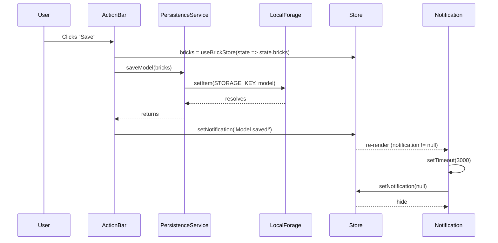
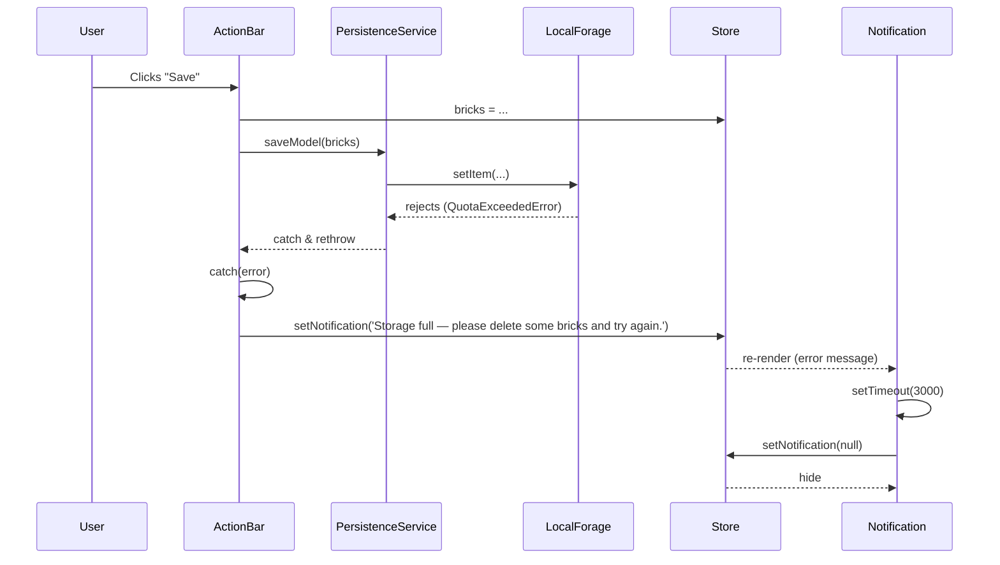

# Low-Level Design: FR-13 — Save Model to Browser Storage

## 1. Overview

- **FR-ID**: FR-13 (corresponds to FR-PERS-001)
- **Issue**: #13 — "[FR-PERS-001] Implement Save Model to Browser Storage (LocalForage) with Success/Error Notification"
- **Area**: frontend
- **Priority**: P0
- **Personas**: Casual Builder, AFOL

### 1.1 Scope

This LLD covers the implementation of the Save Model feature, which persists the current brick model to browser local storage via LocalForage. It includes:

- `persistenceService.saveModel()` — serializes brick data and stores it
- `ActionBar` Save button integration
- `Notification` component for success/error feedback
- Zustand store `setNotification` action
- Error handling for storage quota exceeded
- Performance requirement: ≤ 500ms for up to 1,000 bricks

### 1.2 Out of Scope

- Load Model (FR-PERS-002) — separate LLD
- Export/Import JSON (FR-SHARE-001)
- Auto-save or cloud sync

## 2. API Endpoints (Internal Service Interfaces)

Since this is a client-only SPA, there are no external HTTP APIs. The following internal module interfaces are defined:

### 2.1 Persistence Service

```typescript
// src/services/persistenceService.ts

export async function saveModel(bricks: Brick[]): Promise<void>

// Throws:
// - QuotaExceededError if storage is full
// - Other errors from localforage.setItem


export async function loadModel(): Promise<Brick[] | null>
```

**Parameters**:
- `bricks`: Array of `Brick` objects from the Zustand store.

**Returns**: `Promise<void>` (resolves on success, rejects on error).

**Behavior**:
- Serializes the brick array into a `PersistedModel` structure with `version`, `savedAt`, and `bricks`.
- Uses `localforage.setItem(STORAGE_KEY, model)`.
- Must complete within 500ms for up to 1,000 bricks (NFR-PERF-001 adjacent).

### 2.2 Zustand Store Actions

```typescript
// src/store/useBrickStore.ts
interface BrickStore {
  notification: string | null;
  setNotification: (msg: string | null) => void;
  // ... other state and actions
}
```

- `setNotification(msg: string | null)`: Sets the notification message. Used to display success or error feedback. The UI component auto-dismisses after 3 seconds by calling `setNotification(null)`.

## 3. Data Models

### 3.1 PersistedModel (LocalForage Storage Schema)

```typescript
interface PersistedModel {
  version: string;      // Schema version, e.g., '1.0.0'
  savedAt: string;      // ISO 8601 timestamp
  bricks: Brick[];      // Array of placed bricks
}
```

**Storage Key**: `'lego-builder-model'`

**Schema Version**: `'1.0.0'` (supports future migrations, prevents AG-2).

### 3.2 Brick (Runtime State)

```typescript
interface Brick {
  id: string;           // uuid
  x: number;            // grid X (integer)
  y: number;            // grid Y (always 0 for MVP — CLR-01)
  z: number;            // grid Z (integer)
  type: BrickType;      // '1x1' | '1x2' | '2x2' | '2x4'
  colorId: string;      // references LEGO_COLORS[id]
  rotation: number;     // 0 | 90 | 180 | 270 (degrees around Y-axis)
}
```

**Note**: The `Brick` type is defined in `src/store/types.ts`. The `y` coordinate is always 0 in MVP (flat grid).

## 4. Component Architecture

### 4.1 Component Tree & Interactions

```
<App>
  <div class="app-layout">
    <aside class="sidebar">
      <ActionBar />   ← Contains Save button
    </aside>
    <main class="canvas-container">
      <Scene3D>...</Scene3D>
    </main>
    <Notification />  ← Displays success/error messages
  </div>
</App>
```

### 4.2 Module Dependencies

- **ActionBar** (`src/components/ActionBar/ActionBar.tsx`):
  - Imports `saveModel` from `services/persistenceService`.
  - Imports `useBrickStore` to access `bricks` and `setNotification`.
  - Renders a button with `data-testid="btn-save"`.
  - On click: calls `saveModel(store.bricks)`.
    - On success: `store.setNotification('Model saved!')`.
    - On error (catch): `store.setNotification('Storage full — please delete some bricks and try again.')`.

- **Notification** (`src/components/ActionBar/Notification.tsx`):
  - Imports `useBrickStore` to read `notification`.
  - Renders a visible toast when `notification !== null`.
  - On mount (or when notification changes), sets a timeout to call `setNotification(null)` after 3 seconds.
  - Styled with fixed position and colored background for visibility.

- **persistenceService** (`src/services/persistenceService.ts`):
  - Already scaffolded with `saveModel` and `loadModel`.
  - Uses `localforage` library (already in `package.json`).
  - Defines `STORAGE_KEY = 'lego-builder-model'` and `SCHEMA_VERSION = '1.0.0'`.

- **Zustand Store** (`src/store/useBrickStore.ts`):
  - Already includes `notification: string | null` and `setNotification` in the schema (per TECH_ARCHITECTURE.md).

### 4.3 Stub Replacement Status

| Stub File | Status | Replacement Component |
|-----------|--------|----------------------|
| `src/components/ActionBar/ActionBar.tsx` | To be implemented | `ActionBar` with Save button |
| `src/components/ActionBar/Notification.tsx` | To be implemented | `Notification` toast |
| `src/services/persistenceService.ts` | Already scaffolded (verify complete) | `saveModel`, `loadModel` |

## 5. Sequence Diagrams

### 5.1 Successful Save Flow



### 5.2 Error Flow (Storage Full)



## 6. Error Handling Strategy

### 6.1 Error Types

- **QuotaExceededError**: Browser storage quota exceeded. Show user-friendly message: "Storage full — please delete some bricks and try again."
- **Other errors**: Generic error message: "Failed to save model. Please try again." (could be logged to console for debugging).

### 6.2 Implementation Pattern

```typescript
// Inside ActionBar onClick handler
const handleSave = async () => {
  try {
    await saveModel(store.bricks);
    store.setNotification('Model saved!');
  } catch (error) {
    if (error.name === 'QuotaExceededError') {
      store.setNotification('Storage full — please delete some bricks and try again.');
    } else {
      store.setNotification('Failed to save model. Please try again.');
      console.error('Save failed:', error);
    }
  }
};
```

### 6.3 Notification Auto-Dismiss

- The `Notification` component uses `useEffect` to set a 3-second timer when `notification` becomes non-null.
- After 3 seconds, it calls `store.setNotification(null)` to clear the message.
- If a new notification arrives before the timer fires, the timer should be reset (clear previous timeout).

## 7. Security Considerations

- **No sensitive data**: The saved model contains only brick positions, types, colors, and rotations. No personal or sensitive information.
- **Same-origin storage**: LocalForage uses IndexedDB/localStorage which is scoped to the origin (protocol + host + port). No cross-origin access.
- **No external network calls**: The save operation is entirely client-side; no data is transmitted to any server (NFR-SEC-001).
- **XSS**: Not directly relevant to save functionality. However, the import feature (FR-SHARE-001) includes JSON validation to prevent XSS via malicious JSON. The save operation only writes data, not executes code.
- **Data integrity**: The `PersistedModel` includes a `version` field to support future migrations and prevent AG-2 (storing data in an unmigratable format).

## 8. Performance Considerations

- **Time requirement**: Save must complete in ≤ 500ms for models up to 1,000 bricks (FR-PERS-001 acceptance criteria).
- **LocalForage performance**: Uses IndexedDB by default, which is asynchronous and fast enough for the expected data size. A 1,000-brick model is roughly ~100KB JSON, well within IndexedDB write speeds.
- **Serialization**: `JSON.stringify(model)` is used. This is synchronous but fast for the expected size (< 1ms for 100KB).
- **UI responsiveness**: The save operation is `async/await` and does not block the main thread. The notification appears after the promise resolves.
- **Testing**: Include a performance test (T-FE-PERS-001-02) that measures the time taken for `saveModel` with 1,000 bricks.

## 9. Implementation Notes

- The `persistenceService.ts` scaffold already defines `saveModel` and `loadModel`. Verify that the implementation matches this LLD (especially error handling and schema versioning).
- The Zustand store already includes `notification` and `setNotification` per TECH_ARCHITECTURE.md. No changes needed there.
- The `ActionBar` and `Notification` components are stubs; they need to be implemented according to the acceptance criteria in issue #13.
- The Save button must have `data-testid="btn-save"` for test automation.
- The Notification component should render a toast (e.g., fixed position, colored background) and auto-dismiss after 3 seconds.
- Ensure the `ActionBar` uses `async/await` with try/catch to handle errors from `saveModel`.

## 10. Test Coverage

Refer to the Test IDs listed in issue #13:

- T-FE-PERS-001-01: Unit — Save serializes all brick data
- T-FE-PERS-001-02: Integration — Save completes within 500ms for 1,000 bricks
- T-FE-PERS-001-03: Behavioral — Clicking Save shows success notification
- T-FE-PERS-001-04: Unit — Save shows error when storage is full

These tests will be implemented by the test agent and validated by the implementation agent.

## 11. Open Questions / Assumptions

- Assumption: LocalForage is already installed (`npm install localforage`). Confirm in `package.json`.
- Assumption: The `Brick` type matches the store definition exactly. If there are discrepancies, they must be resolved.
- The error message for storage full is as specified in the issue. If the user experience team prefers a different wording, it should be clarified.
- The notification duration (3 seconds) is taken from the issue description. This is a reasonable default but can be adjusted if needed.

---

*End of Low-Level Design Document*