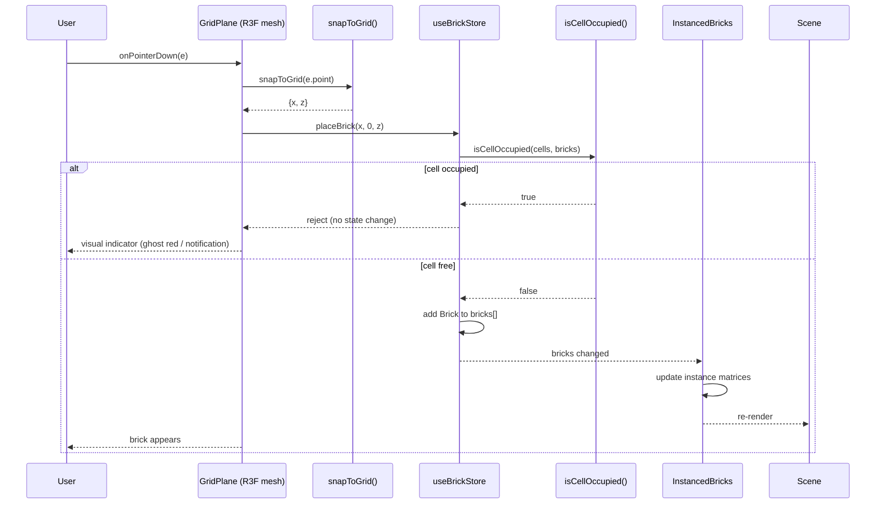
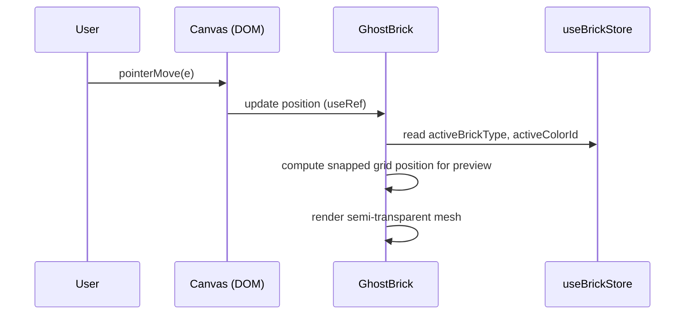

# Low-Level Design: FR-7 — Brick Placement

## 1. Introduction

This LLD details the implementation of **FR-BRICK-001** (Brick Placement) which corresponds to **FR-7** in the Spectra traceability system. The feature enables users to place bricks on a 3D grid with snapping, collision detection, and a ghost preview. The design aligns with the Technical Architecture (`docs/TECHNICAL_ARCHITECTURE.md`) and Product Requirements Document (`docs/PRD.md`).

## 2. API Endpoints

> **Note:** The LEGO Builder is a client-only SPA with no backend. All functionality runs in the browser. There are no server-side API endpoints.

## 3. Data Models

### 3.1 Core TypeScript Interfaces

```typescript
// src/store/types.ts
export type BrickType = '1x1' | '1x2' | '2x2' | '2x4';
export type Tool = 'place' | 'delete';

export interface BrickColor {
  id: string;           // e.g., 'bright-red'
  name: string;         // e.g., 'Bright Red'
  hex: string;          // e.g., '#C91A09'
}

export interface Brick {
  id: string;           // uuid
  x: number;            // grid X (integer)
  y: number;            // grid Y (always 0 for MVP — CLR-01)
  z: number;            // grid Z (integer)
  type: BrickType;
  colorId: string;      // references BrickColor.id
  rotation: number;     // 0 | 90 | 180 | 270 (degrees around Y-axis)
}

export interface BrickStore {
  bricks: Brick[];
  activeTool: Tool;
  activeColorId: string;
  activeBrickType: BrickType;
  notification: string | null;
  placeBrick: (x: number, y: number, z: number) => void;
  deleteBrick: (id: string) => void;
  deleteBrickAtPosition: (x: number, y: number, z: number) => void;
  rotateBrick: (id: string) => void;
  setActiveTool: (tool: Tool) => void;
  setActiveColor: (colorId: string) => void;
  setActiveBrickType: (type: BrickType) => void;
  setBricks: (bricks: Brick[]) => void;
  setNotification: (msg: string | null) => void;
}
```

### 3.2 Domain Functions

```typescript
// src/domain/gridRules.ts
import { Brick, BrickType } from '../store/types';
import { BRICK_CATALOG } from './brickCatalog';

/** Snap world coordinate to nearest integer grid unit */
export function snapToGrid(worldPos: THREE.Vector3): { x: number; z: number } {
  return {
    x: Math.round(worldPos.x),
    z: Math.round(worldPos.z),
  };
}

/** Get all grid cells occupied by a brick at (x, z) with given type and rotation */
export function getOccupiedCells(
  x: number, z: number,
  type: BrickType,
  rotation: number
): Array<{ x: number; z: number }> {
  const def = BRICK_CATALOG[type];
  const cells: Array<{ x: number; z: number }> = [];
  // Swap width/depth for 90°/270° rotations
  const [w, d] = (rotation === 90 || rotation === 270)
    ? [def.depth, def.width]
    : [def.width, def.depth];
  for (let dx = 0; dx < w; dx++) {
    for (let dz = 0; dz < d; dz++) {
      cells.push({ x: x + dx, z: z + dz });
    }
  }
  return cells;
}

/** Check if any of the given cells are occupied by existing bricks */
export function isCellOccupied(
  cells: Array<{ x: number; z: number }>,
  existingBricks: Brick[]
): boolean {
  const occupied = new Set(
    existingBricks.flatMap(b =>
      getOccupiedCells(b.x, b.z, b.type, b.rotation)
        .map(c => `${c.x},${c.z}`)
    )
  );
  return cells.some(c => occupied.has(`${c.x},${c.z}`));
}
```

### 3.3 Brick Catalog & Color Palette

- `BRICK_CATALOG` maps `BrickType` to geometry dimensions and `THREE.BoxGeometry`.
- `LEGO_COLORS` provides official LEGO color names and hex values.

## 4. Component Architecture

### 4.1 Component Tree

```
<App>
  <div class="app-layout">
    <aside class="sidebar">
      <Toolbar />
      <BrickTypeSelector />
      <BrickPalette />
      <ActionBar />
    </aside>
    <main class="canvas-container">
      <Scene3D>
        <Canvas>
          <ambientLight />
          <directionalLight />
          <Grid />
          <GridPlane />        ← click target for placement
          <InstancedBricks />  ← renders all placed bricks
          <GhostBrick />       ← placement preview
          <OrbitControls />
        </Canvas>
      </Scene3D>
    </main>
    <Notification />
  </div>
</App>
```

### 4.2 Key Component Responsibilities

| Component | Responsibility | Key Interactions |
|-----------|----------------|------------------|
| `GridPlane` | Invisible mesh that receives `onPointerDown` events for brick placement. Calls `snapToGrid` and `store.placeBrick`. | R3F `ThreeEvent<PointerEvent>` → `snapToGrid` → `placeBrick` |
| `GhostBrick` | Semi-transparent preview that follows cursor in Place mode. Uses `useRef` for position to avoid re-renders. | Reads `activeBrickType`, `activeColorId` from store; updates position via `useFrame` or pointer move. |
| `InstancedBricks` | Renders all bricks using `InstancedMesh` per brick type. Updates instance matrices and colors when `store.bricks` changes. | Subscribes to `store.bricks`; groups by type; updates `InstancedMesh` buffers. |
| `Toolbar` | Buttons to switch between Place and Delete modes. | Calls `setActiveTool` on click. |
| `BrickPalette` | Color swatches with tooltips. | Calls `setActiveColor` on selection. |
| `BrickTypeSelector` | Brick type options with preview. | Calls `setActiveBrickType` on selection. |
| `ActionBar` | Save, Load, Export, Import buttons. | Calls persistence and export services. |
| `Notification` | Shows success/error messages. | Displays `store.notification`. |

### 4.3 State Management (Zustand)

- The `useBrickStore` is a global singleton. Components subscribe via `useBrickStore(selector)`.
- Actions relevant to brick placement:
  - `placeBrick(x, y, z)`: validates occupancy via `isCellOccupied`; if free, adds a new `Brick` with generated UUID and current `activeColorId`/`activeBrickType`.
  - `deleteBrick(id)`: removes brick by ID.
  - `setActiveTool`, `setActiveColor`, `setActiveBrickType`.

## 5. Sequence Diagrams

### 5.1 Brick Placement Flow



### 5.2 Ghost Brick Follows Cursor



## 6. Error Handling Strategy

| Error Scenario | Detection | Handling | User Feedback |
|----------------|-----------|----------|---------------|
| Collision (occupied cell) | `isCellOccupied` returns `true` during `placeBrick` | Reject addition; do not modify `bricks` array | Ghost brick turns red or shows "occupied" tooltip; no notification needed for silent reject |
| Local storage quota exceeded | `localforage.setItem` promise rejects | Catch error; show error notification | Display error message: "Save failed: storage full. Please free space." |
| Invalid JSON import | `JSON.parse` throws or validation fails | Catch error; do not modify `bricks` | Show error: "Invalid file. Please select a valid LEGO model JSON." |
| WebGL context loss | `webglcontextlost` event | Show fallback UI with instructions to reload | Display message: "WebGL context lost. Please reload the page." |
| Out-of-range grid coordinates | `snapToGrid` returns integers; grid is 20×20 (from `Grid` component) | Clamp to grid bounds or reject if outside | Ghost brick disappears or turns red when outside grid |

### 6.1 Global Error Monitoring

- `window.__legoBuilderErrors` array captures WebGL/Three.js errors for E2E tests.
- `window.addEventListener('error')` logs uncaught errors to console (future: Sentry).

## 7. Security Considerations

- **XSS Prevention**: All user-supplied data (imported JSON) is validated against expected schema. String fields are sanitized (e.g., `id` truncated to 64 chars). No `innerHTML` used; React's JSX auto-escapes.
- **Content Security Policy (CSP)**: In production, CSP will be set to `script-src 'self'` (no `unsafe-eval`), `style-src 'self'` (no `unsafe-inline`). Build must produce static assets with hashed filenames to avoid inline scripts.
- **No External Data**: All data stays in the browser; no network requests for model data.
- **Local Storage**: Data is stored in plain text; users should not store sensitive information. No encryption.
- **Dependency Security**: Dependencies (React, Three.js, etc.) are scanned via GitHub Dependabot.

## 8. Additional Design Decisions

- **Grid Size**: The `Grid` component from `@react-three/drei` is configured with `args={[20, 20]}` — a 20×20 grid centered at origin.
- **Coordinate System**: Y-axis is up. Bricks are placed at `y = 0` (bottom aligned with ground). Brick height is 1 unit.
- **Ghost Brick Appearance**: Semi-transparent (`opacity: 0.4`), uses the active color. When over an occupied cell, ghost turns red to indicate invalid placement.
- **Collision Detection**: `isCellOccupied` builds a `Set` of occupied cell keys `"x,z"` for O(1) lookup. This is efficient for up to 1000 bricks.
- **Performance**: `InstancedBricks` uses one `InstancedMesh` per brick type. Instance count is set to `Math.max(bricks.length, 1)` and updated on every brick change. For MVP, recreating the mesh on count change is acceptable; future optimization can pre-allocate a large buffer.
- **Event Handling**: `OrbitControls` is configured with `mouseButtons={{ LEFT: undefined }}` to free the left mouse button for brick placement on the `GridPlane`.
- **TypeScript Strictness**: All domain functions and store actions are fully typed. `THREE.Vector3` is used only in the R3F event layer; the store holds plain numbers.

## 9. References

- `docs/PRD.md` — Product Requirements Document
- `docs/TECHNICAL_ARCHITECTURE.md` — Technical Architecture
- `docs/tech_stack.yaml` — Technology Stack
- Spectra Constitution: `.spectra/constitution.md`
- React Three Fiber: https://docs.pmnd.rs/react-three-fiber/
- Three.js InstancedMesh: https://threejs.org/docs/#api/en/objects/InstancedMesh
