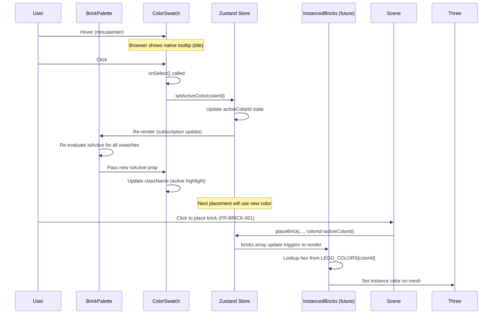
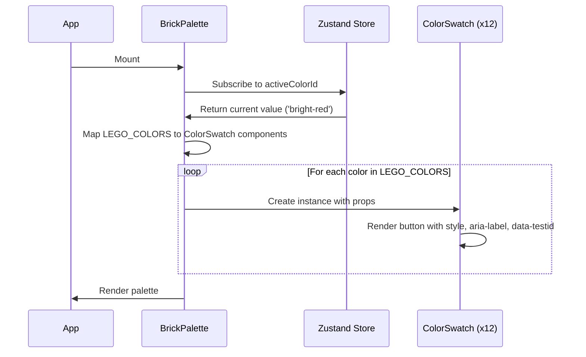

# Low-Level Design Document: FR-BRICK-002 — Brick Color Selection Palette

**FR-ID**: FR-BRICK-002  
**Issue**: #9 — [FR-BRICK-002] Implement Brick Color Selection Palette with LEGO Colors & Tooltips  
**Repository**: sreenivasmrpivot/legobuilder-challenger-config1  
**Branch**: feature/9-brick-color-palette-design  
**Design Agent**: Spectra Design Agent  
**Date**: 2025-04-20 (current)  
**Status**: Draft — Awaiting Design Review (Gate 6a)

---

## 1. Overview

### 1.1 Feature Summary

Implement a color selection palette that allows users to choose from at least 10 standard LEGO colors. The selected color becomes the active color for all subsequently placed bricks. Hovering over a color swatch displays the official LEGO color name as a tooltip.

### 1.2 Design Scope

This LLD covers:
- Component architecture for `BrickPalette` and `ColorSwatch`
- Integration with Zustand store (`activeColorId`, `setActiveColor`)
- DOM-based UI (not R3F/Three.js)
- Accessibility requirements (ARIA labels)
- Data model (`LEGO_COLORS` array)
- Event handling and state updates
- Error handling and edge cases

**Out of Scope:**
- 3D rendering of colors (handled by `InstancedBricks` consuming `colorId`)
- Persistence or export (handled by other FRs)
- Backend APIs (client-only MVP)

---

## 2. API Endpoints

**None.** This is a pure frontend feature with no network communication. All state is managed in the client-side Zustand store.

---

## 3. Data Models

### 3.1 Domain Model: LegoColor

```typescript
// src/domain/colorPalette.ts
export interface LegoColor {
  id: string;           // Unique identifier (e.g., 'bright-red')
  name: string;         // Official LEGO color name (e.g., 'Bright Red')
  hex: string;          // Hex color code (e.g., '#C91A09')
}
```

### 3.2 Constant Data: LEGO_COLORS

```typescript
// src/domain/colorPalette.ts
export const LEGO_COLORS: LegoColor[] = [
  { id: 'bright-red',        name: 'Bright Red',        hex: '#C91A09' },
  { id: 'bright-blue',       name: 'Bright Blue',       hex: '#006CB7' },
  { id: 'bright-yellow',     name: 'Bright Yellow',     hex: '#FFD700' },
  { id: 'bright-green',      name: 'Bright Green',      hex: '#4B9F4A' },
  { id: 'white',             name: 'White',             hex: '#FFFFFF' },
  { id: 'black',             name: 'Black',             hex: '#1B2A34' },
  { id: 'reddish-brown',     name: 'Reddish Brown',     hex: '#82422A' },
  { id: 'dark-bluish-gray',  name: 'Dark Bluish Gray',  hex: '#6C6E68' },
  { id: 'light-bluish-gray', name: 'Light Bluish Gray', hex: '#AFB5C7' },
  { id: 'bright-orange',     name: 'Bright Orange',     hex: '#FE8A18' },
  { id: 'medium-blue',       name: 'Medium Blue',       hex: '#5A93DB' },
  { id: 'sand-green',        name: 'Sand Green',        hex: '#A0BCAC' },
];
```

**Source**: Already scaffolded in `src/domain/colorPalette.ts`. No changes required.

### 3.3 Store State: activeColorId

```typescript
// src/store/useBrickStore.ts (excerpt)
export interface BrickStore {
  // ... other state
  activeColorId: string;  // References LegoColor.id (e.g., 'bright-red')

  // Actions
  setActiveColor: (colorId: string) => void;
}
```

**Default Value**: `'bright-red'` (per US-1 and issue specification)

### 3.4 Relationships

```
BrickPalette (component)
  └── renders N × ColorSwatch (component)
        └── each ColorSwatch receives:
            - color: LegoColor (from LEGO_COLORS array)
            - isActive: boolean (color.id === activeColorId)
            - onSelect: () => setActiveColor(color.id)

Zustand Store
  ├── activeColorId: string
  └── setActiveColor(colorId: void) => updates activeColorId

InstancedBricks (consumer)
  └── reads bricks[] from store
        └── each brick.colorId references LegoColor.id
              └── hex value looked up from LEGO_COLORS at render time
```

---

## 4. Component Architecture

### 4.1 Component Tree

```
<BrickPalette>  (DOM container, not R3F)
  ├── <h2> or <label> "Color Palette"
  └── <div className="color-grid">
        ├── <ColorSwatch> for each LegoColor in LEGO_COLORS
        │     ├── <button> (DOM button element)
        │     │     ├── style={{ backgroundColor: color.hex }}
        │     │     ├── aria-label={color.name}
        │     │     ├── title={color.name} (native tooltip)
        │     │     ├── data-testid={`color-swatch-${color.id}`}
        │     │     ├── className={isActive ? 'active' : ''}
        │     │     └── onClick={onSelect}
        │     └── (optional: custom tooltip component instead of title)
        └── ... more ColorSwatch instances
```

### 4.2 Component Specifications

#### 4.2.1 BrickPalette.tsx

**File**: `src/components/BrickPalette/BrickPalette.tsx`  
**Type**: React Function Component  
**Props**: None (reads store directly)  
**State**: None (derived from store)  
**Dependencies**:
- `react`
- `useBrickStore` from `../../store/useBrickStore`
- `LEGO_COLORS` from `../../domain/colorPalette`
- `ColorSwatch` from `./ColorSwatch`

**Implementation**:

```typescript
// src/components/BrickPalette/BrickPalette.tsx
import React from 'react';
import { useBrickStore } from '../../store/useBrickStore';
import { LEGO_COLORS } from '../../domain/colorPalette';
import { ColorSwatch } from './ColorSwatch';

export function BrickPalette() {
  const activeColorId = useBrickStore(state => state.activeColorId);
  const setActiveColor = useBrickStore(state => state.setActiveColor);

  return (
    <div className="brick-palette" role="group" aria-label="Brick color palette">
      <h2 className="sr-only">Color Palette</h2>
      <div className="color-grid">
        {LEGO_COLORS.map(color => (
          <ColorSwatch
            key={color.id}
            color={color}
            isActive={color.id === activeColorId}
            onSelect={() => setActiveColor(color.id)}
          />
        ))}
      </div>
    </div>
  );
}
```

**Styling (Tailwind CSS)**:

```css
/* Inline or in a CSS module */
.brick-palette {
  display: flex;
  flex-direction: column;
  gap: 0.5rem;
}

.color-grid {
  display: grid;
  grid-template-columns: repeat(auto-fill, minmax(48px, 1fr));
  gap: 0.5rem;
}

/* ColorSwatch button */
.color-swatch {
  width: 48px;
  height: 48px;
  border: 2px solid transparent;
  border-radius: 4px;
  cursor: pointer;
  transition: border-color 0.15s ease;
}

.color-swatch:hover {
  border-color: #888;
}

.color-swatch.active {
  border-color: #2563eb; /* blue-600 */
  box-shadow: 0 0 0 2px rgba(37, 99, 235, 0.3);
}
```

#### 4.2.2 ColorSwatch.tsx

**File**: `src/components/BrickPalette/ColorSwatch.tsx`  
**Type**: React Function Component  
**Props**:
- `color: LegoColor`
- `isActive: boolean`
- `onSelect: () => void`

**Implementation**:

```typescript
// src/components/BrickPalette/ColorSwatch.tsx
import React from 'react';
import { LegoColor } from '../../domain/colorPalette';

interface ColorSwatchProps {
  color: LegoColor;
  isActive: boolean;
  onSelect: () => void;
}

export function ColorSwatch({ color, isActive, onSelect }: ColorSwatchProps) {
  return (
    <button
      type="button"
      className={`color-swatch ${isActive ? 'active' : ''}`}
      style={{ backgroundColor: color.hex }}
      aria-label={color.name}
      title={color.name}  // Native tooltip
      data-testid={`color-swatch-${color.id}`}
      onClick={onSelect}
    >
      <span className="sr-only">Select {color.name}</span>
    </button>
  );
}
```

**Accessibility Notes**:
- `aria-label` provides screen reader announcement of color name
- `title` attribute provides native browser tooltip on hover
- `type="button"` prevents form submission side effects
- `sr-only` span gives additional context for screen readers
- `role="group"` on parent with `aria-label` groups the palette

### 4.3 Integration Points

| Integration | Direction | Mechanism |
|-------------|-----------|-----------|
| Zustand Store | Read `activeColorId` | `useBrickStore(selector)` |
| Zustand Store | Write `setActiveColor` | `useBrickStore(selector)` |
| InstancedBricks | Consumes `bricks[].colorId` | Store subscription (indirect) |
| LEGO_COLORS | Read-only data | Direct import from `colorPalette.ts` |

---

## 5. Sequence Diagrams

### 5.1 User Selects a Color



### 5.2 Initial Render



---

## 6. Error Handling Strategy

### 6.1 Potential Errors

| Error Scenario | Cause | Handling | User Impact |
|----------------|-------|----------|-------------|
| `LEGO_COLORS` is undefined or empty | Module failed to load or was modified incorrectly | **Development-time error**: TypeScript/ESLint will catch missing export. In production, palette renders empty with console error. | No color swatches visible; user cannot select colors. |
| `setActiveColor` called with invalid `colorId` | Bug in ColorSwatch or store | Store action should validate: if `colorId` not in `LEGO_COLORS`, ignore or default to `'bright-red'`. | Invalid color selection silently ignored; active color unchanged. |
| `useBrickStore` returns undefined | Store not initialized (Zustand provider missing) | **Development-time error**: App should wrap with `useBrickStore` provider. In production, palette crashes. | Entire palette component unmounts with error. |
| CSS/ styling fails to load | Tailwind or custom CSS missing | Buttons still render with inline `backgroundColor`; lose active highlight styling. | Functional but poor UX; active state not visually clear. |

### 6.2 Defensive Coding

```typescript
// In setActiveColor store action (defensive validation)
setActiveColor: (colorId) => {
  const isValid = LEGO_COLORS.some(c => c.id === colorId);
  if (!isValid) {
    console.warn(`Invalid colorId: ${colorId}. Defaulting to 'bright-red'.`);
    colorId = 'bright-red';
  }
  set({ activeColorId: colorId });
}
```

---

## 7. Security Considerations

### 7.1 XSS Prevention

- `color.name` is a static string from `LEGO_COLORS` (hard-coded, no user input). No XSS risk.
- `color.hex` is a hard-coded hex string. Inline `style={{ backgroundColor: color.hex }}` is safe because React automatically escapes style values. However, hex strings should be validated to match `/^#[0-9A-Fa-f]{6}$/` if ever derived from external source (not applicable here).

### 7.2 Content Security Policy (CSP)

- No inline scripts or `eval()` used.
- All code is bundled by Vite.
- No external resources loaded by this component.

### 7.3 Data Exposure

- No user data or model data is transmitted.
- All state is local to the browser.

---

## 8. Accessibility (NFR-A11Y-001)

### 8.1 Requirements

- WCAG 2.1 AA compliance for all UI controls outside the 3D canvas.
- Keyboard navigable: users must be able to tab to color swatches and activate with Enter/Space.
- Screen reader support: each swatch must announce the color name.

### 8.2 Implementation Checklist

- [x] `ColorSwatch` uses `<button>` element (native keyboard focus and activation)
- [x] `aria-label={color.name}` provides accessible name
- [x] `title={color.name}` provides native tooltip for sighted users
- [x] `type="button"` prevents form submission side effects
- [x] `BrickPalette` has `role="group"` and `aria-label="Brick color palette"`
- [x] Visible focus ring (via Tailwind `focus-visible` styles)
- [x] Color contrast: active state border color meets contrast ratio (blue-600 on white background)

### 8.3 Keyboard Navigation

- Tab key moves focus between swatch buttons.
- Enter or Space activates the focused swatch (native button behavior).
- No keyboard trap; focus order follows DOM order (grid order).

---

## 9. Test Coverage

### 9.1 Unit Tests (Vitest + React Testing Library)

| Test ID | Description | Implementation |
|---------|-------------|----------------|
| T-FE-BRICK-002-01 | Selecting a color updates `activeColorId` in store | Render `BrickPalette`, click a swatch, assert store state |
| T-FE-BRICK-002-02 | Color palette renders at least 10 swatches | Count `ColorSwatch` instances; expect ≥ 10 |
| T-FE-BRICK-002-03 | Color tooltip shows LEGO color name | Check `title` attribute on each button |
| T-FE-BRICK-002-04 | Selected color applied to next placed brick (mesh material) | Behavioral test: select color, place brick, verify `InstancedBricks` uses correct hex (via scene graph inspection) |

### 9.2 Behavioral Tests

- T-FE-BRICK-002-04: Full integration test from color selection to brick rendering.

### 9.3 E2E Tests (Playwright)

- T-E2E-HAPPY-001-01: Full first-time build flow includes color selection step (already defined in PRD).

---

## 10. Performance Considerations

- **Render cost**: 12 swatches is trivial; no performance concerns.
- **Re-renders**: Only re-render when `activeColorId` changes (infrequent).
- **Bundle size**: Minimal; only React and a few imports.
- **No network requests**: All data is static.

---

## 11. Implementation Checklist (DoD)

- [ ] `BrickPalette.tsx` stub replaced — renders ≥ 10 LEGO color swatches in a grid
- [ ] `ColorSwatch.tsx` stub replaced — tooltip with LEGO color name, active highlight
- [ ] `colorPalette.ts` verified complete with 12 LEGO colors (no changes needed)
- [ ] `setActiveColor` action in store updates `activeColorId` (already exists, verify)
- [ ] Default color is `'bright-red'` on app load (store default)
- [ ] All swatches have `aria-label` for accessibility
- [ ] T-FE-BRICK-002-01 through T-FE-BRICK-002-04 passing
- [ ] Code reviewed and PR merged

---

## 12. Open Questions / Assumptions

| ID | Question | Assumption / Resolution |
|----|----------|-------------------------|
| A1 | Should the palette show all 12 colors or at least 10? | Issue says "at least 10", scaffold has 12. Show all 12. |
| A2 | Tooltip implementation: native `title` or custom component? | Use native `title` for simplicity and accessibility. Custom tooltip can be added later if needed. |
| A3 | Active state visual: border color, background change, or both? | Use blue border + subtle shadow (see styling above). Consistent with other UI controls. |
| A4 | Should the palette be scrollable if more colors are added? | Grid layout with `auto-fill` will wrap; no scroll needed for 12 items. |
| A5 | Does the store already have `setActiveColor`? | According to issue, yes. Verify during implementation. If missing, implement. |

---

## 13. References

- **PRD**: `docs/PRD.md` — FR-BRICK-002, US-1, NFR-A11Y-001
- **Technical Architecture**: `docs/TECHNICAL_ARCHITECTURE.md` — Section 2.3 (Zustand Store Schema), Section 4 (Component Integration Map)
- **Stub Files**: 
  - `src/components/BrickPalette/BrickPalette.tsx` (stub)
  - `src/components/BrickPalette/ColorSwatch.tsx` (stub)
  - `src/domain/colorPalette.ts` (already complete)
- **Test IDs**: `data-testid="color-swatch-{id}"` for Playwright targeting

---

## 14. Revision History

| Version | Date | Changes | Author |
|---------|------|---------|--------|
| 0.1 | 2025-04-20 | Initial draft | Spectra Design Agent |
