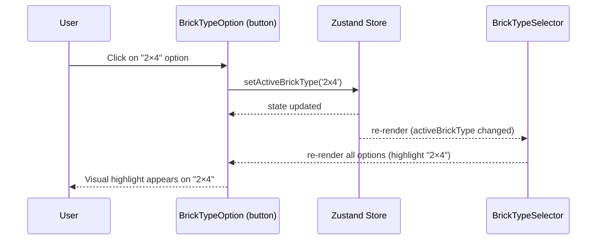
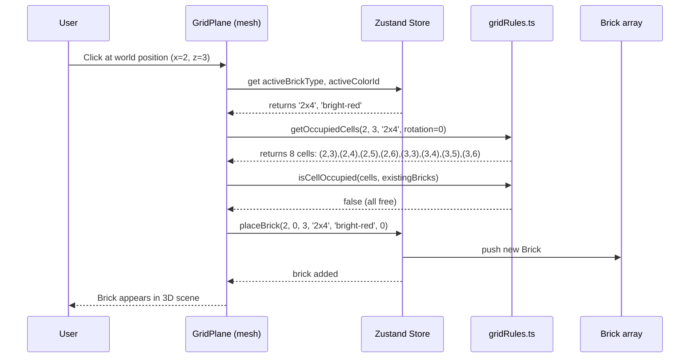
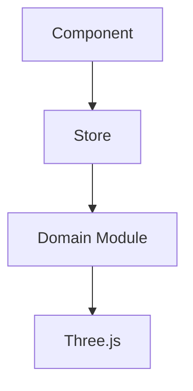

# Low-Level Design: FR-BRICK-003 — Brick Type Selector

**FR-ID**: FR-BRICK-003  
**Issue**: #10  
**Title**: Implement Brick Type Selector with 4 Types (1×1, 1×2, 2×2, 2×4) & Footprint Logic  
**Priority**: P0  
**Design Agent**: Spectra Design Agent  
**Date**: 2025-04-20  
**Status**: Draft

---

## 1. Overview

This LLD defines the implementation for the Brick Type Selector feature. The feature provides a UI component that allows users to select from 4 brick types (1×1, 1×2, 2×2, 2×4). The selected type becomes the active brick type for all subsequent placements. Multi-cell bricks correctly occupy their full footprint and block those cells from further placement.

The design integrates with:
- **Zustand store** (`useBrickStore`) for global state (`activeBrickType`)
- **BRICK_CATALOG** domain module for brick definitions and geometries
- **Grid rules** (`getOccupiedCells`) for footprint collision detection
- **BrickTypeSelector** and **BrickTypeOption** UI components

---

## 2. API Endpoints (Internal Interfaces)

Since this is a client-side SPA, "API endpoints" refer to internal module interfaces and event contracts.

### 2.1 Store Actions

```typescript
// File: src/store/useBrickStore.ts
interface BrickStore {
  // State
  activeBrickType: BrickType;

  // Actions
  setActiveBrickType: (type: BrickType) => void;
}
```

**Contract**:
- `setActiveBrickType(type)` updates `activeBrickType` in the Zustand store.
- Triggers re-render of `BrickTypeSelector` to reflect active state.
- Used by `BrickTypeOption` components on click.

### 2.2 Domain Module: brickCatalog.ts

```typescript
// File: src/domain/brickCatalog.ts
export interface BrickDefinition {
  type: BrickType;
  label: string;
  width: number;   // grid units along X
  depth: number;   // grid units along Z
  height: number;  // grid units along Y (always 1 for MVP)
  geometry: THREE.BoxGeometry;
}

export const BRICK_CATALOG: Record<BrickType, BrickDefinition>;
```

**Contract**:
- Provides geometry instances for rendering.
- Provides width/depth for footprint calculations.
- Module-level singleton geometries (do not serialize).

### 2.3 Domain Module: gridRules.ts

```typescript
// File: src/domain/gridRules.ts
export function getOccupiedCells(
  x: number,
  z: number,
  type: BrickType,
  rotation: number
): Array<{ x: number; z: number }>;

export function isCellOccupied(
  cells: Array<{ x: number; z: number }>,
  existingBricks: Brick[]
): boolean;
```

**Contract**:
- `getOccupiedCells` returns all grid coordinates covered by a brick at given position, type, and rotation.
- For 2×4 at (0,0) rotation=0: returns 8 cells covering (0,0) to (1,3).
- For rotation 90°/270°, width and depth are swapped.
- `isCellOccupied` checks if any of the given cells are already occupied by existing bricks.

---

## 3. Data Models

### 3.1 TypeScript Types

```typescript
// File: src/store/types.ts
export type BrickType = '1x1' | '1x2' | '2x2' | '2x4';

export interface Brick {
  id: string;           // uuid v4
  x: number;            // grid X coordinate (integer)
  y: number;            // grid Y (always 0 for MVP)
  z: number;            // grid Z coordinate (integer)
  type: BrickType;
  colorId: string;      // references BrickColor.id
  rotation: number;     // 0 | 90 | 180 | 270 (degrees around Y-axis)
}
```

### 3.2 LocalForage Storage Schema

The `Brick` array is stored directly in LocalForage under key `'lego-builder-model'`. No separate schema migration needed for MVP.

```typescript
// File: src/services/persistenceService.ts
interface PersistedModel {
  version: string;      // "1.0.0"
  savedAt: string;      // ISO 8601 timestamp
  bricks: Brick[];      // plain objects, no THREE types
}
```

**Note**: `THREE.BoxGeometry` instances are **not** stored; they are reconstructed from `BRICK_CATALOG` at runtime.

---

## 4. Component Architecture

### 4.1 Component Tree

```text
<BrickTypeSelector>  (FR-BRICK-003)
  ├── <BrickTypeOption type="1x1" />
  ├── <BrickTypeOption type="1x2" />
  ├── <BrickTypeOption type="2x2" />
  └── <BrickTypeOption type="2x4" />
```

### 4.2 BrickTypeSelector.tsx

**File**: `src/components/BrickTypeSelector/BrickTypeSelector.tsx`  
**Responsibility**: Render the brick type palette with 4 options, highlight the active type.

**Props**: None (reads from Zustand store directly).

**Implementation**:

```typescript
import React from 'react';
import { useBrickStore } from '../../store/useBrickStore';
import { BrickTypeOption } from './BrickTypeOption';
import { BRICK_CATALOG } from '../../domain/brickCatalog';

export function BrickTypeSelector() {
  const activeBrickType = useBrickStore(state => state.activeBrickType);
  const setActiveBrickType = useBrickStore(state => state.setActiveBrickType);

  const brickTypes: BrickType[] = ['1x1', '1x2', '2x2', '2x4'];

  return (
    <div className="brick-type-selector" role="radiogroup" aria-label="Brick type selection">
      {brickTypes.map(type => (
        <BrickTypeOption
          key={type}
          type={type}
          isActive={type === activeBrickType}
          onSelect={() => setActiveBrickType(type)}
        />
      ))}
    </div>
  );
}
```

**Styling**: Use Tailwind CSS for layout (horizontal flex, spacing, borders).

**Accessibility**:
- `role="radiogroup"` on container.
- Each `BrickTypeOption` has `role="radio"` and `aria-selected`.
- Keyboard navigation: Arrow keys to change selection (optional for MVP, but recommended).

### 4.3 BrickTypeOption.tsx

**File**: `src/components/BrickTypeSelector/BrickTypeOption.tsx`  
**Responsibility**: Render a single brick type option with visual preview and active highlight.

**Props**:
- `type: BrickType`
- `isActive: boolean`
- `onSelect: () => void`

**Implementation**:

```typescript
import React from 'react';
import { BRICK_CATALOG } from '../../domain/brickCatalog';

interface BrickTypeOptionProps {
  type: BrickType;
  isActive: boolean;
  onSelect: () => void;
}

export function BrickTypeOption({ type, isActive, onSelect }: BrickTypeOptionProps) {
  const def = BRICK_CATALOG[type];

  // Compute preview dimensions (CSS pixels proportional to grid units)
  const previewWidth = def.width * 20;  // 20px per grid unit
  const previewHeight = def.depth * 20; // depth is the "length" in 2D preview

  return (
    <button
      data-testid={`brick-type-${type}`}
      className={`brick-type-option ${isActive ? 'active' : ''}`}
      onClick={onSelect}
      role="radio"
      aria-selected={isActive}
      aria-label={`${def.label} brick`}
      style={{
        width: previewWidth + 8,  // add padding
        height: previewHeight + 8,
      }}
    >
      <div
        className="brick-preview"
        style={{
          width: previewWidth,
          height: previewHeight,
          backgroundColor: isActive ? '#3b82f6' : '#e5e7eb', // blue when active, gray otherwise
          border: isActive ? '2px solid #1d4ed8' : '1px solid #9ca3af',
        }}
        title={def.label}
      />
      <span className="brick-label">{def.label}</span>
    </button>
  );
}
```

**Visual Design**:
- Preview rectangle shows brick footprint (width × depth).
- Active state: blue border and background.
- Inactive state: gray border and background.
- Label below preview shows "1×1", "1×2", etc.

**Test ID**: `data-testid="brick-type-{type}"` (e.g., `brick-type-1x2`).

---

## 5. Sequence Diagrams

### 5.1 User Selects Brick Type



### 5.2 Placement with Multi-Cell Footprint



---

## 6. Error Handling Strategy

### 6.1 Component-Level Errors

| Error | Handling | User Impact |
|-------|----------|-------------|
| `BRICK_CATALOG` undefined or missing type | Throw error in development; fallback to 1×1 in production | Selector shows only 1×1; console error logged |
| `setActiveBrickType` called with invalid type | TypeScript compile-time check prevents runtime; runtime guard logs warning | No state change; UI remains on previous selection |
| `useBrickStore` returns undefined (store not initialized) | Guard with default values; show error boundary if critical | UI may not render; error logged |

### 6.2 Footprint Collision

- `isCellOccupied` returns `true` if any cell is already taken.
- `placeBrick` action checks occupancy before adding.
- If collision detected, brick is **not placed** and no error shown (silent reject). Optionally, a subtle visual shake animation could indicate invalid placement (deferred to UX iteration).

### 6.3 Storage Errors (Persistence)

Handled in FR-PERS-001, not directly in this feature.

---

## 7. Security Considerations

### 7.1 XSS Prevention

- No user-generated HTML in brick type selector.
- All text content (`def.label`) comes from static `BRICK_CATALOG` (hardcoded).
- No `dangerouslySetInnerHTML` used.

### 7.2 Input Validation

- `BrickType` is a TypeScript union type; only 4 valid strings accepted.
- `setActiveBrickType` should guard against invalid values (defensive programming):

```typescript
function setActiveBrickType(type: BrickType) {
  if (!VALID_BRICK_TYPES.includes(type)) {
    console.warn('Invalid brick type:', type);
    return;
  }
  // update state
}
```

### 7.3 Data Serialization

- `Brick` objects stored in LocalForage contain only serializable fields (no `THREE` objects).
- `BRICK_CATALOG` geometries are module-level singletons and never serialized.

---

## 8. Integration Points

### 8.1 Zustand Store

- **Read**: `activeBrickType` from `useBrickStore`.
- **Write**: `setActiveBrickType` action.

### 8.2 Domain Layer

- **brickCatalog.ts**: Provides `BRICK_CATALOG` for preview dimensions and geometries.
- **gridRules.ts**: Used by placement engine (FR-BRICK-001) to compute footprint based on `activeBrickType`.

### 8.3 UI Layout

- `BrickTypeSelector` is placed in the sidebar alongside `BrickPalette` and `Toolbar`.
- See `docs/TECHNICAL_ARCHITECTURE.md` Section 4.1 for component tree.

---

## 9. Test Coverage

### 9.1 Unit Tests

| Test ID | Description | Target |
|---------|-------------|--------|
| T-FE-BRICK-003-01 | Selecting a brick type updates `activeBrickType` in store | 100% |
| T-FE-BRICK-003-02 | Brick palette renders 4 brick types | 100% |
| T-FE-BRICK-003-03 | 2×4 brick occupies correct footprint (8 cells) | 100% |
| T-FE-BRICK-003-04 | Selected brick type preview is shown in UI | 100% |

### 9.2 Behavioral Tests

- T-FE-BRICK-003-04: Full app render with active brick type selection.

### 9.3 E2E Tests

- T-E2E-HAPPY-001-01: Full first-time build flow includes selecting brick type and placing a 2×4 brick.
- T-E2E-AFOL-001-01: AFOL build and export flow uses 2×4 brick.

---

## 10. Performance Considerations

- `BrickTypeSelector` renders only 4 options — negligible performance impact.
- `BrickTypeOption` preview uses simple CSS `div` with fixed dimensions — no heavy rendering.
- `BRICK_CATALOG` geometries are created once at module load and reused — no per-render allocation.
- Store updates are lightweight; only `activeBrickType` changes.

---

## 11. Accessibility (NFR-A11Y-001)

- `BrickTypeSelector` uses `role="radiogroup"` and `aria-label`.
- Each `BrickTypeOption` uses `role="radio"` and `aria-selected`.
- Keyboard navigation: Implement arrow key support (left/right) to change selection (recommended for full compliance).
- Color contrast: Active state uses blue (#3b82f6) with sufficient contrast against white background (≥ 4.5:1).
- Focus visible: Ensure `:focus-visible` style on buttons.

---

## 12. Open Questions / Assumptions

| ID | Question | Assumption / Resolution |
|----|----------|-------------------------|
| A1 | Should brick type selection persist across page reloads? | Yes, `activeBrickType` is stored in Zustand; on app load, default is '1x1'. Persistence across reloads would require storing in LocalForage, but not required by FR. |
| A2 | Can users select brick type while in Delete mode? | Yes, brick type selection is independent of tool mode. |
| A3 | Should the preview show the current active color? | No, preview shows neutral gray/blue to indicate selection state; actual brick color is shown in the 3D scene and in `BrickPalette`. |
| A4 | What happens if `BRICK_CATALOG` is missing a type? | The component maps over a hardcoded array `['1x1','1x2','2x2','2x4']`; if catalog entry missing, show placeholder and log error. |

---

## 13. Implementation Checklist

- [ ] Create `src/components/BrickTypeSelector/BrickTypeSelector.tsx`
- [ ] Create `src/components/BrickTypeSelector/BrickTypeOption.tsx`
- [ ] Verify `src/domain/brickCatalog.ts` contains all 4 types with correct geometries
- [ ] Add `setActiveBrickType` action to `useBrickStore` if not already present
- [ ] Integrate `BrickTypeSelector` into sidebar layout (`App.tsx` or layout component)
- [ ] Add Tailwind CSS classes for styling (or CSS module)
- [ ] Implement keyboard navigation (arrow keys) for accessibility
- [ ] Write unit tests: T-FE-BRICK-003-01 through T-FE-BRICK-003-04
- [ ] Verify behavioral test coverage
- [ ] Ensure E2E tests cover brick type selection flow
- [ ] Run lint, typecheck, and tests
- [ ] Update `docs/features/FR-BRICK-003/LOW_LEVEL_DESIGN.md` with any changes during implementation

---

## 14. References

- **PRD**: `docs/PRD.md` — FR-BRICK-003 definition
- **Technical Architecture**: `docs/TECHNICAL_ARCHITECTURE.md` — Component integration map, stub replacement table
- **Stub Files**:
  - `src/components/BrickTypeSelector/BrickTypeSelector.tsx` (stub)
  - `src/components/BrickTypeSelector/BrickTypeOption.tsx` (stub)
  - `src/domain/brickCatalog.ts` (stub, already scaffolded)
- **Related FRs**:
  - FR-BRICK-001 (Brick Placement) — uses `activeBrickType` and `getOccupiedCells`
  - FR-PERF-001 (Instanced Rendering) — uses `BRICK_CATALOG` geometries

---

## Appendix: Mermaid Diagram Legend



This document follows the Spectra LLD scaffold template. All sections are filled with project-specific content.
