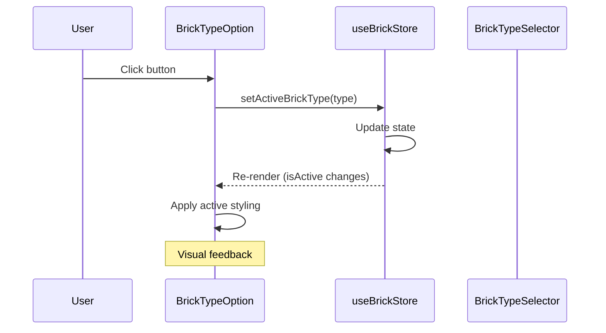
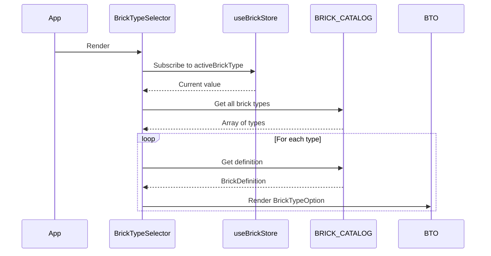

# Low-Level Design: FR-BRICK-003 — Brick Type Selector

## 1. Overview

This LLD details the implementation of the **Brick Type Selector** feature, which allows users to choose from four brick types (1×1, 1×2, 2×2, 2×4) and see a visual preview of the selected type. The selected brick type is stored in the global Zustand store and used for all subsequent brick placements. This feature integrates with the existing `brickCatalog.ts` domain module and the `useBrickStore` state management.

**Scope:**
- Create `BrickTypeSelector` container component.
- Create `BrickTypeOption` presentational component.
- Add `setActiveBrickType` action to the Zustand store.
- Ensure the active brick type is used by the placement engine (via store subscription).

**Out of Scope:**
- Modifying `brickCatalog.ts` (assumed complete).
- Changing footprint logic (handled by `gridRules.ts`).
- Persistence of `activeBrickType` across sessions (not required).

## 2. Data Models

### 2.1 TypeScript Types

```typescript
// src/store/types.ts (existing)
export type BrickType = '1x1' | '1x2' | '2x2' | '2x4';
```

### 2.2 Domain: BrickDefinition

```typescript
// src/domain/brickCatalog.ts (existing)
export interface BrickDefinition {
  type: BrickType;
  label: string;
  width: number;   // grid units (X)
  depth: number;   // grid units (Z)
  height: number;  // grid units (Y) — always 1 for MVP
  geometry: THREE.BoxGeometry;
}

export const BRICK_CATALOG: Record<BrickType, BrickDefinition> = {
  '1x1': { type: '1x1', label: '1×1', width: 1, depth: 1, height: 1,
            geometry: new THREE.BoxGeometry(0.95, 0.95, 0.95) },
  '1x2': { type: '1x2', label: '1×2', width: 1, depth: 2, height: 1,
            geometry: new THREE.BoxGeometry(0.95, 0.95, 1.95) },
  '2x2': { type: '2x2', label: '2×2', width: 2, depth: 2, height: 1,
            geometry: new THREE.BoxGeometry(1.95, 0.95, 1.95) },
  '2x4': { type: '2x4', label: '2×4', width: 2, depth: 4, height: 1,
            geometry: new THREE.BoxGeometry(1.95, 0.95, 3.95) },
};
```

### 2.3 Store State & Actions

```typescript
// src/store/useBrickStore.ts (to be updated)
interface BrickStore {
  // ... existing state
  activeBrickType: BrickType;
  // ... other state

  // Actions
  setActiveBrickType: (type: BrickType) => void;
  // ... other actions
}

// Default state
const defaultState = {
  // ...
  activeBrickType: '1x1',
  // ...
};
```

## 3. Component Architecture

### 3.1 BrickTypeSelector (Container)

- **File:** `src/components/BrickTypeSelector/BrickTypeSelector.tsx`
- **Props:** None.
- **State:** None (uses Zustand store).
- **Renders:** Four `BrickTypeOption` components, one for each key in `BRICK_CATALOG`.
- **Store Subscription:** Reads `activeBrickType` to determine which option is active.
- **Styling:** Flex container with gap, vertical or horizontal layout (to be determined by UI mock).

**Implementation Sketch:**

```tsx
import React from 'react';
import { useBrickStore } from '../../store/useBrickStore';
import { BRICK_CATALOG } from '../../domain/brickCatalog';
import BrickTypeOption from './BrickTypeOption';

export default function BrickTypeSelector() {
  const activeBrickType = useBrickStore(state => state.activeBrickType);
  const setActiveBrickType = useBrickStore(state => state.setActiveBrickType);

  const brickTypes = Object.keys(BRICK_CATALOG) as BrickType[];

  return (
    <div className="brick-type-selector" role="listbox" aria-label="Brick type selection">
      {brickTypes.map(type => (
        <BrickTypeOption
          key={type}
          type={type}
          isActive={type === activeBrickType}
          onSelect={setActiveBrickType}
        />
      ))}
    </div>
  );
}
```

### 3.2 BrickTypeOption (Presentational)

- **File:** `src/components/BrickTypeSelector/BrickTypeOption.tsx`
- **Props:**
  - `type: BrickType`
  - `isActive: boolean`
  - `onSelect: (type: BrickType) => void`
- **Derived Data:** `definition = BRICK_CATALOG[type]`.
- **Renders:** A `<button>` element with:
  - `data-testid={"brick-type-${type}"}` (e.g., `brick-type-1x2`).
  - `aria-selected={isActive}`.
  - Visual preview: a `<div>` with inline `style={{ width: ${definition.width * 20}px, height: ${definition.depth * 20}px }}` representing the brick footprint (top-down view). The preview should have a border and a background color (light gray) to show shape.
  - Label: `definition.label` (e.g., "1×2").
  - Active state styling: distinct border color (e.g., blue) and maybe a checkmark icon.
- **Accessibility:** Button is focusable; `aria-selected` indicates state.

**Implementation Sketch:**

```tsx
import React from 'react';
import { BrickType } from '../../store/types';
import { BRICK_CATALOG } from '../../domain/brickCatalog';

interface Props {
  type: BrickType;
  isActive: boolean;
  onSelect: (type: BrickType) => void;
}

export default function BrickTypeOption({ type, isActive, onSelect }: Props) {
  const definition = BRICK_CATALOG[type];
  const previewWidth = definition.width * 20; // 20px per grid unit
  const previewHeight = definition.depth * 20;

  return (
    <button
      data-testid={"brick-type-" + type}
      className={"brick-type-option " + (isActive ? 'active' : '')}
      aria-selected={isActive}
      onClick={() => onSelect(type)}
      style={{ display: 'flex', flexDirection: 'column', alignItems: 'center', gap: '4px' }}
    >
      <div
        style={
          width: previewWidth,
          height: previewHeight,
          border: '1px solid #666',
          backgroundColor: '#ddd',
          boxSizing: 'border-box'
        }
      />
      <span>{definition.label}</span>
    </button>
  );
}
```

### 3.3 Store Updates

- **File:** `src/store/useBrickStore.ts`
- **Add Action:**

```typescript
setActiveBrickType: (type: BrickType) => {
  // Validate type (optional but safe)
  if (!Object.keys(BRICK_CATALOG).includes(type)) {
    console.warn('Invalid brick type:', type);
    return;
  }
  set({ activeBrickType: type });
},
```

- **Initialize State:** `activeBrickType: '1x1'` in the default state.

## 4. Sequence Diagrams

### 4.1 User Selects a Brick Type



### 4.2 Initial Render of Selector



## 5. Error Handling Strategy

- **Invalid brick type:** If `setActiveBrickType` receives a type not in `BRICK_CATALOG`, log a warning and ignore. This should never happen in normal operation because the UI only offers valid types.
- **Missing catalog:** If `BRICK_CATALOG` is undefined or empty at runtime, the `BrickTypeSelector` should render nothing or a fallback message. This is a development-time error; in production, the module is bundled.
- **No async operations:** All actions are synchronous; no network or storage errors.

## 6. Security Considerations

- **XSS:** No dynamic HTML generation; all text is static from the catalog or TypeScript literals. React's JSX automatically escapes values.
- **Input Validation:** The `setActiveBrickType` action validates against known keys (optional). The UI only calls with known types.
- **No external data:** The brick catalog is a static module; no user-supplied data.
- **Test IDs:** `data-testid` attributes are safe; they don't introduce security risks.

## 7. Accessibility

- Each `BrickTypeOption` button has `aria-selected` indicating whether it is the active choice.
- The container has `role="listbox"` and `aria-label="Brick type selection"`.
- Buttons are focusable via keyboard (native `<button>`).
- Focus styles should be visible (use Tailwind's `focus:ring` or custom CSS).
- Labels include the brick type text (e.g., "1×1") for screen readers.

## 8. Testing Strategy

### 8.1 Unit Tests (Vitest)

- **Store:**
  - `setActiveBrickType('2x4')` updates `activeBrickType` to `'2x4'`.
  - Default state has `activeBrickType: '1x1'`.
- **Components:**
  - `BrickTypeSelector` renders exactly 4 `BrickTypeOption` children.
  - `BrickTypeOption` displays the correct label for each type.
  - `BrickTypeOption` applies `active` class when `isActive` is true.
  - `BrickTypeOption` has correct `data-testid`.
  - Clicking an option calls `onSelect` with the correct type.

### 8.2 Behavioral Tests (Vitest + RTL)

- Render `App` (or `BrickTypeSelector` in isolation), simulate click on a brick type option, verify store state changes.
- Verify that after selecting a type, the `activeBrickType` in the store matches.

### 8.3 E2E Tests (Playwright)

- **T-FE-BRICK-003-01:** Select a brick type and verify store update (via UI effect: subsequent placement uses that type).
- **T-FE-BRICK-003-02:** Brick palette renders 4 brick types.
- **T-FE-BRICK-003-03:** 2×4 brick occupies correct footprint (this is primarily a gridRules test but depends on correct brick type selection).
- **T-FE-BRICK-003-04:** Selected brick type preview is shown (the visual highlight on the selected option).

## 9. Implementation Notes

- **Preview dimensions:** Use a scale of 20px per grid unit. For a 2×4 brick, preview size = 40px × 80px. This provides a clear visual distinction.
- **Active styling:** Use a blue border (`border-blue-500`) and maybe a background change to indicate selection.
- **Layout:** The selector should be placed in the sidebar, likely below the toolbar. The exact layout (horizontal wrap or vertical stack) will be determined by the overall UI design; implement as a flex container that can be styled via Tailwind classes from the parent.
- **Integration with placement:** The `useBrickStore`'s `activeBrickType` is already used by the `placeBrick` action (or will be used by the placement engine). Ensure that when a brick is placed, the current `activeBrickType` is read from the store.
- **No persistence:** `activeBrickType` is not saved to LocalForage; it resets to default on page reload. This is acceptable per the PRD.

## 10. Dependencies

- **React** 18.x
- **TypeScript** 5.x
- **Tailwind CSS** 3.x (for styling)
- **Zustand** 4.x (state management)
- **Existing modules:**
  - `src/domain/brickCatalog.ts` (must be present and correct)
  - `src/store/useBrickStore.ts` (to be updated)
  - `src/store/types.ts` (contains `BrickType`)

## 11. Open Questions / Assumptions

- **Assumption:** `brickCatalog.ts` already defines the four brick types with correct geometries as shown in the PRD. This LLD does not modify that file.
- **Assumption:** The store's `placeBrick` action (or the placement engine) reads `activeBrickType` from the store at the time of placement. If not, a small integration step will be needed (outside this LLD's scope? Actually, the placement engine likely already uses the store's activeBrickType; we are adding the selector to set it).
- **Question:** Should the brick type selector show a preview of the brick's 3D shape? The PRD says "preview of the selected type is shown". Our design uses a 2D top-down rectangle. This is sufficient and consistent with the UI being DOM-based. If a 3D preview is desired, that would require an R3F component, which is more complex. We'll stick with 2D for simplicity unless specified otherwise.
- **Question:** Should the selector be disabled when not in "Place" mode? Probably not; you can change brick type anytime, even in Delete mode. It's a global setting.

## 12. Acceptance Criteria Mapping

| PRD Acceptance Criteria | Implementation Evidence |
|-------------------------|-------------------------|
| Given the brick palette is visible, When the user selects a brick type, Then the active brick type changes and a preview of the selected type is shown. | `BrickTypeSelector` + `BrickTypeOption` with active state and visual preview (2D rectangle). |
| Given a 2×4 brick is selected, When the user places it on the grid, Then the brick occupies a 2×4 footprint and blocks those cells from further placement. | Store's `activeBrickType` is used by placement engine; `gridRules.getOccupiedCells` uses the brick's type to compute footprint. This is existing logic; the selector merely sets the type. |

---

*Created by Spectra Framework — design-agent*