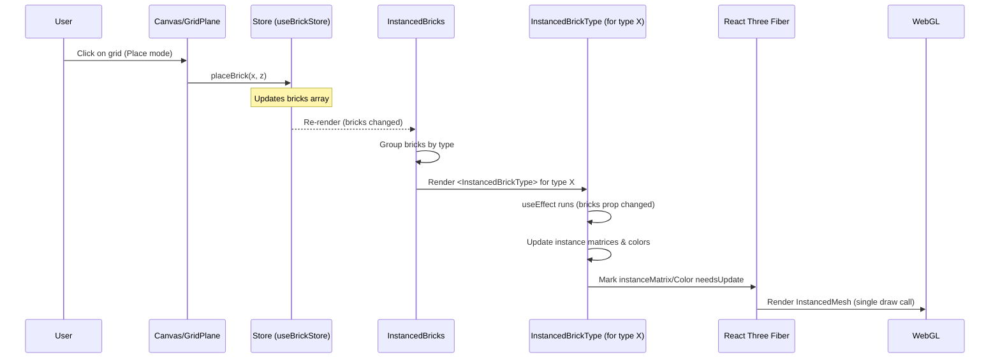
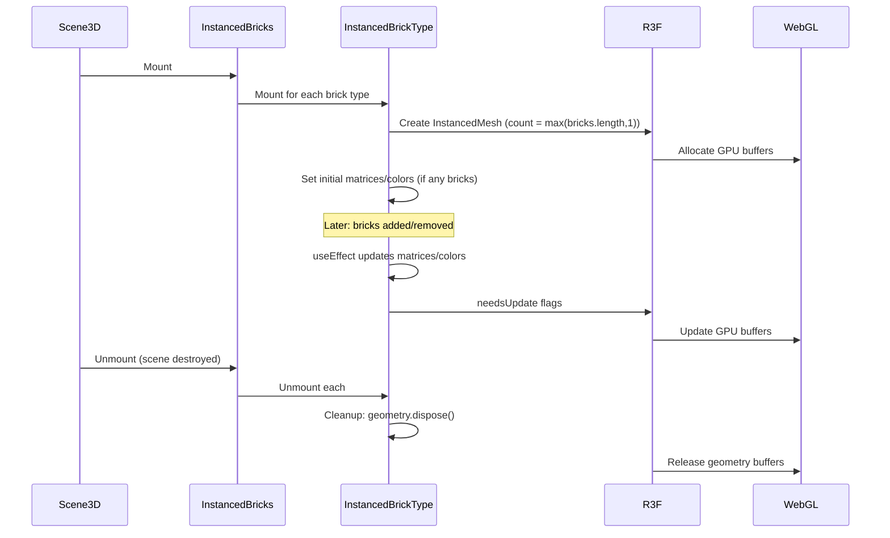

# Low-Level Design: FR-PERF-001 — Instanced Mesh Rendering

## 1. Overview

This LLD details the implementation of **FR-PERF-001: Instanced Mesh Rendering** to achieve ≥30 FPS with 500 bricks on mid-range hardware. The feature replaces the stub `src/components/Scene3D/InstancedBricks.tsx` with an optimized renderer using Three.js `InstancedMesh`.

### 1.1 Problem Statement

The current approach (if any) would render each brick as an individual `Mesh`, resulting in high draw call count and poor performance. With 500 bricks, that's 500 draw calls, which is unacceptable for WebGL on integrated GPUs.

### 1.2 Solution Summary

Use **instanced rendering**: one `InstancedMesh` per brick type (max 4 types = 4 draw calls). Each brick is an instance within its type's mesh. This reduces draw calls dramatically and leverages GPU instancing for parallel rendering.

---

## 2. Component Architecture

### 2.1 High-Level Structure

```
<InstancedBricks> (parent component)
  ├── Manages grouping of bricks by type
  └── Renders one <InstancedBrickType> per brick type
```

### 2.2 Component Specifications

#### InstancedBricks.tsx

**Purpose**: Groups bricks by type and renders an `InstancedBrickType` for each type.

**Props**: None (reads from `useBrickStore`)

**Dependencies**:
- `useBrickStore` (Zustand) — to get `bricks` array
- `BRICK_CATALOG` — to get geometry for each brick type
- `LEGO_COLORS` — to resolve brick colors

**Implementation**:

```typescript
import { useBrickStore } from '../../store/useBrickStore';
import { BRICK_CATALOG } from '../../domain/brickCatalog';
import { LEGO_COLORS } from '../../domain/colorPalette';
import { InstancedBrickType } from './InstancedBrickType';

export function InstancedBricks() {
  const bricks = useBrickStore(state => state.bricks);
  
  // Group bricks by type using Object.groupBy
  const byType = Object.groupBy(bricks, b => b.type);
  
  return (
    <>
      {Object.entries(BRICK_CATALOG).map(([type, def]) => (
        <InstancedBrickType
          key={type}
          brickType={type as BrickType}
          bricks={byType[type] ?? []}
          geometry={def.geometry}
        />
      ))}
    </>
  );
}
```

#### InstancedBrickType.tsx (sub-component)

**Purpose**: Manages a single `InstancedMesh` for one brick type.

**Props**:
- `brickType: BrickType` — the type of brick (e.g., '1x1')
- `bricks: Brick[]` — array of bricks of this type (may be empty)
- `geometry: THREE.BufferGeometry` — the geometry to instance (from `BRICK_CATALOG`)

**Dependencies**:
- `THREE` (Three.js)
- React `useRef`, `useEffect`

**Implementation**:

```typescript
import { useRef, useEffect } from 'react';
import * as THREE from 'three';

interface InstancedBrickTypeProps {
  brickType: BrickType;
  bricks: Brick[];
  geometry: THREE.BufferGeometry;
}

export function InstancedBrickType({ brickType, bricks, geometry }: InstancedBrickTypeProps) {
  const meshRef = useRef<THREE.InstancedMesh>(null);
  
  useEffect(() => {
    if (!meshRef.current) return;
    const mesh = meshRef.current;
    const matrix = new THREE.Matrix4();
    const color = new THREE.Color();
    
    // Update each instance
    bricks.forEach((brick, i) => {
      // Position + rotation matrix
      matrix.makeTranslation(brick.x, brick.y + 0.5, brick.z);
      matrix.multiply(new THREE.Matrix4().makeRotationY(
        (brick.rotation * Math.PI) / 180
      ));
      mesh.setMatrixAt(i, matrix);
      
      // Per-instance color
      const legoColor = LEGO_COLORS.find(c => c.id === brick.colorId);
      color.set(legoColor?.hex ?? '#FF0000');
      mesh.setColorAt(i, color);
    });
    
    // Mark buffers as needing update
    mesh.instanceMatrix.needsUpdate = true;
    if (mesh.instanceColor) mesh.instanceColor.needsUpdate = true;
  }, [bricks]);
  
  // Cleanup geometry on unmount
  useEffect(() => {
    return () => {
      meshRef.current?.geometry.dispose();
      // Material disposal handled by R3F
    };
  }, []);
  
  return (
    <instancedMesh
      ref={meshRef}
      args={[geometry, undefined, Math.max(bricks.length, 1)]}
    >
      <meshStandardMaterial vertexColors />
    </instancedMesh>
  );
}
```

### 2.3 Integration Points

- **Parent**: `Scene3D.tsx` will include `<InstancedBricks />` in the scene.
- **State**: Reads from `useBrickStore().bricks`. Any change to the bricks array triggers a re-render and matrix update.
- **Geometry**: Uses pre-created geometries from `BRICK_CATALOG` (module-level singletons). No geometry creation in render path.
- **Material**: Uses `meshStandardMaterial` with `vertexColors` enabled to utilize per-instance colors.

---

## 3. Data Models

### 3.1 Brick Interface (existing)

```typescript
// src/store/types.ts
export interface Brick {
  id: string;           // uuid
  x: number;            // grid X (integer)
  y: number;            // grid Y (always 0 for MVP)
  z: number;            // grid Z (integer)
  type: BrickType;      // '1x1' | '1x2' | '2x2' | '2x4'
  colorId: string;      // references LEGO_COLORS[].id
  rotation: number;     // 0 | 90 | 180 | 270 (degrees around Y-axis)
}
```

No changes to this model are required.

### 3.2 BrickType Enum (existing)

```typescript
export type BrickType = '1x1' | '1x2' | '2x2' | '2x4';
```

### 3.3 BrickDefinition (existing)

```typescript
// src/domain/brickCatalog.ts
export interface BrickDefinition {
  type: BrickType;
  label: string;
  width: number;
  depth: number;
  height: number;
  geometry: THREE.BoxGeometry;
}
```

---

## 4. Interfaces & Contracts

### 4.1 InstancedBricks Props

None. Component reads from global store.

### 4.2 InstancedBrickType Props

| Prop | Type | Required | Description |
|------|------|----------|-------------|
| `brickType` | `BrickType` | Yes | The brick type identifier |
| `bricks` | `Brick[]` | Yes | Array of bricks of this type to render |
| `geometry` | `THREE.BufferGeometry` | Yes | The geometry to instance (BoxGeometry) |

### 4.3 Event Contracts

No custom events emitted. The component is purely presentational and reacts to store changes.

### 4.4 Store Contract

The component expects `useBrickStore().bricks` to be an array of `Brick` objects. It does not modify the store.

---

## 5. Sequence Diagrams

### 5.1 Brick Placement → Render Update Flow



### 5.2 Component Mount/Unmount



---

## 6. Error Handling Strategy

### 6.1 WebGL Errors

- **Symptom**: Browser console shows WebGL errors (e.g., "instanceColor buffer not created").
- **Cause**: Forgetting to call `mesh.setColorAt()` or not setting `instanceColor.needsUpdate`.
- **Mitigation**: 
  - Always use `setColorAt()` for each instance.
  - After updating colors, set `mesh.instanceColor.needsUpdate = true`.
  - The code template in the issue includes these steps.

### 6.2 InstancedMesh Count Exceeded

- **Symptom**: New bricks don't appear when count exceeds the `count` argument.
- **Cause**: `InstancedMesh` count is fixed at creation. Adding more instances than count silently fails.
- **Mitigation**:
  - Set `count = Math.max(bricks.length, 1)` on every render.
  - Since `args` changes cause mesh recreation, React will unmount the old mesh and mount a new one with the correct count. This is acceptable because the number of brick types is small (max 4) and recreation is infrequent.
  - Alternative: Pre-allocate a large count (e.g., 1000) and only update up to `bricks.length`. This avoids recreation but wastes memory. For MVP, dynamic recreation is simpler and performant enough.

### 6.3 Geometry Disposal

- **Symptom**: Memory leak warnings in console when navigating away or hot-reloading.
- **Cause**: Three.js geometries are not automatically disposed.
- **Mitigation**: In `InstancedBrickType`, add a cleanup effect:

```typescript
useEffect(() => {
  return () => {
    meshRef.current?.geometry.dispose();
    // Material is managed by R3F; no need to dispose manually
  };
}, []);
```

### 6.4 Color Not Found

- **Symptom**: Brick renders with fallback color (red) if `colorId` is invalid.
- **Cause**: `LEGO_COLORS.find()` returns undefined.
- **Mitigation**: Use nullish coalescing: `color.set(legoColor?.hex ?? '#FF0000')`. This is safe and visible during development.

---

## 7. Security Considerations

This is a client-side only feature with no server communication. Security concerns are minimal:

- **Input Validation**: The `Brick` objects come from the Zustand store, which is only modified by internal actions (`placeBrick`, `deleteBrick`, etc.). Those actions already validate grid positions and collision detection. No additional validation needed here.
- **XSS**: Not applicable. No user-generated content is rendered as HTML.
- **Data Exposure**: No data is sent to any server. All data stays in browser memory and storage.

---

## 8. Performance Optimizations

### 8.1 Instancing Strategy

- **One InstancedMesh per brick type**: Maximum 4 draw calls regardless of brick count.
- **Grouping**: `Object.groupBy(bricks, b => b.type)` efficiently groups bricks. This runs on every render, but with 500 bricks it's negligible (<1ms).
- **Matrix Reuse**: Create `Matrix4` and `Color` objects once per effect and reuse them in the loop to avoid garbage collection pressure.

### 8.2 Buffer Updates

- Only `instanceMatrix.needsUpdate` and `instanceColor.needsUpdate` are set to `true` after modifications.
- No need to set `geometry.attributes.position.needsUpdate` because geometry is static.

### 8.3 Material

- Use `meshStandardMaterial` with `vertexColors` to enable per-instance coloring.
- Material is shared across all `InstancedMesh` instances of the same type? Actually each `InstancedBrickType` creates its own material. This is fine because there are only up to 4 materials. Could be optimized later by sharing a single material across all types, but not necessary for MVP.

### 8.4 Pre-allocation (Optional)

If performance testing shows frequent mesh recreation is a bottleneck, switch to pre-allocation:

```typescript
const MAX_INSTANCES = 1000;
<instancedMesh
  ref={meshRef}
  args={[geometry, undefined, MAX_INSTANCES]}
>
```

Then in the update loop, only update the first `bricks.length` instances. The remaining instances are invisible (scale to zero or set matrix to identity). However, the current dynamic approach is simpler and likely sufficient.

---

## 9. Testing Strategy

### 9.1 Unit Tests (Vitest)

**T-FE-PERF-001-01**: Verify that `InstancedBricks` renders one `InstancedMesh` per brick type.

- Render `<InstancedBricks />` with a store containing bricks of multiple types.
- Use `@testing-library/react` to query the rendered output.
- Since R3F elements are not DOM, we need to inspect the Three.js scene graph. Use R3F's `useThree` in a test component or access the store state directly.
- Simpler: Test the grouping logic in isolation:

```typescript
import { describe, it, expect } from 'vitest';
import { groupBricksByType } from './InstancedBricks.utils'; // hypothetical utility

describe('InstancedBricks', () => {
  it('groups bricks by type correctly', () => {
    const bricks = [
      { type: '1x1' }, { type: '1x2' }, { type: '1x1' }
    ];
    const grouped = Object.groupBy(bricks, b => b.type);
    expect(grouped['1x1']).toHaveLength(2);
    expect(grouped['1x2']).toHaveLength(1);
  });
});
```

Alternatively, test the component's behavior by checking that the store's brick count matches the total instances across all meshes after render. This may require mocking Three.js.

**T-FE-PERF-001-02**: Verify that matrix and color updates happen when bricks change.

- Render `<InstancedBrickType>` with a set of bricks.
- Advance timers if needed.
- Check that `mesh.setMatrixAt` and `mesh.setColorAt` were called with correct parameters. Use jest.spyOn or vi.spyOn.

### 9.2 Behavioral Tests (Vitest + R3F Testing Library)

Use `@react-three/testing-library` to render the component in a test Canvas and simulate brick additions.

```typescript
import { render } from '@react-three/testing-library';
import { InstancedBricks } from './InstancedBricks';
import { useBrickStore } from '../../store/useBrickStore';

test('renders bricks as instances', async () => {
  // Setup store with bricks
  useBrickStore.setState({
    bricks: [
      { id: '1', x: 0, y: 0, z: 0, type: '1x1', colorId: 'bright-red', rotation: 0 },
      { id: '2', x: 1, y: 0, z: 0, type: '1x1', colorId: 'bright-blue', rotation: 0 },
    ]
  });
  
  const { scene } = render(<InstancedBricks />);
  // Find InstancedMesh objects in the scene
  const meshes = scene.children.filter(c => c.type === 'InstancedMesh');
  expect(meshes.length).toBeGreaterThan(0);
  // Verify instance count
  const mesh1x1 = meshes.find(m => (m as any).userData?.brickType === '1x1');
  expect((mesh1x1 as any).count).toBe(2);
});
```

### 9.3 Performance Tests (Playwright)

**T-PERF-PERF-001-01**: Measure FPS with 500 bricks.

- Use Playwright to launch the app, programmatically add 500 bricks via store dispatch or by simulating clicks (but 500 clicks is slow). Better: expose a test-only API to populate the store.
- Use the `measureFPS` utility from `src/utils/measureFPS.ts` to record FPS over 5 seconds.
- Assert `fps >= 30`.

```typescript
// In Playwright test
await page.evaluate(async () => {
  // Access store and add 500 bricks (assuming store is globally accessible in dev)
  const store = window.__STORE__; // would need to expose in dev mode
  for (let i = 0; i < 500; i++) {
    store.placeBrick(i % 20, 0, Math.floor(i / 20));
  }
});
const fps = await page.evaluate(() => measureFPS(5000));
expect(fps).toBeGreaterThanOrEqual(30);
```

**T-PERF-SCALE-001-01**: Load 1000 bricks without crash.

- Populate store with 1000 bricks.
- Verify no console errors (especially WebGL errors).
- Verify the scene renders (instance count matches).

### 9.4 E2E Tests (Playwright)

**T-E2E-PERF-001-01**: Visual regression with many bricks.

- Place 500 bricks in a pattern.
- Take a screenshot and compare against baseline (pixel match tolerance for performance variations).

---

## 10. Implementation Steps

1. **Create the `InstancedBricks.tsx` component** in `src/components/Scene3D/`.
   - Implement `InstancedBricks` that groups bricks by type.
   - Implement `InstancedBrickType` sub-component with `useEffect` for matrix/color updates and cleanup.
2. **Update `Scene3D.tsx`** to include `<InstancedBricks />` in the scene, replacing any previous individual brick rendering.
3. **Ensure `BRICK_CATALOG` and `LEGO_COLORS` are imported** correctly.
4. **Add unit tests** for grouping logic and component rendering (using R3F testing utilities).
5. **Add performance tests** using Playwright and `measureFPS`.
6. **Run all tests** and verify FPS targets are met.
7. **Manual verification**: Load the app, place 500 bricks, orbit camera, check FPS via browser dev tools performance monitor.
8. **Code review**: Ensure all gotchas from the issue are addressed (instanceColor buffer, geometry disposal, etc.).

---

## 11. Open Questions / Risks

| Question | Risk | Mitigation |
|----------|------|------------|
| Will dynamic recreation of `InstancedMesh` cause frame hitches when brick count changes? | Medium — if many bricks are added/removed rapidly, multiple meshes may be recreated in quick succession. | Pre-allocation strategy can be used if needed. For MVP, expect brick additions to be user-paced (clicks), not bulk. |
| Does `Object.groupBy` cause performance issues with 1000 bricks? | Low — grouping is O(n) and 1000 items is trivial. | Profile if needed; could memoize with `useMemo` but bricks array changes trigger re-render anyway. |
| Are there any memory leaks from not disposing materials? | Low — R3F disposes materials when the component unmounts. | Verify in testing; add explicit material disposal if needed. |
| Will the `meshStandardMaterial` be too heavy for 500 instances? | Low — standard material is fine; instancing reduces draw calls dramatically. | If FPS target not met, consider `meshBasicMaterial` (no lighting) as a fallback, but that would reduce visual quality. |

---

## 12. References

- **Issue**: #15 — FR-PERF-001
- **Technical Architecture**: `docs/TECHNICAL_ARCHITECTURE.md` (Section 2.3, 3.3)
- **PRD**: `docs/PRD.md` (FR-PERF-001, NFR-PERF-001)
- **Three.js InstancedMesh Documentation**: https://threejs.org/docs/#api/en/objects/InstancedMesh
- **React Three Fiber Instancing Example**: https://docs.pmnd.rs/react-three-fiber/usage/instancing

---

## 13. Revision History

| Date | Version | Changes | Author |
|------|---------|---------|--------|
| 2026-04-14 | 1.0 | Initial LLD | Design Agent |
