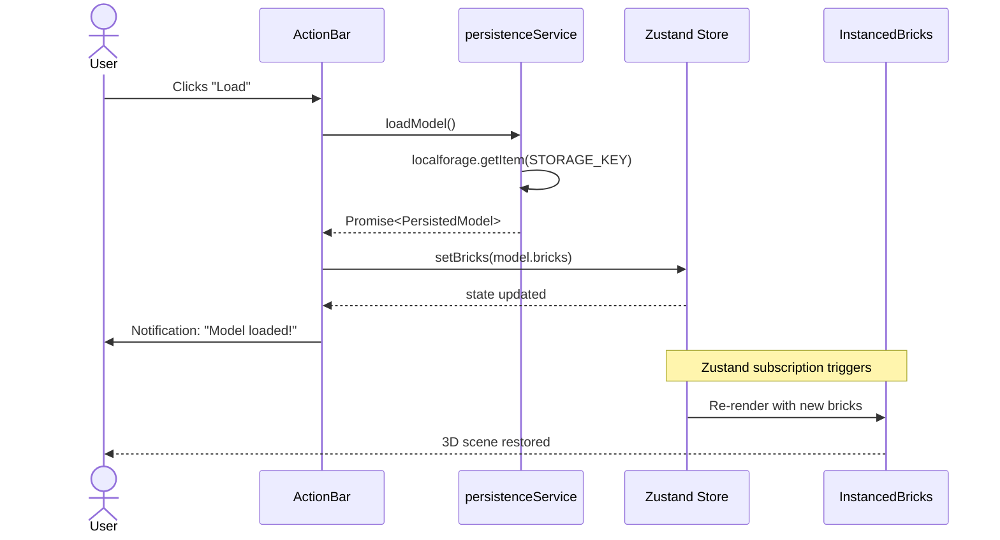
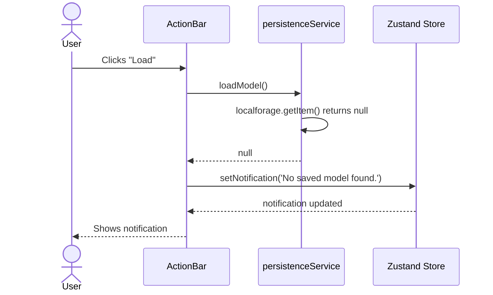
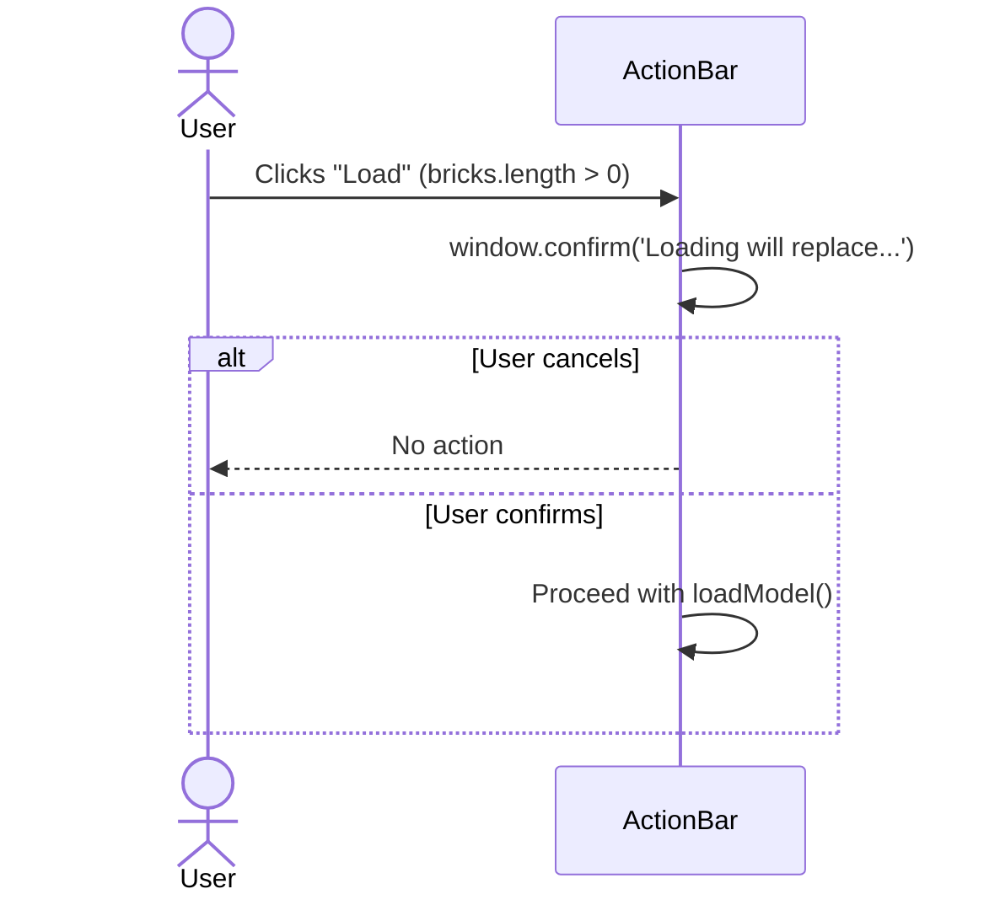

# Low-Level Design: FR-PERS-002 — Load Model from Browser Storage

**FR-ID:** FR-PERS-002
**Issue:** #14
**Title:** Implement Load Model from Browser Storage with Full Scene Restoration
**Priority:** P0
**Depends On:** FR-PERS-001
**Related FRs:** FR-PERS-001 (Save Model), FR-SHARE-001 (JSON Export/Import)

---

## 1. Overview

This LLD specifies the implementation for loading a previously saved LEGO model from browser local storage (LocalForage) and restoring it to the 3D scene with 100% data fidelity. The feature completes the persistence pair with FR-PERS-001 (Save Model).

**Key Requirements:**
- Load button in ActionBar with `data-testid="btn-load"`
- `persistenceService.loadModel()` returns `Brick[] | null`
- On load success: clear current scene, replace with saved bricks via `store.setBricks(bricks)`
- On load failure (no saved model): show notification "No saved model found."
- 100% fidelity: all brick fields (position, color, type, rotation) must be restored exactly
- Optional: confirmation dialog if current scene has bricks (prevents accidental overwrite)

---

## 2. Data Model & Storage Schema

### 2.1 Persisted Model Schema

```typescript
// src/services/persistenceService.ts
interface PersistedModel {
  version: string;      // Schema version for future migrations
  savedAt: string;      // ISO 8601 timestamp
  bricks: Brick[];      // Complete brick array
}

const STORAGE_KEY = 'lego-builder-model';
const SCHEMA_VERSION = '1.0.0';
```

**Storage Backend:** LocalForage (abstracts IndexedDB / localStorage).

### 2.2 Brick Data Contract

```typescript
interface Brick {
  id: string;           // uuid v4
  x: number;            // grid X coordinate (integer)
  y: number;            // grid Y (always 0 for MVP — CLR-01)
  z: number;            // grid Z coordinate (integer)
  type: BrickType;      // '1x1' | '1x2' | '2x2' | '2x4'
  colorId: string;      // references LEGO_COLORS[id]
  rotation: number;     // 0 | 90 | 180 | 270 (degrees Y-axis)
}
```

**Fidelity Guarantee:** The `Brick` type is fully serializable (no Three.js objects). All fields are primitive types, ensuring perfect round-trip.

---

## 3. Component Architecture

### 3.1 High-Level Component Diagram

```mermaid
flowchart TD
  A[ActionBar] -->|onClick| B[persistenceService.loadModel]
  B -->|Promise<Brick[]|null>| C{Result?}
  C -- null --> D[store.setNotification('No saved model found.')]
  C -- Brick[] --> E[store.setBricks(bricks)]
  E --> F[Zustand store updates]
  F --> G[InstancedBricks re-renders]
  G --> H[Scene restored]
```

### 3.2 Modified Components

| Component | File | Changes |
|-----------|------|---------|
| ActionBar | `src/components/ActionBar/ActionBar.tsx` | Add Load button with `data-testid="btn-load"`; onClick handler calls `loadModel()` and updates store |
| Persistence Service | `src/services/persistenceService.ts` | Implement `loadModel()` (already scaffolded — verify correctness) |
| Zustand Store | `src/store/useBrickStore.ts` | `setBricks(bricks)` action already exists — used to replace entire brick array |
| Notification | `src/components/ActionBar/Notification.tsx` | Already present from FR-PERS-001 — displays `store.notification` |

### 3.3 ActionBar Load Button Integration

```typescript
// src/components/ActionBar/ActionBar.tsx (additions)
import { loadModel } from '../../services/persistenceService';
import { useBrickStore } from '../../store/useBrickStore';

// Inside component:
const handleLoad = async () => {
  // Optional: confirm if current scene has bricks
  if (store.bricks.length > 0) {
    const ok = window.confirm('Loading will replace your current model. Continue?');
    if (!ok) return;
  }

  const bricks = await loadModel();
  if (bricks === null) {
    store.setNotification('No saved model found.');
  } else {
    store.setBricks(bricks);
    store.setNotification('Model loaded!');
  }
};

// Render (alongside Save button):
<button data-testid="btn-load" onClick={handleLoad}>Load</button>
```

### 3.4 Persistence Service Implementation

```typescript
// src/services/persistenceService.ts
import localforage from 'localforage';
import { Brick } from '../store/types';

const STORAGE_KEY = 'lego-builder-model';

interface PersistedModel {
  version: string;
  savedAt: string;
  bricks: Brick[];
}

export async function loadModel(): Promise<Brick[] | null> {
  const model = await localforage.getItem<PersistedModel>(STORAGE_KEY);
  if (!model) return null;
  return model.bricks;
}
```

**Note:** The `saveModel()` function from FR-PERS-001 already stores the full `PersistedModel` with version and timestamp. This `loadModel()` simply extracts the `bricks` array.

### 3.5 Store Action (Already Exists)

```typescript
// src/store/useBrickStore.ts
setBricks: (bricks: Brick[]) => {
  state.bricks = bricks;
}, // FR-PERS-002 uses this to replace the entire scene
```

---

## 4. Sequence Diagrams

### 4.1 Load Success Flow



### 4.2 Load Failure (No Saved Model) Flow



### 4.3 Confirmation Dialog Flow (Optional)



---

## 5. Error Handling Strategy

| Error Scenario | Detection | Handling | User Feedback |
|----------------|-----------|----------|---------------|
| No saved model exists | `loadModel()` returns `null` | Show notification: "No saved model found." | Non-error informational message (toast/notification)
| LocalForage storage error (quota exceeded, corrupted) | `loadModel()` throws exception | Catch error, show notification: "Failed to load model: {error.message}" | Error notification (toast)
| Invalid data schema (missing bricks, wrong version) | `loadModel()` returns object but `bricks` is missing/not array | Treat as `null` (no saved model) or show error if partial data exists | "No saved model found." or "Corrupted model data." |

**Implementation Pattern:**

```typescript
const handleLoad = async () => {
  try {
    const bricks = await loadModel();
    if (bricks === null) {
      store.setNotification('No saved model found.');
    } else {
      store.setBricks(bricks);
      store.setNotification('Model loaded!');
    }
  } catch (error) {
    store.setNotification(`Failed to load model: ${error.message}`);
  }
};
```

---

## 6. Security Considerations

- **No server-side transmission:** All data stays in the browser; LocalForage uses only client-side storage (IndexedDB or localStorage).
- **Input validation:** The `Brick[]` array from storage is assumed to be valid because it was written by the same app's `saveModel()`. However, if users manually edit storage (unlikely), malformed data could cause rendering errors. The `InstancedBricks` component should handle missing/invalid brick types gracefully (fallback to default type).
- **XSS:** Not applicable — no HTML injection from stored data.
- **Storage quota:** LocalForage may throw `QuotaExceededError` on save, but load is read-only and should not fail due to quota. However, corrupted storage could throw. Catch and display user-friendly error.

---

## 7. Performance Considerations

- **Load time:** For 1,000 bricks, `localforage.getItem()` should complete within 100ms on modern browsers. The bottleneck is re-rendering the InstancedMesh, which updates all instance matrices in a single pass.
- **Re-render optimization:** `store.setBricks()` replaces the entire array, causing `InstancedBricks` to rebuild all instances. This is O(n) and acceptable for up to 1,000 bricks (target < 200ms).
- **Memory:** The brick array is duplicated briefly during replacement. Use immutable update pattern: `state.bricks = newBricks` (Zustand handles this efficiently).

---

## 8. Test Coverage Requirements

| Test ID | Type | Description |
|---------|------|-------------|
| T-FE-PERS-002-01 | Unit | `loadModel()` returns `null` when storage empty |
| T-FE-PERS-002-02 | Unit | `loadModel()` returns `Brick[]` when storage has valid model |
| T-FE-PERS-002-03 | Behavioral | Load populates scene with saved brick meshes (full app, no mocks) |
| T-E2E-AFOL-001-01 | E2E | AFOL build and export flow (Load used at start) — covered in E2E suite |

**Unit Tests (Vitest):**
- Mock LocalForage to return `null` and valid `PersistedModel`.
- Verify `loadModel()` extracts `bricks` correctly.

**Behavioral Test:**
- Render full `<App />`.
- Mock LocalForage to return a brick array.
- Click Load button.
- Assert `useBrickStore.getState().bricks` equals the loaded array.
- Assert notification shows "Model loaded!".

**E2E Test (Playwright):**
- Already covered in T-E2E-AFOL-001-01: full flow includes Save → reload page → Load.

---

## 9. Integration with Other FRs

| FR | Integration Point |
|----|-------------------|
| FR-PERS-001 | Shared storage key (`STORAGE_KEY`) and schema (`PersistedModel`). Save and Load are symmetric operations. |
| FR-SHARE-001 | JSON export/import uses a different format (`ExportedModel`) but same `Brick[]` data. Could be refactored to share schema in future. |
| FR-PERF-001 | Load performance is critical: restoring 500+ bricks must not drop below 30 FPS. InstancedBricks handles this efficiently. |

---

## 10. Open Questions & Assumptions

| Question | Assumption / Resolution |
|----------|-------------------------|
| Should Load show a confirmation if current scene is empty? | No — only confirm if `bricks.length > 0` to prevent accidental loss of unsaved work. |
| What if the saved model has a different schema version? | Current MVP has only version 1.0.0. Future: implement version migration or show error. |
| Should Load clear the current scene before applying new bricks? | Yes — `store.setBricks(bricks)` replaces the array, effectively clearing and repopulating in one operation. |
| Does Load need to reset camera/view? | No — preserve user's camera position; only the model changes. |

---

## 11. Implementation Checklist (DoD)

- [ ] ActionBar.tsx: Load button with `data-testid="btn-load"`
- [ ] ActionBar.tsx: onClick handler calls `loadModel()` and handles null/array cases
- [ ] ActionBar.tsx: Optional confirmation dialog when `bricks.length > 0`
- [ ] persistenceService.ts: `loadModel()` implementation matches spec
- [ ] Notification: "Model loaded!" on success, "No saved model found." on empty
- [ ] 100% data fidelity: all brick fields restored exactly
- [ ] Unit tests T-FE-PERS-002-01, T-FE-PERS-002-02 passing
- [ ] Behavioral test T-FE-PERS-002-03 passing
- [ ] E2E test T-E2E-AFOL-001-01 passing (includes Load)
- [ ] Code reviewed and PR merged

---

## 12. References

- **PRD:** `docs/PRD.md` — FR-PERS-002 definition
- **Technical Architecture:** `docs/TECHNICAL_ARCHITECTURE.md` — Persistence Service, Zustand Store, Component Integration
- **Stub Replacement Table:** `docs/TECHNICAL_ARCHITECTURE.md` §4.2 — ActionBar stub
- **Test IDs:** `docs/PRD.md` §FR-PERS-002
- **Related FR:** FR-PERS-001 (Save Model) — symmetric persistence operation

---

*Document generated by Spectra Design Agent — FR-PERS-002 LLD*