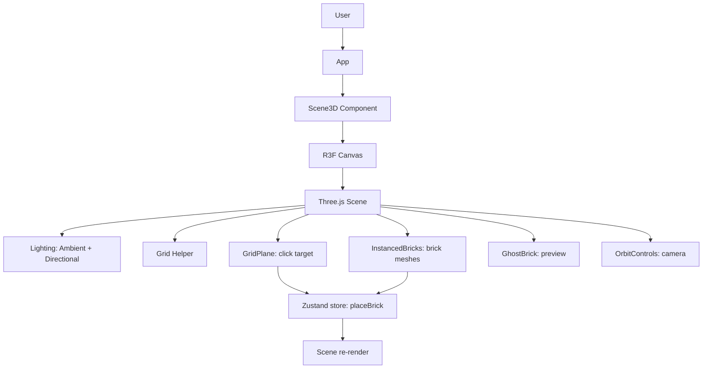
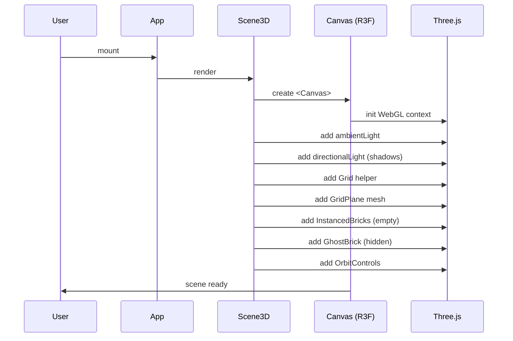
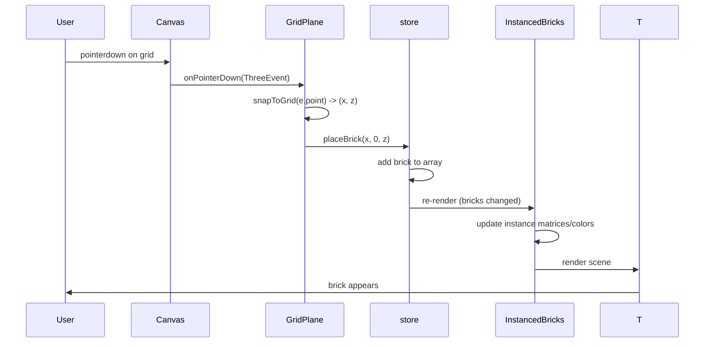
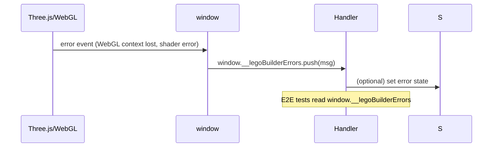

# Low-Level Design: FR-SCENE-001 — 3D Scene Rendering

**Issue:** #8  
**FR-ID:** FR-SCENE-001  
**Title:** Implement 3D Scene Rendering with R3F Canvas, Lighting & OrbitControls  
**Branch:** `feature/8-3d-scene-rendering-design`  
**Design Agent:** design-agent  
**Date:** 2025-06-17

---

## 1. Overview

### 1.1 Scope

This LLD defines the implementation details for **FR-SCENE-001**, which establishes the 3D scene rendering foundation using React Three Fiber (R3F). The scope includes:

- R3F `<Canvas>` configuration (camera, shadows, antialiasing)
- Lighting setup (ambient + directional with shadows)
- Ground grid visualization
- Camera controls via `OrbitControls` with mouse button configuration to reserve LEFT button for brick placement
- Integration points for `GridPlane` (click target), `InstancedBricks` (brick rendering), and `GhostBrick` (placement preview)
- Global WebGL error detection and reporting

### 1.2 Out of Scope

- Brick placement logic (FR-BRICK-001)
- Brick color selection (FR-BRICK-002)
- Brick type selection (FR-BRICK-003)
- Persistence (FR-PERS-001/002)
- Export/Import (FR-SHARE-001)
- Instanced rendering optimization (FR-PERF-001) — although `InstancedBricks` component is included as part of the scene, its internal optimization is covered in a separate LLD.

### 1.3 References

- PRD: `docs/PRD.md` (FR-SCENE-001 acceptance criteria)
- Technical Architecture: `docs/TECHNICAL_ARCHITECTURE.md` (Section 2.3, 3.1–3.4, 4.1)
- Issue #8: Full implementation scope and test IDs
- Tech Stack: `docs/tech_stack.yaml` (React 18, R3F 8, Drei 9, Three.js 0.165.x)

---

## 2. System Context



The `Scene3D` component is the root of the 3D view. It owns the R3F Canvas and sets up the Three.js scene graph. It does **not** handle user input directly; that is delegated to child meshes (e.g., `GridPlane` for placement, `InstancedBricks` for brick selection). The component integrates with the global Zustand store (`useBrickStore`) to read brick data and trigger re-renders.

---

## 3. Component Architecture

### 3.1 Component Tree

```
<Scene3D>
  <Canvas camera={{ position: [10, 10, 10], fov: 50 }} gl={{ antialias: true }} shadows>
    <ambientLight intensity={0.6} />
    <directionalLight position={[10, 20, 10]} intensity={0.8} castShadow />
    <Grid args={[20, 20]} cellColor="#888" sectionColor="#444" />
    <GridPlane />
    <InstancedBricks />
    <GhostBrick />
    <OrbitControls mouseButtons={{ LEFT: undefined, MIDDLE: 1, RIGHT: 2 }} enableDamping />
  </Canvas>
</Scene3D>
```

### 3.2 Component Responsibilities

| Component | Responsibility | Key Props / State |
|-----------|----------------|-------------------|
| `Scene3D` | Creates Canvas, configures scene-wide settings (shadows, antialias), composes child 3D elements. | None (static) |
| `GridPlane` | Invisible mesh that receives pointer events for brick placement. Calls `store.placeBrick()` on `onPointerDown`. | None (reads store for active tool/color/type) |
| `InstancedBricks` | Renders all placed bricks using `THREE.InstancedMesh` per brick type. Subscribes to `store.bricks`. | `bricks` from store |
| `GhostBrick` | Semi-transparent preview of the brick that follows the cursor while in Place mode. Uses `useRef` for position to avoid store churn. | Active brick type/color from store |
| `OrbitControls` | Handles camera orbit, zoom, pan. Configured to free LEFT mouse button for placement. | `mouseButtons` config |

### 3.3 Interfaces (Props & Callbacks)

All components are internal to the `Scene3D` module and share access to the global `useBrickStore`. No external props are required.

**GridPlane**

- **Store dependencies:** `activeTool`, `activeBrickType`, `activeColorId`
- **Actions:** `placeBrick(x, z)` (Y is always 0)
- **Events:** `onPointerDown` (R3F `ThreeEvent<PointerEvent>`) → `snapToGrid(e.point)` → `store.placeBrick(snappedX, 0, snappedZ)`

**InstancedBricks**

- **Store dependencies:** `bricks`
- **Rendering:** Groups bricks by `type`, creates one `InstancedMesh` per type with count = number of bricks of that type.
- **Update cycle:** `useEffect` on `bricks` builds instance matrices and colors. Calls `mesh.instanceMatrix.needsUpdate = true` and `mesh.instanceColor.needsUpdate = true`.

**GhostBrick**

- **Store dependencies:** `activeTool` (only visible in Place mode), `activeBrickType`, `activeColorId`
- **Position:** Derived from `useGridInteraction` hook that tracks mouse position in world space (via raycaster on an invisible plane).
- **Rendering:** Single `mesh` with `meshBasicMaterial` (transparent) and geometry from `BRICK_CATALOG`.

---

## 4. Sequence Diagrams

### 4.1 Scene Initialization



### 4.2 Brick Placement Interaction



### 4.3 WebGL Error Detection



---

## 5. Data Models

### 5.1 Scene Configuration (internal constants)

```typescript
// Scene3D constants
const CAMERA_CONFIG = {
  position: [10, 10, 10] as [number, number, number],
  fov: 50,
};

const LIGHTING = {
  ambient: { intensity: 0.6 },
  directional: { position: [10, 20, 10] as [number, number, number], intensity: 0.8, castShadow: true },
};

const GRID_CONFIG = {
  size: 20,
  divisions: 20,
  cellColor: '#888',
  sectionColor: '#444',
};

const ORBIT_CONTROLS_CONFIG = {
  mouseButtons: { LEFT: undefined, MIDDLE: 1, RIGHT: 2 },
  enableDamping: true,
};
```

These values are hardcoded in `Scene3D.tsx` per the Tech Arch. They may be exposed as configurable in future FRs.

### 5.2 Store State (shared)

The `useBrickStore` state is defined in `docs/TECHNICAL_ARCHITECTURE.md` Section 2.2. `Scene3D` components read from the store but do not modify it directly except `GridPlane` calling `placeBrick`.

---

## 6. Error Handling Strategy

| Error Scenario | Detection | Handling | User Impact |
|----------------|-----------|----------|-------------|
| WebGL context loss | `window.addEventListener('error')` capturing WebGL/THREE errors | Errors logged to `window.__legoBuilderErrors`; UI may show generic error if critical | Scene may freeze or go blank; user can reload |
| Geometry/material leaks | Manual code review; `useEffect` cleanup in components that create geometries | Call `geometry.dispose()` and `material.dispose()` on unmount (e.g., `GhostBrick`) | Memory growth over time; eventual slowdown |
| Invalid brick placement (duplicate) | `isCellOccupied()` check in `placeBrick` action | Silently reject; no UI error (spec says visual indicator of occupied cell) | User sees no new brick; may be confused if no feedback |
| InstancedMesh count overflow | `bricks.length > current mesh count` | Recreate mesh with larger count (or pre-allocate large count) | Performance hiccup during rebuild; eventual correct rendering |

**Global Error Handler** (in `src/main.tsx`):

```typescript
window.addEventListener('error', (event) => {
  const msg = event.message;
  if (msg.includes('WebGL') || msg.includes('THREE')) {
    window.__legoBuilderErrors.push(msg);
  }
});
```

E2E tests will assert `window.__legoBuilderErrors.length === 0` after normal interactions.

---

## 7. Security Considerations

- **XSS via JSON Import:** The `importModelJSON` function validates the structure and sanitizes string fields (max length, allowed characters). No `eval()` or `innerHTML` used.
- **CSP:** The app is served with a strict Content Security Policy that disallows inline scripts except for Vite's HMR in development. See `nginx.conf` in Tech Arch.
- **No External Data:** All data stays in the browser; no network requests for model data in MVP.
- **Third-Party Libraries:** All dependencies are from npm with locked versions. No dynamic script loading.

---

## 8. Performance Considerations

- **InstancedMesh:** Bricks of the same type are rendered in a single draw call. This is critical for FR-PERF-001.
- **Re-render minimization:** `GhostBrick` uses `useRef` for its world position to avoid triggering Zustand store updates on every mouse move. Only `placeBrick` commits to store.
- **R3F re-render control:** R3F automatically re-renders when subscribed store state changes. We keep store updates minimal (only brick array changes) to avoid unnecessary renders.
- **Geometry reuse:** `BRICK_CATALOG` provides shared `THREE.BoxGeometry` instances; do not create new geometries per brick.
- **Material reuse:** A single `meshStandardMaterial` is used for all bricks in `InstancedBrickType`; per-instance color is set via `instanceColor`.

---

## 9. Testing Strategy

| Test Level | Scope | Tools | Example Tests |
|------------|-------|-------|---------------|
| Unit | Component rendering, store actions | Vitest, React Testing Library | `Scene3D` renders Canvas and lights; `placeBrick` adds brick |
| Behavioral | Full app integration without mocks | Vitest (jsdom) | Clicking grid in Place mode adds brick to scene graph |
| E2E | Real browser performance and errors | Playwright | FPS measurement with 500 bricks; `window.__legoBuilderErrors` empty |

**Key Test IDs** (from Issue #8):
- T-FE-SCENE-001-01: Scene renders without WebGL errors
- T-FE-SCENE-001-02: Camera orbit controls are present
- T-FE-SCENE-001-03: Scene renders grid plane (full integration, no mocked stores)

---

## 10. Open Questions & Assumptions

| Question | Assumption / Resolution |
|----------|-------------------------|
| Should `GhostBrick` snap to grid in real-time? | Yes, it should show the exact grid cell where the brick will be placed. Implementation uses `snapToGrid` on the raycaster intersection point. |
| How to handle `OrbitControls` damping? | `enableDamping: true` is set; the `<Canvas>` must call `useFrame` to update controls: `<OrbitControls />` automatically integrates with R3F's render loop. |
| What if WebGL is not supported? | The app will show a blank canvas; we could add a fallback message but it's out of scope for MVP (assume WebGL 2.0 capable browser). |
| Should `GridPlane` be visible? | No, it's an invisible mesh (`<mesh visible={false}>`) that receives pointer events. The visible grid is the `Grid` helper from Drei. |

---

## 11. Implementation Checklist

- [ ] Create `src/components/Scene3D/Scene3D.tsx` with Canvas, lights, Grid, GridPlane, InstancedBricks, GhostBrick, OrbitControls
- [ ] Implement `GridPlane` with `onPointerDown` handler that calls `store.placeBrick` after snapping
- [ ] Ensure `OrbitControls` has `mouseButtons={{ LEFT: undefined }}` to free LEFT button
- [ ] Verify `InstancedBricks` updates correctly when `store.bricks` changes
- [ ] Add global error handler in `src/main.tsx` to populate `window.__legoBuilderErrors`
- [ ] Write unit tests for `Scene3D` rendering (lights, grid present)
- [ ] Write behavioral test for grid click → brick placed
- [ ] Write E2E test for FPS ≥ 30 with 500 bricks and zero WebGL errors
- [ ] Code review and PR merge

---

*End of LLD*