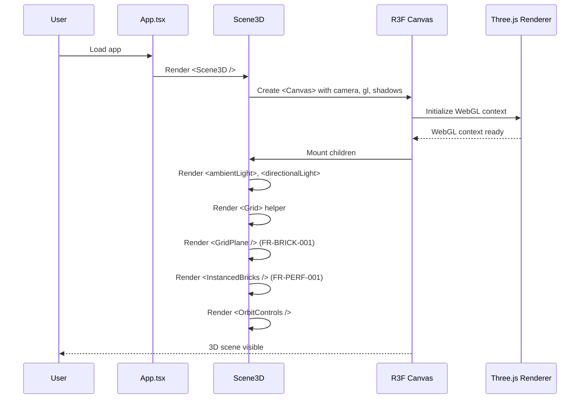
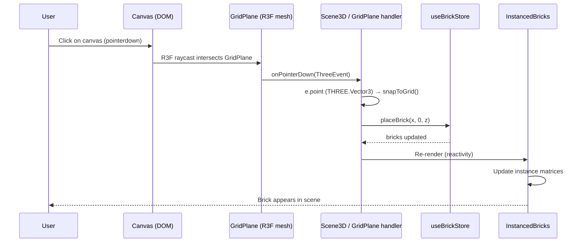
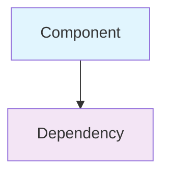

# Low-Level Design: FR-SCENE-001 — 3D Scene Rendering

**FR-ID:** FR-SCENE-001
**Issue:** #8
**Title:** Implement 3D Scene Rendering with R3F Canvas, Lighting & OrbitControls
**Priority:** P0
**Design Agent:** Spectra Design Agent
**Date:** 2025-06-17

---

## 1. Overview

This LLD defines the implementation details for the foundational 3D scene rendering component of the LEGO Builder Web App. It specifies the React Three Fiber (R3F) canvas configuration, lighting setup, camera controls, and integration points with other feature modules.

### 1.1 Scope

- Replace `src/components/Scene3D/Scene3D.tsx` stub with full R3F implementation
- Configure `<Canvas>` with proper camera, shadows, and WebGL settings
- Add ambient and directional lighting
- Add ground grid helper
- Configure OrbitControls with LEFT mouse button freed for brick placement
- Mount placeholder components for `GridPlane` (FR-BRICK-001) and `InstancedBricks` (FR-PERF-001)
- Register global WebGL error handler in `src/main.tsx`

### 1.2 Out of Scope

- Brick placement logic (handled by FR-BRICK-001)
- Instanced mesh rendering optimization (handled by FR-PERF-001)
- Color palette or brick type selection (handled by FR-BRICK-002, FR-BRICK-003)
- Toolbar or UI controls (handled by FR-TOOL-001, FR-TOOL-002)
- Persistence or export (handled by FR-PERS-001, FR-PERS-002, FR-SHARE-001)

---

## 2. Component Architecture

### 2.1 Scene3D Component Structure

```typescript
// src/components/Scene3D/Scene3D.tsx
import { Canvas } from '@react-three/fiber';
import { OrbitControls, Grid } from '@react-three/drei';
import { GridPlane } from './GridPlane';         // FR-BRICK-001 stub
import { InstancedBricks } from './InstancedBricks'; // FR-PERF-001 stub

export function Scene3D() {
  return (
    <Canvas
      camera={{ position: [10, 10, 10], fov: 50 }}
      gl={{ antialias: true }}
      shadows
    >
      {/* Lighting */}
      <ambientLight intensity={0.6} />
      <directionalLight
        position={[10, 20, 10]}
        intensity={0.8}
        castShadow
      />

      {/* Grid helper (visual only) */}
      <Grid
        args={[20, 20]}
        cellColor="#888888"
        sectionColor="#444444"
      />

      {/* Interaction layer */}
      <GridPlane />        {/* Clickable plane for brick placement */}
      <InstancedBricks /> {/* Instanced mesh renderer for placed bricks */}

      {/* Camera controls */}
      <OrbitControls
        mouseButtons={{
          LEFT: undefined,   // Free LEFT for brick placement
          MIDDLE: 1,         // MIDDLE = dolly/zoom
          RIGHT: 2,          // RIGHT = pan
        }}
        enableDamping
      />
    </Canvas>
  );
}
```

### 2.2 Dependencies

| Dependency | Version | Purpose |
|------------|---------|---------|
| `@react-three/fiber` | 8.x | React renderer for Three.js |
| `@react-three/drei` | 9.x | Helper components (OrbitControls, Grid) |
| `three` | 0.165.x | Core 3D engine (transitive) |
| `react` | 18.x | UI framework |
| `typescript` | 5.x | Type safety |

### 2.3 Interfaces

#### Canvas Props (from R3F)

```typescript
interface CanvasProps {
  camera?: { position: [number, number, number]; fov: number };
  gl?: { antialias: boolean };
  shadows?: boolean;
  children?: React.ReactNode;
}
```

#### OrbitControls Props (from Drei)

```typescript
interface OrbitControlsProps {
  mouseButtons?: {
    LEFT: number | undefined;  // undefined = not used
    MIDDLE: number;
    RIGHT: number;
  };
  enableDamping?: boolean;
}
```

---

## 3. Data Models

### 3.1 Zustand Store (Shared)

The `useBrickStore` holds the application state. Scene3D does not directly modify the store but subscribes to `bricks` to render via `InstancedBricks`.

```typescript
// src/store/types.ts (referenced)
export interface Brick {
  id: string;           // uuid
  x: number;            // grid X (integer)
  y: number;            // grid Y (always 0 for MVP)
  z: number;            // grid Z (integer)
  type: BrickType;      // '1x1' | '1x2' | '2x2' | '2x4'
  colorId: string;      // references LEGO_COLORS[id]
  rotation: number;     // 0 | 90 | 180 | 270 (degrees around Y-axis)
}

export interface BrickStore {
  bricks: Brick[];
  activeTool: Tool;           // 'place' | 'delete'
  activeColorId: string;      // default: 'bright-red'
  activeBrickType: BrickType; // default: '1x1'
  notification: string | null;
  // actions...
}
```

### 3.2 Brick Catalog (Domain)

```typescript
// src/domain/brickCatalog.ts
export interface BrickDefinition {
  type: BrickType;
  label: string;
  width: number;   // grid units (X)
  depth: number;   // grid units (Z)
  height: number;  // grid units (Y) — always 1 for MVP
  geometry: THREE.BoxGeometry;
}

export const BRICK_CATALOG: Record<BrickType, BrickDefinition> = {
  '1x1': { type: '1x1', label: '1×1', width: 1, depth: 1, height: 1,
           geometry: new THREE.BoxGeometry(0.95, 0.95, 0.95) },
  '1x2': { type: '1x2', label: '1×2', width: 1, depth: 2, height: 1,
           geometry: new THREE.BoxGeometry(0.95, 0.95, 1.95) },
  '2x2': { type: '2x2', label: '2×2', width: 2, depth: 2, height: 1,
           geometry: new THREE.BoxGeometry(1.95, 0.95, 1.95) },
  '2x4': { type: '2x4', label: '2×4', width: 2, depth: 4, height: 1,
           geometry: new THREE.BoxGeometry(1.95, 0.95, 3.95) },
};
```

---

## 4. Sequence Diagrams

### 4.1 Scene Initialization



### 4.2 Brick Placement Event Flow



---

## 5. Error Handling Strategy

### 5.1 WebGL Context Loss

**Detection:** R3F fires `gl` context loss events on the Canvas.

**Handling:**
- Register global error handlers in `src/main.tsx`:
  ```typescript
  window.addEventListener('error', (event) => {
    if (event.message.includes('WebGL')) {
      window.__legoBuilderErrors?.push(event.message);
    }
  });
  ```
- For context loss, show a user-friendly message: "WebGL context lost. Please refresh the page."
- Do not attempt auto-recovery; context restoration is unreliable.

### 5.2 Three.js Resource Disposal

**Rule:** Three.js does NOT auto-dispose geometries and materials.

**Enforcement:**
- In `InstancedBricks.tsx` (FR-PERF-001), on unmount:
  ```typescript
  useEffect(() => {
    return () => {
      geometry.dispose();
      // material is shared; not disposed here
    };
  }, []);
  ```
- The `BRICK_CATALOG` geometries are module-level singletons and live for the app lifetime; no disposal needed.

### 5.3 OrbitControls Configuration Errors

**Risk:** Misconfiguration could block LEFT mouse for brick placement.

**Validation:**
- Unit test: verify `OrbitControls` props include `mouseButtons={{ LEFT: undefined }}`
- E2E test: simulate left-click on canvas and verify brick placement still works

### 5.4 InstancedMesh Count Overflow

**Risk:** Adding more bricks than the `count` argument silently fails.

**Mitigation:**
- In `InstancedBricks.tsx`, set `count = Math.max(bricks.length, 1)` on each render.
- For production, consider pre-allocating a large count (e.g., 1000) and recreating mesh when exceeded, or use a dynamic allocation strategy (FR-PERF-001 implementation).

---

## 6. Security Considerations

### 6.1 Content Security Policy (CSP)

**Recommendation:** Deploy with CSP headers to mitigate XSS.

```nginx
# nginx.conf
add_header Content-Security-Policy
  "default-src 'self'; script-src 'self' 'unsafe-eval'; style-src 'self' 'unsafe-inline'; worker-src blob:";
```

- `'unsafe-eval'` required for Vite dev and some Three.js builds; consider CSP nonce in production if feasible.
- `worker-src blob:` allows Web Workers if used later.

### 6.2 XSS via JSON Import

**Risk:** Importing malicious JSON could inject script if data is used in `innerHTML`.

**Mitigation:**
- In `exportService.ts`, strictly validate imported JSON schema.
- Sanitize string fields: limit length, strip HTML tags.
- Never use imported data in `dangerouslySetInnerHTML` or `eval()`.

### 6.3 No External Data Transmission

**Requirement:** NFR-SEC-001 — all model data stays in browser.

**Enforcement:**
- No `fetch()` or `XMLHttpRequest` calls in FR-SCENE-001.
- Verify via CI: network tab audit in E2E tests shows zero outbound requests containing model data.

---

## 7. Performance Considerations

### 7.1 FPS Targets

- ≥ 60 FPS with 100 bricks (baseline)
- ≥ 30 FPS with 500 bricks (NFR-PERF-001)

### 7.2 Optimization Path

1. **Initial implementation:** Simple `InstancedBricks` with per-frame matrix updates (as shown in TECHNICAL_ARCHITECTURE.md).
2. **If FPS < target:** Implement FR-PERF-001 optimizations:
   - Use `useMemo` for geometry and material to avoid recreation
   - Batch updates: only mark `instanceMatrix.needsUpdate` when bricks change
   - Consider frustum culling (Three.js does this automatically)
   - Reduce shadow map resolution if needed

### 7.3 Memory Management

- Dispose geometries on component unmount (see §5.3).
- Avoid creating new `THREE.Matrix4` or `THREE.Color` objects inside render loops; reuse instances.

---

## 8. Testing Strategy

### 8.1 Unit Tests (Vitest)

| Test ID | Description |
|---------|-------------|
| T-FE-SCENE-001-01 | Scene renders without WebGL errors |
| T-FE-SCENE-001-02 | Camera orbit controls are present |

**Implementation:**
```typescript
// src/tests/unit/Scene3D.test.tsx
import { describe, it, expect } from 'vitest';
import { render } from '@testing-library/react';
import { Scene3D } from '../../components/Scene3D/Scene3D';

describe('Scene3D', () => {
  it('T-FE-SCENE-001-01: renders without WebGL errors', () => {
    const { container } = render(<Scene3D />);
    const canvas = container.querySelector('canvas');
    expect(canvas).toBeTruthy();
    // Check no errors in window.__legoBuilderErrors
    expect(window.__legoBuilderErrors).toHaveLength(0);
  });

  it('T-FE-SCENE-001-02: contains OrbitControls with LEFT freed', () => {
    const { container } = render(<Scene3D />);
    // Verify OrbitControls component is present (via R3F scene graph)
    // This may require accessing the Three.js scene directly
    // For unit test, we can mock OrbitControls and check props
  });
});
```

### 8.2 Behavioral Tests (Vitest + RTL)

| Test ID | Description |
|---------|-------------|
| T-FE-SCENE-001-03 | Scene renders grid plane (full app, no mocked stores) |

**Implementation:**
```typescript
// src/tests/behavioral/Scene3D.behavioral.test.tsx
import { describe, it, expect } from 'vitest';
import { render } from '@testing-library/react';
import { App } from '../../App';

describe('Scene3D Behavioral', () => {
  it('T-FE-SCENE-001-03: grid plane visible in full app', () => {
    const { container } = render(<App />);
    const canvas = container.querySelector('canvas');
    expect(canvas).toBeTruthy();
    // Verify Grid helper rendered (check scene graph)
  });
});
```

### 8.3 E2E Tests (Playwright)

| Test ID | Description |
|---------|-------------|
| T-E2E-SCREENSHOT-001-01 | Brick placement screenshot comparison |
| T-E2E-SCREENSHOT-001-02 | Delete brick screenshot comparison |

These tests are implemented in FR-BRICK-001 and FR-TOOL-002 but depend on FR-SCENE-001 being functional.

---

## 9. Implementation Checklist

- [ ] Create `src/components/Scene3D/Scene3D.tsx` with R3F Canvas
- [ ] Configure camera: `position: [10, 10, 10]`, `fov: 50`
- [ ] Enable `gl={{ antialias: true }}` and `shadows`
- [ ] Add `<ambientLight intensity={0.6} />`
- [ ] Add `<directionalLight position={[10, 20, 10]} intensity={0.8} castShadow />`
- [ ] Add `<Grid args={[20, 20]} cellColor="#888" sectionColor="#444" />`
- [ ] Add `<GridPlane />` placeholder (FR-BRICK-001 stub)
- [ ] Add `<InstancedBricks />` placeholder (FR-PERF-001 stub)
- [ ] Add `<OrbitControls mouseButtons={{ LEFT: undefined, MIDDLE: 1, RIGHT: 2 }} enableDamping />`
- [ ] Register global WebGL error handler in `src/main.tsx`
- [ ] Write unit tests: T-FE-SCENE-001-01, T-FE-SCENE-001-02
- [ ] Write behavioral test: T-FE-SCENE-001-03
- [ ] Verify all tests pass
- [ ] Code review and PR merge

---

## 10. Open Questions / Assumptions

| ID | Question | Assumption / Resolution |
|----|----------|-------------------------|
| A1 | Grid size? | 20×20 grid units (matches `Grid args={[20, 20]}`) |
| A2 | Shadow map resolution? | Default (1024×1024) — can be tuned later if performance issues |
| A3 | Background color? | Default transparent (shows HTML background) — can be set via `gl={{ alpha: true }}` |
| A4 | Should GridPlane be invisible? | Yes — invisible mesh that receives pointer events for placement |
| A5 | Should we dispose `BRICK_CATALOG` geometries? | No — they are module-level singletons for app lifetime |

---

## 11. References

- **TECHNICAL_ARCHITECTURE.md** — Section 2.3 (Scene3D.tsx example), Section 3 (Framework Runtime Contracts)
- **PRD.md** — FR-SCENE-001 acceptance criteria
- **React Three Fiber Docs** — https://docs.pmnd.rs/react-three-fiber/getting-started/introduction
- **Drei OrbitControls** — https://docs.pmnd.rs/drei/orbit-controls

---

## Appendix: Mermaid Diagram Legend


