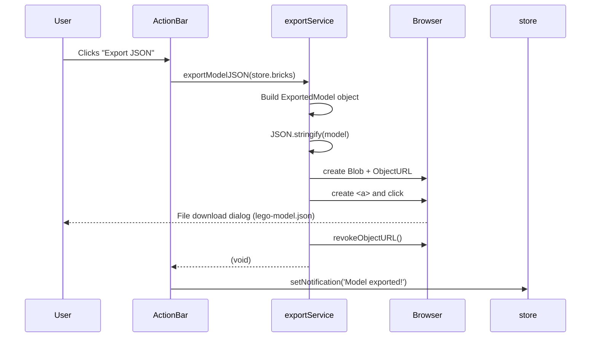

# Low-Level Design: FR-SHARE-001 — JSON Export & Import

**FR-ID:** FR-SHARE-001
**Issue:** #17
**Title:** Implement JSON Export & Import for Model Sharing with Versioned Format
**Priority:** P1
**Persona:** AFOL
**Dependencies:** FR-PERS-001

---

## 1. Overview

This LLD defines the implementation design for JSON export and import functionality. The feature enables users to:
- Export the current model (all brick data) as a versioned JSON file downloaded to their device
- Import a JSON file to restore a model, with validation and error handling

This is a **client-only** feature with no backend. All operations happen in the browser.

---

## 2. Data Models

### 2.1 Exported Model Schema (Versioned)

```typescript
interface ExportedModel {
  version: string;           // Schema version, e.g., "1.0.0"
  exportedAt: string;        // ISO 8601 timestamp
  bricks: Brick[];           // Array of brick objects
}
```

### 2.2 Brick Interface (Runtime)

```typescript
interface Brick {
  id: string;               // UUID (max 64 chars after sanitization)
  x: number;                // Grid X coordinate (integer)
  y: number;                // Grid Y coordinate (always 0 in MVP)
  z: number;                // Grid Z coordinate (integer)
  type: BrickType;          // '1x1' | '1x2' | '2x2' | '2x4'
  colorId: string;          // References LEGO_COLORS[id]
  rotation: number;         // 0 | 90 | 180 | 270 (degrees Y-axis)
}
```

### 2.3 Validation Allowlists

```typescript
const VALID_BRICK_TYPES = ['1x1', '1x2', '2x2', '2x4'] as const;
const VALID_COLOR_IDS = LEGO_COLORS.map(c => c.id); // from colorPalette.ts
const VALID_ROTATIONS = [0, 90, 180, 270] as const;
```

---

## 3. Component Architecture

### 3.1 Service Layer

| Service | File | Responsibility |
|---------|------|----------------|
| `exportService` | `src/services/exportService.ts` | - `exportModelJSON(bricks: Brick[]): void` — triggers file download<br>- `importModelJSON(jsonString: string): Brick[]` — validates and sanitizes imported bricks |

### 3.2 UI Components

| Component | File | Responsibility |
|-----------|------|----------------|
| `ActionBar` | `src/components/ActionBar/ActionBar.tsx` | Renders Export and Import buttons; integrates with `exportService` and store |

### 3.3 State Management (Zustand)

The `useBrickStore` already contains:
- `bricks: Brick[]` — source data for export
- `setBricks(bricks: Brick[])` — used by import to replace scene
- `setNotification(msg: string | null)` — shows success/error messages

---

## 4. API Interfaces (Service Functions)

### 4.1 `exportModelJSON(bricks: Brick[]): void`

**Purpose:** Serialize the model to JSON and trigger a file download.

**Algorithm:**
1. Create `ExportedModel` object with `version: '1.0.0'`, `exportedAt: new Date().toISOString()`, and `bricks`.
2. `JSON.stringify(model, null, 2)` for pretty-printed output.
3. Create `Blob` with type `application/json`.
4. `URL.createObjectURL(blob)` to get a temporary URL.
5. Create `<a>` element, set `href` and `download='lego-model.json'`.
6. Programmatically click the anchor to trigger download.
7. `URL.revokeObjectURL(url)` to clean up.

**Errors:** None thrown; synchronous operation. Any errors (unlikely) would be caught by global error handler.

### 4.2 `importModelJSON(jsonString: string): Brick[]`

**Purpose:** Parse and validate imported JSON, return sanitized brick array.

**Algorithm:**
1. `JSON.parse(jsonString)` inside try/catch.
   - On `SyntaxError`: throw `Error('Invalid JSON: file could not be parsed')`.
2. Validate structure:
   - `parsed` must be non-null object
   - Must have `version` (string) and `bricks` (array) properties
   - If missing: throw `Error('Invalid model format: missing version or bricks fields')`
3. Sanitize each brick in `bricks` array:
   - `id`: `String(brick.id).slice(0, 64)`
   - `type`: allowlist check; default `'1x1'` if invalid
   - `colorId`: allowlist check; default `'bright-red'` if invalid
   - `rotation`: allowlist `[0, 90, 180, 270]`; default `0` if invalid
4. Return sanitized `Brick[]`.

**Errors:** Throws `Error` with human-readable message. Caller must catch and display notification.

---

## 5. Sequence Diagrams

### 5.1 Export Flow



### 5.2 Import Success Flow

```mermaid
sequenceDiagram
  participant User
  participant ActionBar
  participant FileReader
  participant exportService
  participant store

  User->>ActionBar: Clicks "Import JSON"
  ActionBar->>ActionBar: trigger hidden <input type="file">
  User->>Browser: Selects file
  Browser->>ActionBar: onchange event
  ActionBar->>FileReader: readAsText(file)
  FileReader-->>ActionBar: onload (jsonString)
  ActionBar->>exportService: importModelJSON(jsonString)
  exportService->>exportService: parse + validate + sanitize
  exportService-->>ActionBar: returns Brick[]
  ActionBar->>store: setBricks(importedBricks)
  ActionBar->>store: setNotification('Model imported!')
```



### 5.3 Import Error Flow

```mermaid
sequenceDiagram
  participant User
  participant ActionBar
  participant FileReader
  participant exportService
  participant store

  User->>ActionBar: Clicks "Import JSON"
  ActionBar->>ActionBar: trigger hidden <input type="file">
  User->>Browser: Selects invalid file
  Browser->>ActionBar: onchange event
  ActionBar->>FileReader: readAsText(file)
  FileReader-->>ActionBar: onload (jsonString)
  ActionBar->>exportService: importModelJSON(jsonString)
  exportService->>exportService: JSON.parse() throws or validation fails
  exportService-->>ActionBar: throws Error
  ActionBar->>store: setNotification('Import failed: ' + error.message)
  Note over store: Scene bricks unchanged
```



---

## 6. Error Handling Strategy

| Operation | Failure Mode | Handling | User Experience |
|-----------|--------------|----------|-----------------|
| Export | Blob creation failure (extremely rare) | Let error bubble to global error handler | Browser shows generic error; console logs stack trace |
| Import — JSON parse | Malformed JSON | `importModelJSON` throws `Error('Invalid JSON: file could not be parsed')` | Notification: "Import failed: Invalid JSON: file could not be parsed" |
| Import — missing fields | JSON object missing `version` or `bricks` | Throw `Error('Invalid model format: missing version or bricks fields')` | Notification: "Import failed: Invalid model format: missing version or bricks fields" |
| Import — type/color/rotation invalid | Field contains non-allowlist value | Sanitize to defaults (no throw) | Import succeeds with corrected values; no error shown (silent sanitization) |
| FileReader | File read error (e.g., permission denied) | `onerror` event fires; show error notification | Notification: "Import failed: Could not read file" |

**Design Rationale:**
- Sanitization (type/color/rotation) uses safe defaults rather than rejecting the entire import, because a single bad brick should not block the rest.
- Structural validation (missing version/bricks) is fatal because the file is not a valid model.

---

## 7. Security Considerations

### 7.1 XSS Prevention (NFR-SEC-002)

- All imported string fields are sanitized:
  - `id` truncated to 64 characters
  - `type` validated against `VALID_BRICK_TYPES` allowlist
  - `colorId` validated against `VALID_COLOR_IDS` allowlist
  - `rotation` validated against `[0, 90, 180, 270]`
- No `eval()` or `innerHTML` used. The JSON is parsed with `JSON.parse()` only.
- The imported data is stored in Zustand state as plain objects; React's JSX escaping prevents XSS when rendering any user-facing strings (though brick data is not directly rendered as HTML).

### 7.2 No External Data Transmission (NFR-SEC-001)

- Export creates a Blob and triggers a download; no network request is made.
- Import reads a local file via `FileReader`; no data leaves the browser.
- No analytics or telemetry is sent during these operations.

### 7.3 File Type Validation

- The file input accepts any file type (HTML limitation), but `FileReader.readAsText()` will read any text file.
- Validation happens after parsing; non-JSON files will fail at `JSON.parse()` and show an error.

---

## 8. Integration Points

### 8.1 ActionBar Component

**New Props:** None (uses store directly).

**Implementation:**
- Add two buttons:
  - Export: `data-testid="btn-export"`
  - Import: `data-testid="btn-import"` with hidden `<input type="file" accept=".json" />`
- On Export click: `exportModelJSON(useBrickStore.getState().bricks)` then `setNotification('Model exported!')`.
- On Import file selection: read file, call `importModelJSON(jsonString)` inside try/catch.
  - Success: `setBricks(importedBricks)` + `setNotification('Model imported!')`.
  - Error: `setNotification('Import failed: ' + error.message)`.

### 8.2 Store (useBrickStore)

No changes required. Existing `setBricks` and `setNotification` actions are used.

### 8.3 Existing Stub File

`src/components/ActionBar/ActionBar.tsx` is the stub to be replaced. The implementation will add the two buttons and the file input.

---

## 9. Test Coverage (from Issue)

| Test ID | Type | Description |
|---------|------|-------------|
| T-FE-SHARE-001-01 | Unit | Export produces valid versioned JSON with all brick data |
| T-FE-SHARE-001-02 | Unit | Import from valid JSON populates store |
| T-FE-SHARE-001-03 | Unit | Import from invalid JSON shows error and preserves scene |
| T-FE-SHARE-001-04 | Behavioral | Export JSON button triggers file download (URL.createObjectURL called) |
| T-E2E-AFOL-001-01 | E2E | AFOL build and export flow |
| T-E2E-ERR-001-01 | E2E | Invalid JSON import shows error and preserves scene |
| T-SEC-SEC-001-01 | Security | No model data sent to external servers |

---

## 10. Cross-Browser Compatibility

- `Blob`, `URL.createObjectURL`, and programmatic `<a>` click are supported in Chrome, Firefox, Safari, Edge.
- `FileReader.readAsText()` is universally supported.
- No polyfills required for target browsers (per tech stack).

---

## 11. Performance Considerations

- Export: `JSON.stringify` is O(n) in number of bricks. For 1,000 bricks, this completes in < 50ms on modern browsers.
- Import: `JSON.parse` is also O(n). Sanitization loop is O(n).
- No memory leaks: `URL.revokeObjectURL()` is called immediately after download.

---

## 12. Versioning Strategy

- The exported JSON includes a `version` field (string). Current version: `'1.0.0'`.
- Future versions can add new fields while keeping `bricks` array backward-compatible.
- Import does not enforce version check; unknown versions are still imported as long as `bricks` array is present. This allows forward compatibility.
- If a future version requires migration, the `importModelJSON` function can be extended with version-specific logic.

---

## 13. Open Questions / Assumptions

- Assumption: The `Brick` interface matches the store's `Brick` type exactly. If the store evolves (e.g., adds `y` stacking), the export schema will need to be updated accordingly.
- Assumption: File name is fixed as `lego-model.json`. Could be made configurable in future.
- No compression is used; JSON files are plain text. For 1,000 bricks, file size is ~100-200 KB, acceptable for MVP.

---

## 14. Related FRs and Artifacts

- **FR-SHARE-001** (this feature)
- **FR-PERS-001** (dependency — provides store `setBricks` and `setNotification`)
- **TECHNICAL_ARCHITECTURE.md** — Section 2.6 describes `exportService.ts`
- **PRD.md** — Acceptance criteria and test IDs

---

## 15. Implementation Checklist

- [ ] Implement `exportModelJSON` in `src/services/exportService.ts`
- [ ] Implement `importModelJSON` in `src/services/exportService.ts`
- [ ] Add Export button to `ActionBar.tsx` with `data-testid="btn-export"`
- [ ] Add Import button and hidden file input to `ActionBar.tsx` with `data-testid="btn-import"`
- [ ] Wire Export button to call `exportModelJSON(store.bricks)` and show success notification
- [ ] Wire Import file input to read file, call `importModelJSON`, update store on success, show error on failure
- [ ] Write unit tests T-FE-SHARE-001-01 through T-FE-SHARE-001-04
- [ ] Write E2E tests T-E2E-AFOL-001-01 and T-E2E-ERR-001-01
- [ ] Write security test T-SEC-SEC-001-01 (verify no network requests with model data)
- [ ] Verify cross-browser behavior manually in Chrome, Firefox, Safari, Edge
- [ ] Ensure all tests pass and coverage thresholds met
