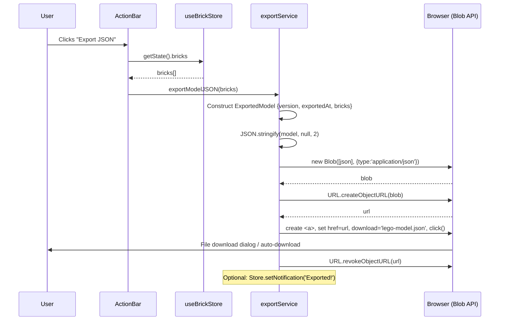
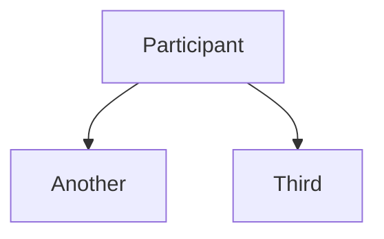

# Low-Level Design: FR-SHARE-001 — JSON Export & Import

**FR-ID:** FR-SHARE-001
**Issue:** #16
**Title:** Implement JSON Export & Import for Model Sharing with Versioned Format
**Priority:** P1
**Persona:** AFOL
**Dependencies:** FR-PERS-001 (persistence service pattern)
**Design Agent:** Spectra Design Agent
**Date:** 2025-06-17

---

## 1. Overview

This LLD defines the implementation details for JSON export and import functionality in the LEGO Builder Web App. The feature enables users to:

- **Export:** Download the current model as a versioned JSON file
- **Import:** Upload a JSON file to restore a model, with validation and error handling

The implementation is entirely client-side, leveraging the existing `exportService.ts` scaffold and extending the `ActionBar` component with Export/Import buttons.

---

## 2. API Endpoints (Client-Side Interfaces)

Since this is a client-only SPA, there are no backend API endpoints. The following client-side functions constitute the public interface:

### 2.1 `exportModelJSON(bricks: Brick[]): void`

**Location:** `src/services/exportService.ts`

**Description:** Serializes the brick array to a versioned JSON file and triggers a browser download.

**Parameters:**
- `bricks: Brick[]` — The current model's brick data from the store

**Returns:** `void` (side effect: file download)

**Behavior:**
1. Constructs `ExportedModel` object with `version`, `exportedAt`, and `bricks`
2. Serializes with `JSON.stringify(model, null, 2)` for readability
3. Creates a `Blob` with MIME type `application/json`
4. Generates an object URL and triggers a hidden `<a>` click
5. Revokes the object URL after download

**Errors:** Throws no errors; any failure (e.g., blob creation) will be caught by the caller and displayed via notification.

### 2.2 `importModelJSON(jsonString: string): Brick[]`

**Location:** `src/services/exportService.ts`

**Description:** Validates and parses a JSON string, returning sanitized brick data.

**Parameters:**
- `jsonString: string` — Raw JSON content from file upload

**Returns:** `Brick[]` — Sanitized brick array ready for store update

**Throws:** `Error` with messages:
- `"Invalid JSON: file could not be parsed"` — JSON.parse failure
- `"Invalid model format: missing version or bricks fields"` — missing required fields
- (Sanitization replaces invalid values but does not throw)

**Validation & Sanitization:**
- Ensures `version` and `bricks` fields exist and `bricks` is an array
- Sanitizes each brick:
  - `id` → `String(brick.id).slice(0, 64)` (limit length)
  - `type` → validated against `VALID_BRICK_TYPES`; defaults to `'1x1'`
  - `colorId` → validated against `VALID_COLOR_IDS`; defaults to `'bright-red'`
  - `rotation` → validated against `[0, 90, 180, 270]`; defaults to `0`

### 2.3 ActionBar Button Handlers

**Location:** `src/components/ActionBar/ActionBar.tsx`

**Export Button:**
- `data-testid="btn-export"`
- `onClick`: calls `exportModelJSON(store.bricks)`
- No async handling needed (synchronous)

**Import Button:**
- `data-testid="btn-import"`
- `onClick`: triggers hidden `<input type="file" accept=".json">` click
- `onChange` handler on input:
  - Reads file with `FileReader.readAsText()`
  - On load: calls `importModelJSON(result)`
    - Success: `store.setBricks(importedBricks)` + `store.setNotification('Model imported!')`
    - Error: `store.setNotification('Import failed: ' + error.message)`

---

## 3. Data Models

### 3.1 Core Domain Types (from `src/store/types.ts`)

```typescript
export type BrickType = '1x1' | '1x2' | '2x2' | '2x4';
export type Tool = 'place' | 'delete';

export interface Brick {
  id: string;           // uuid or user-provided; max 64 chars after sanitization
  x: number;            // grid X (integer)
  y: number;            // grid Y (always 0 for MVP — CLR-01)
  z: number;            // grid Z (integer)
  type: BrickType;
  colorId: string;      // references BrickColor.id
  rotation: number;     // 0 | 90 | 180 | 270 (degrees around Y-axis)
}
```

### 3.2 Exported Model Schema

```typescript
const EXPORT_VERSION = '1.0.0';

interface ExportedModel {
  version: string;      // Semantic version string; used for future compatibility
  exportedAt: string;   // ISO 8601 timestamp
  bricks: Brick[];      // Array of brick objects (same as store format)
}
```

**Versioning Strategy:**
- Current version: `1.0.0`
- Future changes that break compatibility must increment the major version
- Import function should handle unknown versions gracefully (e.g., show warning but still import if schema is compatible)

### 3.3 Validation Constants (to be defined in `exportService.ts`)

```typescript
const VALID_BRICK_TYPES: BrickType[] = ['1x1', '1x2', '2x2', '2x4'];
const VALID_COLOR_IDS: string[] = LEGO_COLORS.map(c => c.id); // from colorPalette.ts
```

---

## 4. Component Architecture

### 4.1 Integration Points

```
┌─────────────────────────────────────────────────────────────┐
│                      ActionBar.tsx                          │
│  ┌─────────────┐  ┌─────────────┐                         │
│  │  Save Btn   │  │  Load Btn   │                         │
│  └─────────────┘  └─────────────┘                         │
│  ┌─────────────┐  ┌─────────────┐                         │
│  │Export Btn   │  │ Import Btn  │                         │
│  └─────────────┘  └─────────────┘                         │
│         │                     │                            │
│         └─────────────────────┘                            │
│                   │                                         │
│                   ▼                                         │
│         useBrickStore (setNotification)                   │
└─────────────────────────────────────────────────────────────┘
                            │
                            ▼
┌─────────────────────────────────────────────────────────────┐
│                exportService.ts                            │
│  ┌──────────────────────────────────────────────────────┐  │
│  │ exportModelJSON(bricks) → triggers download          │  │
│  │ importModelJSON(jsonString) → returns Brick[]        │  │
│  └──────────────────────────────────────────────────────┘  │
└─────────────────────────────────────────────────────────────┘
```

### 4.2 State Flow

**Export Flow:**
1. User clicks Export button
2. `ActionBar` calls `exportModelJSON(store.bricks)`
3. Service constructs `ExportedModel`, creates Blob, triggers download
4. Optional: `store.setNotification('Model exported!')` (not in original spec but good UX)

**Import Flow:**
1. User clicks Import button → triggers hidden file input
2. User selects `.json` file
3. `FileReader.readAsText()` reads file
4. On load, `importModelJSON(fileContent)` is called
   - Success: `store.setBricks(importedBricks)` + success notification
   - Error: error notification (scene unchanged)

### 4.3 Stub Replacement

| Stub File | FR | Replacement | Changes Required |
|-----------|----|-------------|------------------|
| `src/components/ActionBar/ActionBar.tsx` | FR-SHARE-001 | Add Export/Import buttons | Add two buttons with test IDs, wire to service |
| `src/services/exportService.ts` | FR-SHARE-001 | Verify scaffold completeness | Ensure `VALID_BRICK_TYPES` and `VALID_COLOR_IDS` are defined; add sanitization if missing |

---

## 5. Sequence Diagrams

### 5.1 Export Sequence



### 5.2 Import Success Sequence

```mermaid
sequenceDiagram
    participant U as User
    participant AB as ActionBar
    participant Input as <input type="file">
    participant FR as FileReader
    participant ES as exportService
    participant Store as useBrickStore

    U->>AB: Clicks "Import JSON"
    AB->>Input: click() (hidden file input)
    Input->>U: File picker dialog
    U->>Input: Selects valid .json file
    Input->>FR: readAsText(file)
    FR->>FR: Read file content
    FR-->>AB: onload event (result = jsonString)
    AB->>ES: importModelJSON(jsonString)
    ES->>ES: JSON.parse(jsonString)
    ES->>ES: Validate {version, bricks array}
    ES->>ES: Sanitize each brick (id, type, colorId, rotation)
    ES-->>AB: returns sanitized bricks[]
    AB->>Store: setBricks(importedBricks)
    AB->>Store: setNotification('Model imported!')
    Store-->>AB: state updated
    Note over Store: R3F re-renders with new bricks
```



### 5.3 Import Error Sequence

```mermaid
sequenceDiagram
    participant U as User
    participant AB as ActionBar
    participant Input as <input type="file">
    participant FR as FileReader
    participant ES as exportService
    participant Store as useBrickStore

    U->>AB: Clicks "Import JSON"
    AB->>Input: click()
    Input->>U: File picker
    U->>Input: Selects invalid/corrupted file
    Input->>FR: readAsText(file)
    FR-->>AB: onload event (result = jsonString)
    AB->>ES: importModelJSON(jsonString)
    ES->>ES: JSON.parse() throws or validation fails
    ES-->>AB: throws Error('Invalid JSON: ...' or 'Invalid model format...')
    AB->>Store: setNotification('Import failed: ' + error.message)
    Note over Store: Scene unchanged (no setBricks call)
```



---

## 6. Error Handling Strategy

### 6.1 Error Categories

| Error Type | Source | Handling | User Message |
|------------|--------|----------|--------------|
| JSON parse error | `JSON.parse()` in `importModelJSON` | Caught in `importModelJSON`, re-thrown as `Error('Invalid JSON: file could not be parsed')` | "Import failed: Invalid JSON: file could not be parsed" |
| Schema validation error | Missing `version` or `bricks` fields, or `bricks` not an array | Throw `Error('Invalid model format: missing version or bricks fields')` | "Import failed: Invalid model format: missing version or bricks fields" |
| File read error | `FileReader.onerror` | Call `store.setNotification('Import failed: Could not read file')` | "Import failed: Could not read file" |
| Blob creation error (export) | `new Blob()` failure (unlikely) | Not explicitly caught; would bubble to caller and be caught by global error handler | Generic error (unlikely) |
| Storage quota exceeded (not applicable) | N/A — export is file download, not storage | N/A | N/A |

### 6.2 Error Display

All errors are displayed via the existing `useBrickStore.setNotification()` mechanism, which shows a transient notification in the `Notification` component (already implemented for FR-PERS-001).

**Notification behavior:**
- Success: "Model imported!" or "Model exported!" (optional)
- Error: "Import failed: <error message>"
- Auto-dismiss after 3-5 seconds (implementation in `Notification.tsx`)

### 6.3 Scene Preservation on Import Failure

The import flow **only** calls `store.setBricks()` if `importModelJSON` returns successfully. Any thrown error prevents `setBricks` from being called, leaving the scene unchanged.

---

## 7. Security Considerations

### 7.1 XSS Prevention (NFR-SEC-002)

The `importModelJSON` function sanitizes all string fields to prevent XSS via malicious JSON:

- `id`: truncated to 64 characters (`String(brick.id).slice(0, 64)`)
- `type`: validated against allowlist `VALID_BRICK_TYPES`; defaults to `'1x1'`
- `colorId`: validated against `VALID_COLOR_IDS`; defaults to `'bright-red'`
- `rotation`: validated against `[0, 90, 180, 270]`; defaults to `0`

This ensures that even if the JSON contains unexpected strings or numbers, they cannot break the application or inject script.

### 7.2 No External Data Transmission (NFR-SEC-001)

- Export: File is generated entirely client-side; no network request
- Import: File is read via `FileReader`; no upload to any server
- The feature does not use `fetch`, `XMLHttpRequest`, or any third-party API

### 7.3 Content Security Policy (CSP)

The app's CSP (defined in `nginx.conf` per TECH_ARCH §9.1) allows:
- `script-src 'self' 'unsafe-eval'` — needed for Vite dev and possibly Three.js
- `worker-src blob:` — required for `URL.createObjectURL` blob downloads

The export feature uses `blob:` URLs, which are permitted by `worker-src blob:`.

---

## 8. Data Validation & Schema Versioning

### 8.1 Version Field

The exported JSON includes a `version` field (currently `"1.0.0"`). This enables future compatibility:

- **Major version bump** (1.x → 2.x): Breaking changes to the brick schema or required fields
- **Minor version bump** (x.0 → x.1): Additive changes (new optional fields)

### 8.2 Import Version Handling

Current implementation does not enforce version checks; it only validates the presence of `version` and `bricks`. Future versions can:

- Compare `parsed.version` with `EXPORT_VERSION`
- If major version differs, show a warning or error
- If minor version differs, allow import but log a compatibility note

### 8.3 Backward Compatibility

Since the MVP only produces version `1.0.0`, backward compatibility is not a concern yet. However, the import function should be designed to be tolerant of additional unknown fields (it ignores them).

---

## 9. Cross-Browser Compatibility (KR-2.2)

The feature relies on standard Web APIs with excellent browser support:

| API | Support | Notes |
|-----|---------|-------|
| `Blob` | Chrome 20+, Firefox 14+, Safari 6+, Edge 12+ | Universal |
| `URL.createObjectURL()` / `revokeObjectURL()` | Universal | |
| `<a>.click()` | Universal | Programmatic download |
| `FileReader.readAsText()` | Universal | |
| `JSON.parse()` / `JSON.stringify()` | Universal | |

**Testing:** E2E tests (T-E2E-AFOL-001-01, T-E2E-ERR-001-01) will run across Chrome, Firefox, Safari, Edge via Playwright.

---

## 10. Performance Considerations

- **Export:** Synchronous JSON.stringify on up to 1,000 bricks should complete well under 500ms (FR-PERS-001 requirement). No performance concerns.
- **Import:** JSON.parse and sanitization are also fast for 1,000 bricks.
- **Memory:** The imported brick array is a shallow copy; no large temporary objects beyond the parsed JSON.

---

## 11. Test Coverage

### 11.1 Unit Tests (from issue)

| Test ID | Description | Scope |
|---------|-------------|-------|
| T-FE-SHARE-001-01 | Export produces valid versioned JSON with all brick data | `exportModelJSON` output format |
| T-FE-SHARE-001-02 | Import from valid JSON populates store | `importModelJSON` returns correct bricks |
| T-FE-SHARE-001-03 | Import from invalid JSON shows error and preserves scene | Error handling path |
| T-FE-SHARE-001-04 | Export JSON button triggers file download (URL.createObjectURL called) | Button handler integration |

### 11.2 E2E Tests

| Test ID | Description |
|---------|-------------|
| T-E2E-AFOL-001-01 | AFOL build and export flow (place bricks, export, verify file) |
| T-E2E-ERR-001-01 | Invalid JSON import shows error and preserves scene |

### 11.3 Security Test

| Test ID | Description |
|---------|-------------|
| T-SEC-SEC-001-01 | No model data sent to external servers (network tab audit) |

---

## 12. Implementation Checklist (DoD)

- [ ] `ActionBar.tsx` adds Export button with `data-testid="btn-export"`
- [ ] `ActionBar.tsx` adds Import button with `data-testid="btn-import"`
- [ ] Import button uses hidden `<input type="file" accept=".json">`
- [ ] `exportModelJSON` creates versioned JSON with `version`, `exportedAt`, `bricks`
- [ ] `importModelJSON` validates required fields and sanitizes brick properties
- [ ] Import success updates store via `setBricks` and shows success notification
- [ ] Import failure shows error notification and does **not** modify store
- [ ] All unit tests T-FE-SHARE-001-01 through T-FE-SHARE-001-04 pass
- [ ] E2E tests T-E2E-AFOL-001-01 and T-E2E-ERR-001-01 pass
- [ ] Security test T-SEC-SEC-001-01 passes (no external requests)
- [ ] Code reviewed and PR merged

---

## 13. Open Questions / Assumptions

| Question | Answer / Assumption | Rationale |
|----------|---------------------|-----------|
| Should export include the `y` field if it's always 0? | Yes — include for completeness and future vertical stacking | Schema should be forward-compatible |
| Should import allow unknown fields? | Yes — ignore them | Allows forward compatibility when new fields are added |
| Should we show a success notification on export? | Optional — not in original spec but good UX | Can be added as a minor enhancement |
| What filename should be used? | `lego-model.json` (hardcoded) | Simple and clear |
| Should we support importing from LocalForage saved models? | Not required — FR-PERS-002 covers load from storage | Import is for JSON file exchange only |

---

## 14. References

- **PRD:** `docs/PRD.md` — FR-SHARE-001, acceptance criteria, test IDs
- **Technical Architecture:** `docs/TECHNICAL_ARCHITECTURE.md` — §2.6 (Export Service), §3 (Framework Runtime Contracts), §4.2 (Stub Replacement Table)
- **Tech Stack:** `docs/tech_stack.yaml` — `export_import_service` mapping to Browser Blob/FileReader APIs
- **Stub Files:**
  - `src/components/ActionBar/ActionBar.tsx`
  - `src/services/exportService.ts`
- **Existing Services:**
  - `src/services/persistenceService.ts` — similar pattern for save/load

---

## Appendix: Mermaid Diagram Legend



The sequence diagrams above use standard Mermaid syntax and are rendered in GitHub Markdown.
