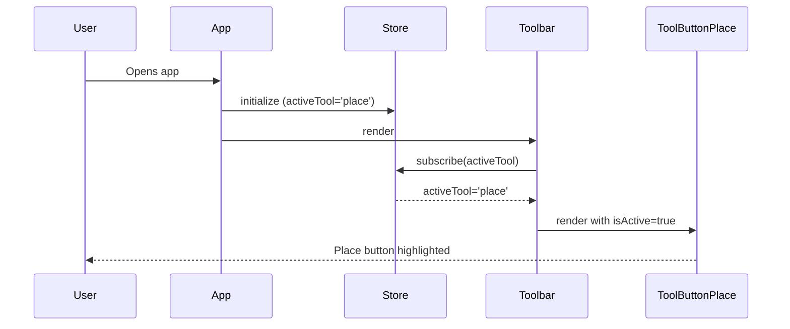
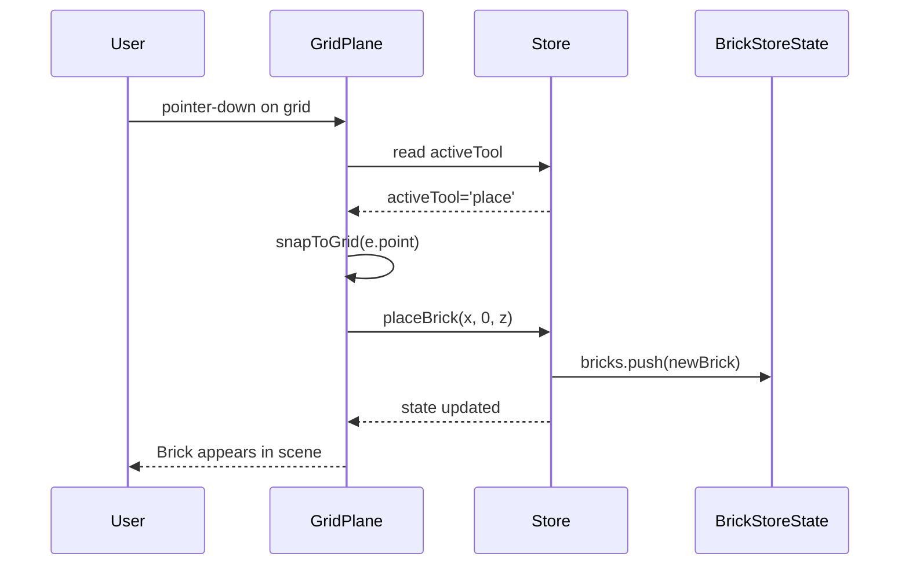
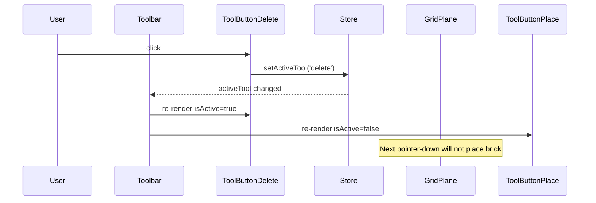

# Low-Level Design: FR-TOOL-001 — Place Mode Tool

**FR-ID:** FR-TOOL-001
**Issue:** #12 — [FR-TOOL-001] Implement Place Mode Tool — Default Active Tool with Visual Highlight
**App ID:** app-legobuilder-challenger-config1-20240615
**Design Agent:** Spectra Design Agent
**Date:** 2025-06-17

---

## 1. Overview

This LLD defines the implementation details for **FR-TOOL-001: Place Mode Tool**. The feature introduces a tool mode system where the Place tool is the default active tool on application load. When active, the Place tool button in the Toolbar must be visually highlighted, and clicking the 3D grid places a brick.

The design integrates with the existing Zustand state management, the Toolbar and ToolButton components, and the GridPlane interaction handler. It also sets the foundation for FR-TOOL-002 (Delete Mode) which shares the same Toolbar.

---

## 2. API Endpoints

> **Note:** This is a client-side only application. There are no backend API endpoints. All interactions are via React components and Zustand store actions.

### 2.1 Internal Interfaces (Component Props & Store Actions)

| Interface | Type | Description |
|-----------|------|-------------|
| `Tool` | `type Tool = 'place' | 'delete'` | Union type for tool modes (defined in `src/store/types.ts`). |
| `useBrickStore.activeTool` | `Tool` | Zustand state: current active tool. Default: `'place'`. |
| `useBrickStore.setActiveTool` | `(tool: Tool) => void` | Action to change active tool. |
| `ToolbarProps` | `{}` | Toolbar component takes no props; reads store directly. |
| `ToolButtonProps` | `{ toolName: Tool; label: string; icon?: ReactNode }` | Props for individual tool button. `isActive` derived from store. |
| `GridPlaneProps` | `{}` | GridPlane reads `activeTool` from store to decide behavior on pointer-down. |

---

## 3. Data Models

### 3.1 Zustand Store Schema (`src/store/useBrickStore.ts`)

```typescript
// src/store/types.ts (existing)
export type Tool = 'place' | 'delete';

export interface BrickStore {
  // State
  bricks: Brick[];
  activeTool: Tool;           // ← FR-TOOL-001: default 'place'
  activeColorId: string;
  activeBrickType: BrickType;
  notification: string | null;

  // Actions
  placeBrick: (x: number, y: number, z: number) => void;
  deleteBrick: (id: string) => void;
  setActiveTool: (tool: Tool) => void; // ← FR-TOOL-001
  // ... other actions
}
```

**Initial State:**

```typescript
const initialState: BrickStore = {
  bricks: [],
  activeTool: 'place', // FR-TOOL-001: Place mode is default
  activeColorId: 'bright-red',
  activeBrickType: '1x1',
  notification: null,
};
```

### 3.2 Component State

- `Toolbar`: No local state; subscribes to `activeTool` and `setActiveTool`.
- `ToolButton`: Receives `toolName` prop; computes `isActive = activeTool === toolName`.
- `GridPlane`: Subscribes to `activeTool`; on pointer-down, if `activeTool === 'place'` then calls `placeBrick`.

---

## 4. Component Architecture

### 4.1 Component Tree

```
<App>
  <div className="app-layout">
    <aside className="sidebar">
      <Toolbar />                    ← FR-TOOL-001, FR-TOOL-002
        ├── <ToolButton toolName="place" label="Place" />
        └── <ToolButton toolButton="delete" label="Delete" />
    </aside>
    <main className="canvas-container">
      <Scene3D>
        <Canvas>
          <GridPlane />            ← reads activeTool, triggers placeBrick
          <InstancedBricks />
          <OrbitControls />
        </Canvas>
      </Scene3D>
    </main>
  </div>
</App>
```

### 4.2 Component Specifications

#### Toolbar.tsx

- **Location:** `src/components/Toolbar/Toolbar.tsx` (stub → implementation)
- **Responsibilities:** Render two `ToolButton` components (Place and Delete).
- **State:** Reads `activeTool` and `setActiveTool` from `useBrickStore`.
- **Implementation:**
  ```tsx
  import { useBrickStore } from '../../store/useBrickStore';
  import ToolButton from './ToolButton';

  export default function Toolbar() {
    const { activeTool, setActiveTool } = useBrickStore();

    return (
      <div className="toolbar" role="toolbar" aria-label="Tools">
        <ToolButton
          toolName="place"
          label="Place"
          isActive={activeTool === 'place'}
          onClick={() => setActiveTool('place')}
        />
        <ToolButton
          toolName="delete"
          label="Delete"
          isActive={activeTool === 'delete'}
          onClick={() => setActiveTool('delete')}
        />
      </div>
    );
  }
  ```

#### ToolButton.tsx

- **Location:** `src/components/Toolbar/ToolButton.tsx` (stub → implementation)
- **Responsibilities:** Render a clickable button with active state visual highlight.
- **Props:** `toolName: Tool`, `label: string`, `isActive: boolean`, `onClick: () => void`.
- **Test ID:** `data-testid="tool-{toolName}"` (e.g., `tool-place`).
- **Accessibility:** Use `aria-pressed={isActive}` to convey toggle state.
- **Styling:** Apply a distinct CSS class (e.g., `bg-blue-500 text-white`) when `isActive` is true.
- **Implementation:**
  ```tsx
  interface Props {
    toolName: Tool;
    label: string;
    isActive: boolean;
    onClick: () => void;
  }

  export default function ToolButton({ toolName, label, isActive, onClick }: Props) {
    return (
      <button
        data-testid={`tool-${toolName}`}
        className={`tool-button ${isActive ? 'active' : ''}`}
        aria-pressed={isActive}
        onClick={onClick}
      >
        {label}
      </button>
    );
  }
  ```

#### GridPlane.tsx (existing stub, integration point)

- **Location:** `src/components/Scene3D/GridPlane.tsx`
- **Responsibilities:** Provide an invisible clickable plane for brick placement. Already implements `onPointerDown` that calls `placeBrick` when appropriate.
- **Integration:** Must read `activeTool` from store and only trigger placement when `activeTool === 'place'`.
- **Implementation (existing stub to be completed in FR-BRICK-001, but FR-TOOL-001 requires the activeTool check):**
  ```tsx
  import { useBrickStore } from '../../store/useBrickStore';
  import { snapToGrid } from '../../domain/gridRules';

  export default function GridPlane() {
    const { activeTool, placeBrick } = useBrickStore();

    const handlePointerDown = (e: ThreeEvent<PointerEvent>) => {
      e.stopPropagation();
      if (activeTool !== 'place') return; // FR-TOOL-001: only place when active
      const { x, z } = snapToGrid(e.point);
      placeBrick(x, 0, z);
    };

    return (
      <mesh
        rotation={[-Math.PI / 2, 0, 0]}
        position={[0, -0.5, 0]}
        onPointerDown={handlePointerDown}
      >
        <planeGeometry args={[20, 20]} />
        <meshBasicMaterial visible={false} />
      </mesh>
    );
  }
  ```

---

## 5. Sequence Diagrams

### 5.1 App Load — Place Mode Becomes Active



### 5.2 User Clicks Grid to Place Brick



### 5.3 User Switches to Delete Mode



---

## 6. Error Handling Strategy

| Error Condition | Detection | Handling | User Feedback |
|-----------------|-----------|----------|---------------|
| Store not initialized | Component mount | Throw development error; in production, fallback to default state | Console error (dev only)
| `placeBrick` called with invalid coordinates | Input validation in `placeBrick` (must be integers) | Clamp or round to nearest integer; reject if occupied | No error shown; silent rejection (duplicate placement)
| `setActiveTool` called with invalid tool | TypeScript compile-time check; runtime guard | Ignore invalid value; log warning | None (developer-facing only)
| GridPlane pointer-down when `activeTool !== 'place'` | Normal flow check | Early return; no action | None (expected behavior)

**General Principles:**
- No runtime crashes; all errors are contained.
- User-facing errors are shown via `notification` state (toast) for critical failures (e.g., storage full). FR-TOOL-001 has no user-facing error conditions beyond normal state.

---

## 7. Security Considerations

- **XSS:** No user-generated HTML in tool labels; labels are static strings (`'Place'`, `'Delete'`). No risk.
- **Input Validation:** `setActiveTool` only accepts `'place'` or `'delete'`. TypeScript union type ensures no other strings compile.
- **Accessibility:** `aria-pressed` on `ToolButton` conveys toggle state to screen readers. Toolbar has `role="toolbar"` and `aria-label`.
- **Client-Side Only:** No data is sent to any server; all state is local.

---

## 8. Testing Strategy

### 8.1 Unit Tests (Vitest)

- **T-FE-TOOL-001-01:** Store default `activeTool` is `'place'`.
- **T-FE-TOOL-001-02:** `setActiveTool('place')` and `setActiveTool('delete')` update state correctly.
- **ToolButton renders with `isActive` prop** and applies `active` CSS class.
- **ToolButton `data-testid`** matches `tool-{toolName}`.

### 8.2 Behavioral Tests (Vitest + RTL)

- **T-FE-TOOL-001-02 (behavioral variant):** Full app render shows Place button highlighted on load without mocked stores.
- Clicking Delete button changes active tool to `'delete'` and Place button loses highlight.

### 8.3 E2E Tests (Playwright)

- **T-E2E-HAPPY-001-01 (part):** On app load, `[data-testid="tool-place"]` has `aria-pressed="true"` and visible highlight.
- Clicking Delete tool changes highlight to Delete button; subsequent grid click does not place brick.

---

## 9. Implementation Checklist (Design Gate)

- [ ] `Toolbar.tsx` renders two `ToolButton` components with correct props.
- [ ] `ToolButton.tsx` applies active CSS class when `isActive` is true.
- [ ] `ToolButton.tsx` includes `data-testid="tool-{toolName}"`.
- [ ] `ToolButton.tsx` sets `aria-pressed={isActive}`.
- [ ] Zustand store initializes `activeTool: 'place'`.
- [ ] `GridPlane.tsx` checks `activeTool` before calling `placeBrick`.
- [ ] All unit tests (T-FE-TOOL-001-01, etc.) pass.
- [ ] All behavioral tests pass.
- [ ] E2E test verifies visual highlight on load.
- [ ] Code follows existing project conventions (TypeScript, Tailwind, component structure).
- [ ] No console errors or warnings in development build.

---

## 10. Related Features

- **FR-TOOL-002 (Delete Mode):** Shares the same Toolbar and ToolButton components. Implementation should ensure both tools work together without conflict.
- **FR-BRICK-001 (Brick Placement):** GridPlane integration; placement only occurs when `activeTool === 'place'`.
- **FR-TOOL-003 (Brick Rotation):** Independent of tool mode; rotation action may be triggered via keyboard or button.

---

## 11. Change Log

| Version | Date | Changes | Author |
|---------|------|---------|--------|
| 1.0 | 2025-06-17 | Initial LLD | Spectra Design Agent |
