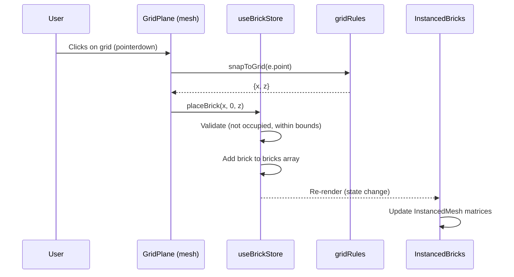
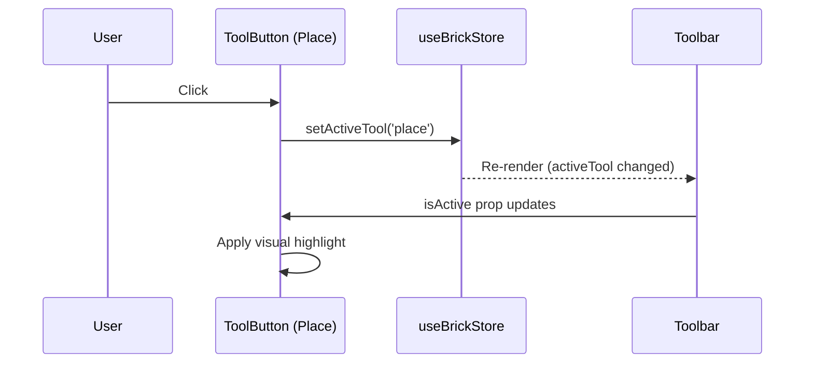

# Low-Level Design: FR-TOOL-001 — Place Mode Tool

## 1. Overview
This LLD details the implementation of the Place mode tool, which is the default active tool on app load. It enables users to place bricks by clicking on the 3D grid. The Place tool button in the Toolbar must be visually highlighted when active.

## 2. API Endpoints
*None.* This is a client-side only feature; all interactions are within the browser.

## 3. Data Models

### 3.1 Zustand Store State
The `useBrickStore` (Zustand) holds the application state. Relevant slice:
```typescript
interface BrickStore {
  activeTool: Tool; // 'place' | 'delete'
  // ... other state
}
```
Default: `activeTool: 'place'` (as per FR-TOOL-001).

### 3.2 Persisted Model (LocalForage)
When saving, the model is stored as:
```typescript
interface PersistedModel {
  version: string; // e.g., "1.0.0"
  savedAt: string; // ISO timestamp
  bricks: Brick[]; // array of brick objects
}
```
`Brick` type defined in `src/store/types.ts`.

### 3.3 Brick Data Structure
```typescript
interface Brick {
  id: string;       // uuid
  x: number;        // grid X coordinate (integer)
  y: number;        // grid Y (always 0 for MVP)
  z: number;        // grid Z coordinate (integer)
  type: BrickType;  // '1x1' | '1x2' | '2x2' | '2x4'
  colorId: string;  // references LEGO_COLORS entry
  rotation: number; // 0 | 90 | 180 | 270 (degrees)
}
```

## 4. Component Architecture

### 4.1 Component Tree
```
<App>
  <div class="app-layout">
    <aside class="sidebar">
      <Toolbar />          <!-- Contains ToolButton for Place and Delete -->
      <BrickPalette />
      <BrickTypeSelector />
      <ActionBar />
    </aside>
    <main class="canvas-container">
      <Scene3D>
        <Canvas>
          <Grid />
          <GridPlane />     <!-- Click target for placement -->
          <InstancedBricks />
          <OrbitControls />
        </Canvas>
      </Scene3D>
    </main>
    <Notification />
  </div>
</App>
```

### 4.2 Key Modules and Dependencies
- **Toolbar** (`src/components/Toolbar/Toolbar.tsx`): Renders two `ToolButton` components (Place and Delete). Reads `activeTool` from store and passes `isActive` prop.
- **ToolButton** (`src/components/Toolbar/ToolButton.tsx`): Renders a button with visual highlight when `isActive` is true. Calls `setActiveTool(tool)` on click. Has `data-testid="tool-{toolName}"`.
- **GridPlane** (`src/components/Scene3D/GridPlane.tsx`): An invisible mesh that covers the grid area. Attaches `onPointerDown` handler to capture clicks and call `placeBrick` when `activeTool === 'place'`.
- **useBrickStore** (`src/store/useBrickStore.ts`): Zustand store. Provides `activeTool`, `setActiveTool`, `placeBrick`, etc. Initializes `activeTool` to `'place'`.
- **gridRules** (`src/domain/gridRules.ts`): Provides `snapToGrid(e.point)` to convert world coordinates to grid integers, and `isCellOccupied` to prevent duplicate placement.

### 4.3 Interfaces

#### ToolButton Props
```typescript
interface ToolButtonProps {
  tool: Tool;        // 'place' | 'delete'
  label: string;     // e.g., "Place"
  icon?: ReactNode;  // optional icon
}
```

#### GridPlane Event Handler
```typescript
// Inside GridPlane.tsx
const onPointerDown = (e: ThreeEvent<PointerEvent>) => {
  e.stopPropagation();
  if (activeTool !== 'place') return;
  const { x, z } = snapToGrid(e.point);
  // Check occupancy via isCellOccupied (optional: can be done inside placeBrick)
  placeBrick(x, 0, z);
};
```

## 5. Sequence Diagrams

### 5.1 Place Brick Flow


### 5.2 Tool Activation Flow


## 6. Error Handling Strategy

- **Placement on occupied cell**: `placeBrick` checks `isCellOccupied` and silently returns without adding a brick. No error shown to user (the grid cell is already occupied, so no action needed). Optionally, could show a subtle visual feedback (e.g., red highlight) but not required.
- **Storage full on save** (FR-PERS-001): `saveModel` catches QuotaExceededError from LocalForage and shows an error notification via `setNotification`.
- **Invalid JSON import** (FR-SHARE-001): `importModelJSON` throws descriptive errors; UI catches and displays error message.
- **WebGL errors**: Global error listener logs to console and exposes `window.__legoBuilderErrors` for E2E tests (see Technical Architecture §8.3). No user-facing error UI in MVP; errors are logged.

## 7. Security Considerations

- **Input validation**: All imported JSON is validated against the `Brick` type schema. String fields are sanitized (length limits, allowed characters) to prevent XSS if data is later rendered in DOM (unlikely but defensive).
- **No external data**: The app does not send any user data to external servers; all data stays in the browser.
- **Content Security Policy**: The nginx config (see Technical Architecture §9.1) sets CSP to restrict script sources, mitigating XSS.
- **No eval()**: The codebase avoids `eval` and `innerHTML`; React's JSX escaping prevents injection.

## 8. Implementation Notes

- **Default active tool**: The Zustand store initializes `activeTool: 'place'`. This satisfies "Place mode is active by default on app load".
- **Visual highlight**: The `ToolButton` component applies a CSS class (e.g., `bg-blue-500`) when `isActive` is true. Also sets `aria-pressed="true"` for accessibility.
- **Test IDs**: Place tool button gets `data-testid="tool-place"`; Delete gets `data-testid="tool-delete"`.
- **Integration with GridPlane**: The `GridPlane` mesh must be large enough to cover the grid area (e.g., 20x20 units). It should be invisible (`opacity={0}` or material with `visible: false`? Actually, to receive pointer events, it needs to be visible to raycasting but can be transparent. In R3F, a mesh with `onPointerDown` will be raycast even if its material is transparent. Use a `mesh` with a `meshBasicMaterial` with `opacity: 0` and `transparent: true`? Or set `visible: false` would make it not raycast. So we need it to be raycastable but not visually intrusive. Could use a `mesh` with a `meshBasicMaterial` color="#000" opacity={0} and side={DoubleSide}. Or use an `plane` geometry with `meshBasicMaterial` and set `visible={false}`? Actually, in Three.js, an object with `visible=false` is not rendered and not raycasted. So we need it to be visible but maybe we can set `material.transparent = true` and `opacity = 0` so it's invisible but still present. Alternatively, we can attach the pointer handler to the `<Grid>` component from Drei? But the Grid is a helper that renders lines, not a solid plane. The GridPlane is a separate invisible plane below the grid lines to capture clicks. The Technical Architecture shows `<GridPlane />` as a separate component. We'll implement it as a `<mesh>` with a `planeGeometry` (size 20x20) rotated -90° around X to be horizontal, positioned at y=0. Material: `meshBasicMaterial({ color: 0x000000, transparent: true, opacity: 0 })`. This will be invisible but still receive pointer events if `onPointerDown` is attached.
- **OrbitControls conflict**: As per Technical Architecture §3.1, we must set `mouseButtons={{ LEFT: undefined }}` to free the left mouse button for placement. This is configured in `Scene3D.tsx`.
- **Zustand store**: The store is global; no provider needed. Components subscribe via `useBrickStore(state => state.activeTool)` etc.
- **Performance**: For FR-PERF-001, we use `InstancedBricks` for rendering. The placement flow updates the store, which triggers a re-render of `InstancedBricks` to update instance matrices. This is already in place.

## 9. Open Questions / Assumptions

- **Duplicate placement**: The acceptance criteria for FR-BRICK-001 says "no duplicate brick is placed". The `placeBrick` action should check occupancy using `isCellOccupied` and reject duplicates. This is implemented in the store (see existing code? The PRD and tech arch indicate it's part of FR-BRICK-001). For Place mode, we need to ensure that `placeBrick` does not add a brick if the cell is already occupied. The store's `placeBrick` should include this check. If not already present, it will be added as part of FR-BRICK-001 implementation. Since this LLD is for FR-TOOL-001, we assume that FR-BRICK-001's placement logic (including occupancy check) is already implemented or will be implemented concurrently. The Place tool simply triggers `placeBrick`; the store handles validation.
- **Grid size**: The grid is 20x20 as per the example code. This is fixed in `Scene3D.tsx` via `<Grid args={[20,20]} />`. The `GridPlane` should match that size.
- **Brick selection**: The active brick type and color are managed by the store (`activeBrickType`, `activeColorId`). The Toolbar does not affect these; they are controlled by `BrickPalette` and `BrickTypeSelector`. Place mode uses the currently selected type/color.

## 10. Traceability

| FR ID | Component(s) | File(s) | Test IDs |
|-------|--------------|---------|----------|
| FR-TOOL-001 | Toolbar, ToolButton, useBrickStore | `src/components/Toolbar/Toolbar.tsx`, `src/components/Toolbar/ToolButton.tsx`, `src/store/useBrickStore.ts` | T-FE-TOOL-001-01, T-FE-TOOL-001-02 |

This LLD supports FR-TOOL-001 and aligns with the Technical Architecture and PRD.
